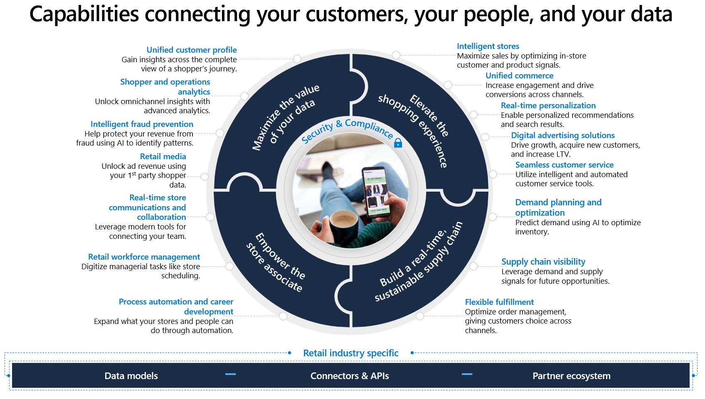
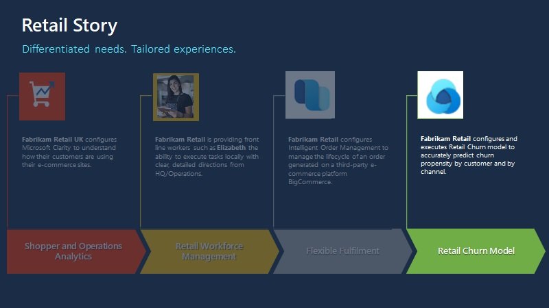
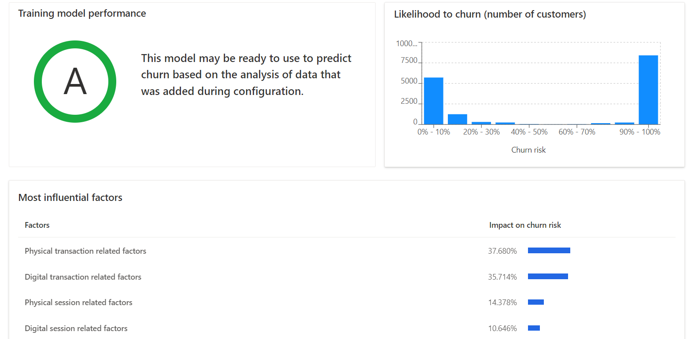

Unified customer profile is a key capability of Microsoft Cloud for Retail. Unified customer profile can help you gain insights across the complete view of a shopper's journey. With Unified customer profile, you can gain a 360-degree perspective of the customer in a clear and intuitive way. With this feature, you can provide personalized experiences, reveal important opportunities, prevent potential loss or churn, and improve customer satisfaction.

> [!div class="mx-imgBorder"]
> 

## Learning objectives 

This module will focus on the retail story of Fabrikam Retail.

> [!div class="mx-imgBorder"]
> 

In the following exercises, you'll be playing the role of a system administrator and a developer.

Initially, you'll create a Microsoft Dynamics 365 Customer Insights - Data environment, and then you’ll deploy **Unified customer profile** through the Solution Center. Later, you'll import Fabrikam Retail's customer data from Microsoft Azure Blob Storage, generate a retail channel churn model, and then analyze the churn predictions.

## Retail channel churn model

Expand your insights into your customer with the retail channel churn predictive model. The Unified customer profile feature in Microsoft Cloud for Retail includes an AI-based churn predictive model, which is designed for omnichannel retail and built atop of Customer Insights.

You can create a retail channel churn predictive model to fit your business needs and gain cross-channel insights into the chance of retail customer churn. By running your company data through this model, you can train it to improve its predictions and identify the factors that contribute to churn, at the customer level.

### Prerequisites to set up and train your retail channel churn model

To complete setup and training of your retail channel churn model, you need to meet the following prerequisites:

- Retail components, available within Microsoft Cloud for Retail in Microsoft Cloud Solution Center

- At least Contributor permissions in Dynamics 365 Customer Insights - Data. For more information, see [User permissions](/dynamics365/customer-insights/audience-insights/permissions/?azure-portal=true).

- An understanding of what churn means for your organization (a customer is considered to have *churned* if the customer's purchase value or volume drops below thresholds that you've defined)

Three data entities require mapping to the retail channel churn model: customer data, session data, and transaction data. With each entity, you'll have columns of data that are required for setting up and training the model and some columns that are optional. With all AI models, the more data that you set up for training, the more accurate predictions can be. Furthermore, with more accurate predictions, the value of the churn model is greater for your organization.

> [!NOTE]
> You might notice some entities being referred to as *tables*. For the purposes of this module, consider these terms interchangeable.

To create and train your model, see [Introduction to Azure Synapse Analytics](/training/modules/introduction-azure-synapse-analytics/?azure-portal=true).

### Prediction results

After initial training has been completed, you should review the results of the prediction model. The results page will display three primary sections of data: training model performance, churn risk by percentile, and most influential attributes.

> [!div class="mx-imgBorder"]
> 

- **Training model performance** - Displays a letter grade of how well the model has performed. In this section, possible scores include **A**, **B**, or **C**. This score indicates the performance of the prediction and can help you make the decision to use the results that are stored in the output table.

  Scores are determined based on the following rules:

  - **A** - When the model accurately predicted at least 50 percent of the total predictions and when the percentage of inaccurate predictions for customers who became dormant is lower than 10 percent

  - **B** - When the model accurately predicted at least 50 percent of the total predictions and when the percentage of inaccurate predictions for customers who became dormant is greater than 10 percent

  - **C** - When the model accurately predicted less than 50 percent of the total predictions

- **Likelihood to churn (number of customers)** - Groups of customers based on their predicted risk of churn. This data can help you later if you want to create a segment of customers with high churn risk. For example, such segments can help you understand where your cutoff should be for customer retention segments. 

- **Most influential factors** - Many factors are considered when you're creating your prediction. Each factor has its importance calculated for the aggregated predictions that a model creates. You can use these factors to help validate your prediction results. Additionally, you can use this information to create segments that could help influence churn risk for customers.

## Customer intelligence

Customer intelligence unifies important, relevant, and accurate customer information across multiple sources through Dynamics 365 Customer Insights - Data. This solution empowers the agent to engage with customers based on relevant insights. Customer intelligence combines demographic information, financial measures, and attitudes to form financial segments and AI models. These insights help agents quickly understand the customer.
