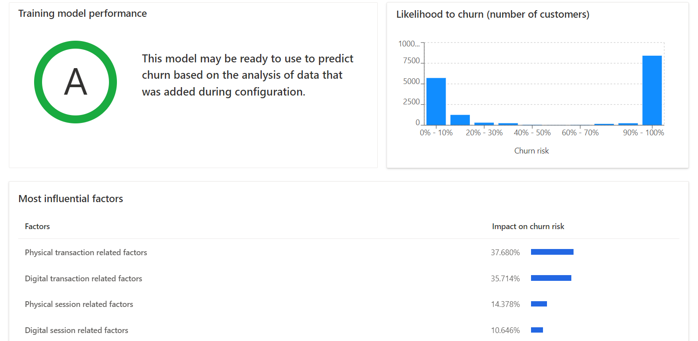
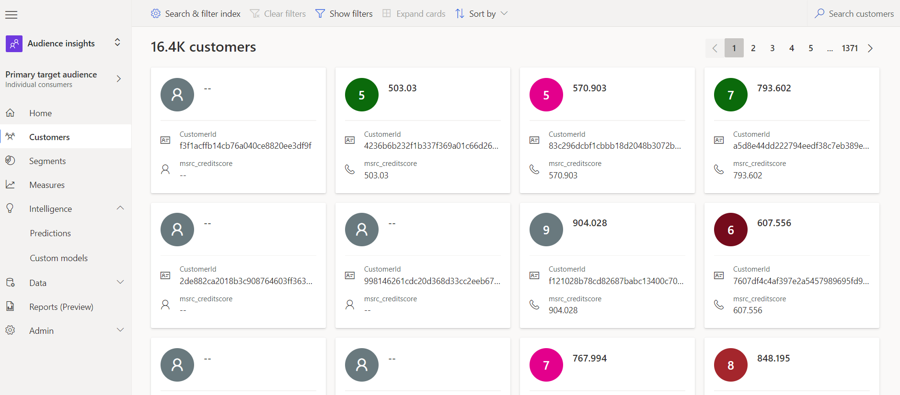
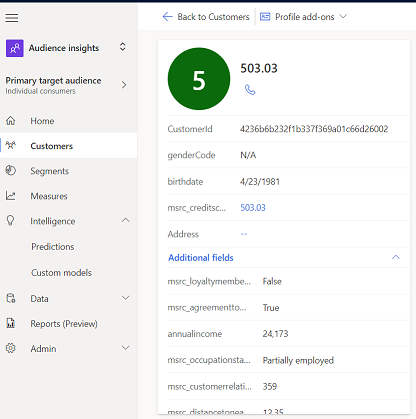
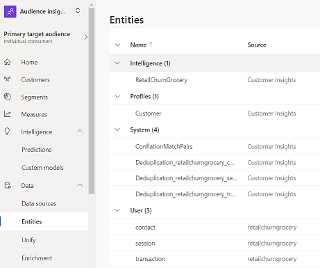
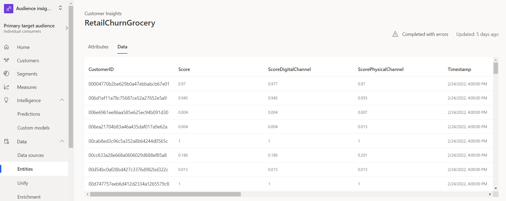

In this exercise, you'll review the output of the Retail churn model.

1.  Open the Retail churn model.

	> [!div class="mx-imgBorder"]
	> 

1.  To view a customer's full profile in Dynamics 365 Customer Insights - Data, go to **Customers** and open any sample record.

	> [!div class="mx-imgBorder"]
	> 

	> [!div class="mx-imgBorder"]
	> 

1.  To view the calculated churn scores, go to **Data**, and then under **Entities**, open the **msfsiRetailBankingChurn** entity that was created when you ran the churn model.

	> [!div class="mx-imgBorder"]
	> 

1.  On the **Attributes** tab, view the various new columns that were created by the model that factor into the score:

	- **ExpFeature1** = Contact related factors
	
	- **ExpFeature2** = Digital transaction factors
	
	- **ExpFeature3** = Physical transaction factors
	
	- **ExpFeature4** = Digital session factors
	
	- **ExpFeature5** = Physical session factors

	> [!div class="mx-imgBorder"]
	> 

1.  Select the **Data** tab to view the calculated churn score for each **CustomerID** in the dataset.

	> [!div class="mx-imgBorder"]
	> 

Congratulations, you’ve successfully run the Retail churn model in Dynamics 365 Customer Insights - Data.
