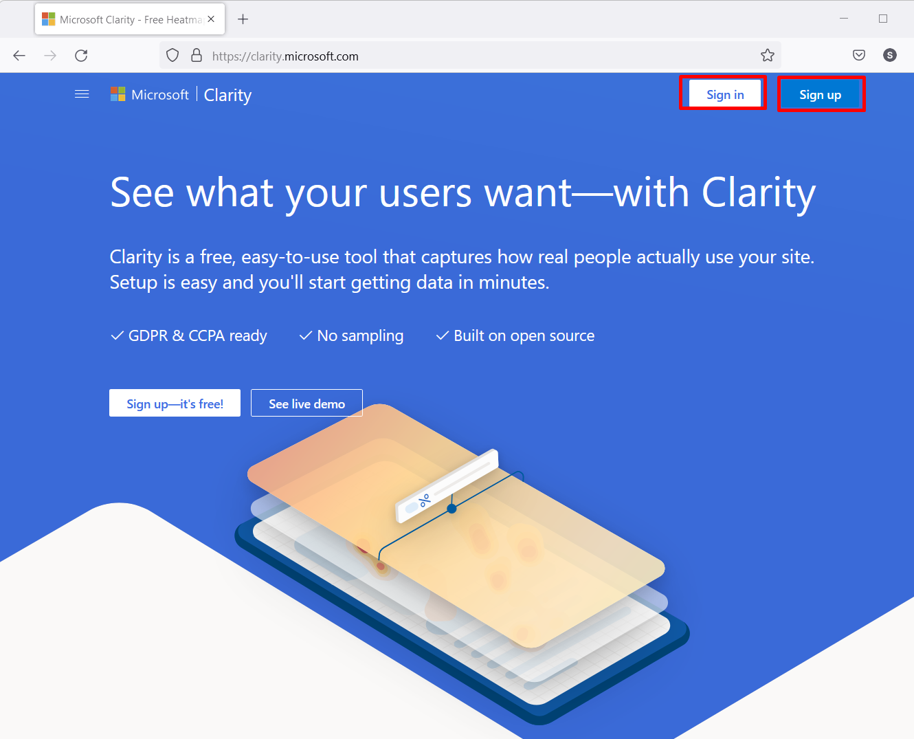
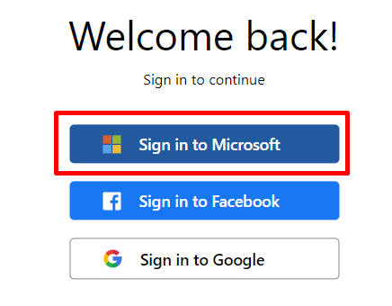
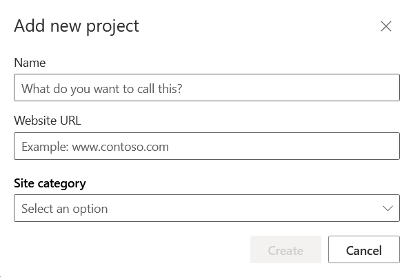
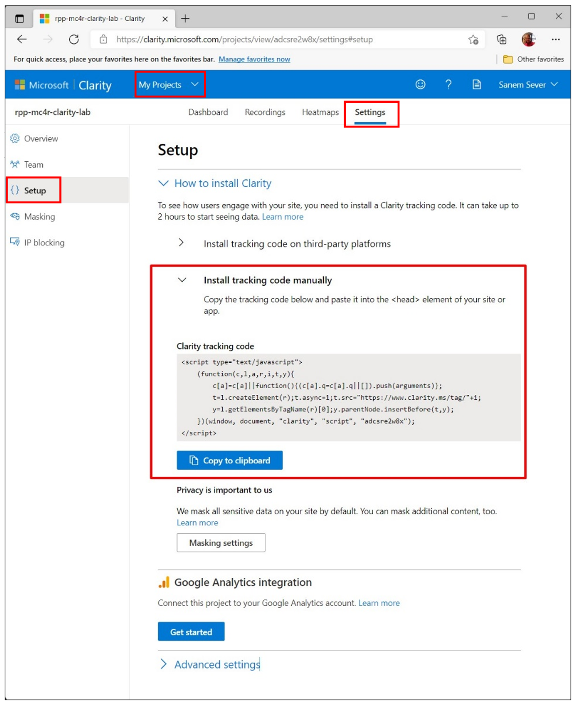
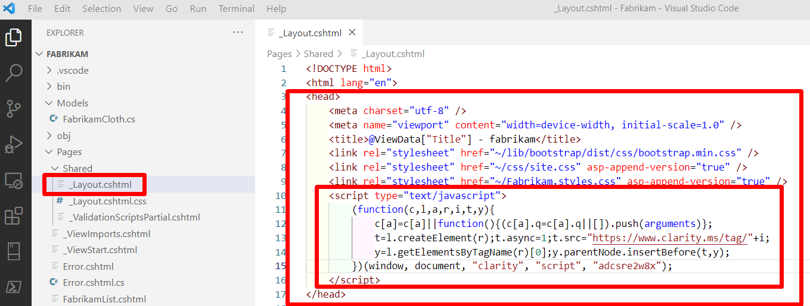
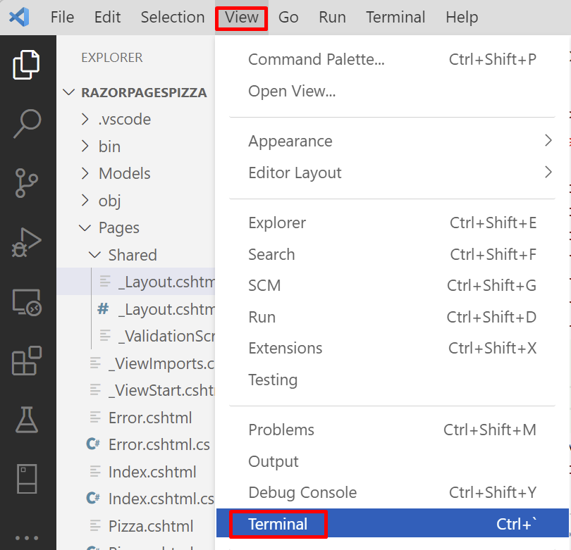
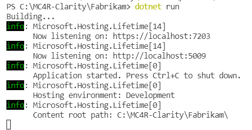
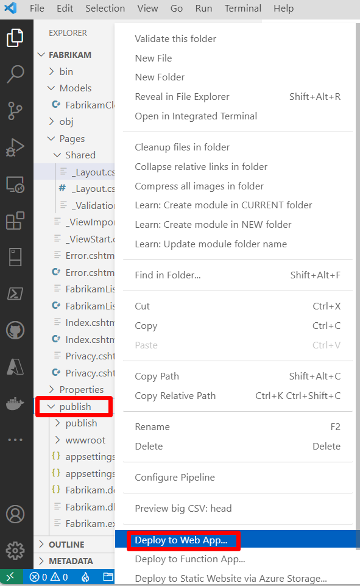

In this exercise, you'll create your Microsoft Clarity project and then set up the Clarity project and your website to complete the integration. 

## Task 1: Sign in to Clarity and create your project
To sign in to Microsoft Clarity and then create your project, follow these steps:
1.  Go to [Microsoft Clarity](https://clarity.microsoft.com/?azure-portal=true). If you have a [Microsoft account](https://account.microsoft.com/account/?azure-portal=true), whether work or personal, select **Sign in**. If you don't have a Microsoft account, select [Microsoft account](https://account.microsoft.com/account/?azure-portal=true) and **Sign up** to create one for free. For the purposes of this lab, you can use your work account because it's a free service.

	> [!div class="mx-imgBorder"]
	> 

1.  Select **Sign in to Microsoft**.

	> [!div class="mx-imgBorder"]
	> 

1.  The following pop-up window will appear, where you can **Add new project**. You can use the project that’s shown in the following screenshot.

	> [!div class="mx-imgBorder"]
	> 

	Alternatively, you can select the **Cancel** button in the lower-left corner or select the **X** in the upper-left corner and then use any **+ Add new project** button, as shown in the following image.

	> [!div class="mx-imgBorder"]
	> 

	The same pop-up window to **Add new project** will appear for all options that are shown in the preceding screenshot.

1.  Fill in the form on the pop-up window with the following details:

    1.  Choose a name for your Clarity project and then enter it in the **Name** field.

    1.  In the **Website URL** field, paste the URL that you previously saved.

    1.  From the **Site category** dropdown menu, choose a website category. You can select **Other** for this sample application, but various other categories are available for you to choose from, such as **E-Commerce**, **SaaS**, **Blog**, **Marketing**, **Consulting**, **Media**, **Education**, **Community**, or **Non-profit**.

    1.  Select **Create**.

	> [!div class="mx-imgBorder"]
	> 

1.  After you select **Create**, you'll be forwarded to the **Setup** section. Copy the **Clarity tracking code** that’s provided for you in the **Install tracking code manually** section to integrate Clarity into your custom website.

	> [!div class="mx-imgBorder"]
	> 

    If you forget to copy the tracking code, you can go to **My Projects**, choose the project that you want to integrate with your website, and then select **Settings > Setup**. In the **How to install Clarity** expandable section, you'll find the tracking code in the **Install tracking code manually** section.

	> [!IMPORTANT]
	> Read the warning under the **Install tracking code manually** section, which states that the data flow from your application to Clarity Portal can take up to 2 hours. Therefore, after performing the steps in this exercise, you’ll continue with other labs and then return to this exercise later, when the data from your application will be synced to Microsoft Clarity.

## Task 2: Embed/install the Clarity tracking code to the custom website and redeploy the website

To embed/install the Clarity tracking code to the custom website and redeploy the website, follow these steps:

1.  Return to Visual Studio Code and expand the **>Pages** sub directory and the **>Shared** sub directory and then select **_Layout.cshtml**. Locate the **<HEAD\></HEAD\>** section, where you'll integrate the tracking code. Paste the tracking code as the last item in the **<HEAD\></HEAD\>** section, as shown in the following screenshot, and then save by using the **Ctrl+S** keyboard shortcut.

	> [!div class="mx-imgBorder"]
	> 

1.  Check locally whether the web application still works properly by using the **Terminal** section of Visual Studio Code. If the **Terminal** window doesn’t display, you can go to the **View** menu and select the **Terminal** menu item to enable it.

	> [!div class="mx-imgBorder"]
	> 

1.  Type `dotnet run` in the **Terminal** screen and then press the  **Enter** key to watch the website build without an error after your change. The result will list local host URLs. You can select one and reach your website from local installation. Use the **Ctrl+C** keyboard shortcut to shut down the local instance.

	> [!div class="mx-imgBorder"]
	> 

1.  To build and create the Clarity-integrated website executables, type `dotnet publish -c Release -o ./publish` and then press the  **Enter** key.

	> [!div class="mx-imgBorder"]
	> 

1.  To redeploy a new version of the website, go to **>publish** in the **Explorer** window, and then right-click to find and select the **Deploy to Web App** menu item.

	> [!div class="mx-imgBorder"]
	> 

1.  If you selected **Yes** when Visual Studio Code asked if you want to "Always deploy same webapp," the following window will appear, where you can select **Deploy**. If this pop-up window doesn’t appear, continue from item **e**.

	> [!div class="mx-imgBorder"]
	> 

1.  If you didn't sign out from the Azure account that you used previously, Visual Studio Code will ask you to select your subscription again. If so, then select the subscription that you used previously.

	> [!div class="mx-imgBorder"]
	> 

1.  Visual Studio Code will ask you to select the web app to redeploy. Select the one that you previously deployed to.

	> [!div class="mx-imgBorder"]
	> 

1.  Browse to your website from your mobile devices and your computer, multiple times. Then, select the URLs, explore the form on the **Cloth Stocks** page, and then add and delete some cloths. This action will create the usage logs and recordings that Clarity will use to build its dashboards, heatmaps, and recordings. You can ask friends or colleagues to explore your website as well.

> [!IMPORTANT]
> Synching the application logs with Microsoft Clarity can take from 30 minutes to two hours. Therefore, after completing this exercise, you’ll start the remaining labs. After completing those labs, you’ll return to this lab and continue with Exercise 3.

Congratulations, you've integrated your custom website with Microsoft Clarity.
