> [!NOTE]
> To start this exercise, you should have created some traffic on your website and waited around 30 minutes (minimum) to reflect the data. If you haven’t met the prerequisites, you can still follow the steps of this exercise by using the publicly available [Microsoft Clarity Demo Project](https://clarity.microsoft.com/demo/projects/view/3t0wlogvdz/dashboard/?azure-portal=true).

In this final task, you'll explore the Microsoft Clarity capabilities to monitor and understand the usage patterns of your own application.

## Task 1: Discover Clarity dashboard capabilities

In this task, you'll sign in to Microsoft Clarity and discover the main dashboard capabilities.

1.  Go to [Clarity](https://clarity.microsoft.com/?azure-portal=true) and sign in.

1.  Select your project.

	> [!div class="mx-imgBorder"]
	> 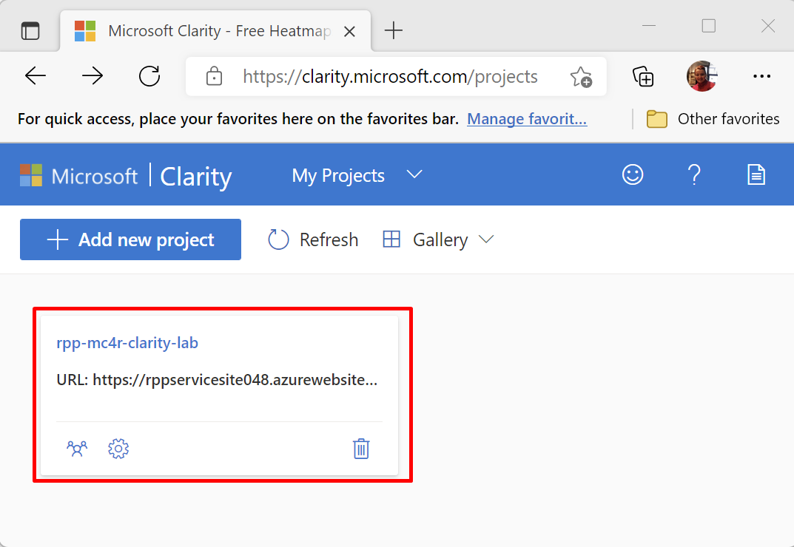

1.  Select the **Dashboard** view and observe the contents of the view.

	> [!div class="mx-imgBorder"]
	> 

    The **Dashboard** view shows the following components:

	- Number of sessions, number of distinct users, pages browsed each session
	
	- Whether the pages are scrolled fully
	
	- The amount of time that people spend on your page and how much of that time was active
	
	- Dead clicks, or the ratio of sessions where a user clicked or tapped with no effect/go nowhere
	
	- Rage clicks, or the ratio of sessions where the user rapidly clicked or tapped in the same small area
	
	- Quick backs, or the ratio of sessions when the user navigated to a page then quickly returned to the previous one
	
	- JavaScript errors, or the ratio of sessions that had a JavaScript error
	
	- Ranked popularity of your application's sub pages
	
	- Main referrers to your site (which sites that users are coming to your page from)
	
	- Device type distribution
	
	- Operating systems distribution
	
	- Browser distribution
	
	- Countries/Region distribution

    You can interact with these Dashboard view contents(modules) and filter the data directly from them as well. Additionally, you can go to other views, such as **Recordings** and/or **Heatmaps** by selecting the camera and fire icons that are shown on the module. The detailed information on **Recordings** and **Heatmaps** will be described in future tasks. Selecting the country/region directly will allow you to filter your dashboard data and view details such as the referrer breakdown for sessions in a specific country/region.

	> [!div class="mx-imgBorder"]
	> 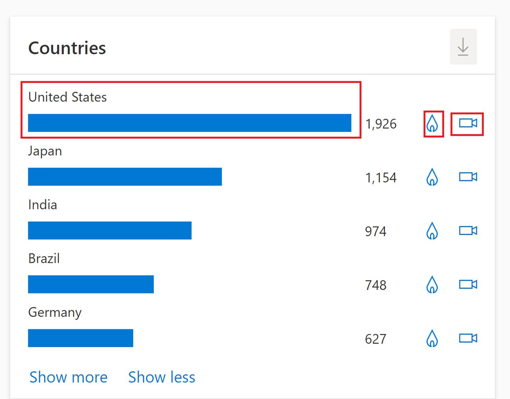

1.  For select Clarity projects (as shown in the following image), you can also view more e-commerce information:

	- Percentage of sessions ended with a purchase (all Shopify sites)

	- Percentage of checkout sessions that were abandoned (all Shopify Pro sites)

	- Most viewed products (all sites that use Product JSON.LD)

	> [!div class="mx-imgBorder"]
	> 

## Task 2: Discover Clarity filtering capabilities and segments

In this task, you'll use the **Filters** feature and then save filters by creating segments. You can use filters in all capability views of Clarity, such as dashboards that you’ve seen or recordings and heatmaps that you'll view in subsequent tasks.

1.  Use **filters** to view data that’s coming from specific interest groups and create **segments** to have specific views for specific purposes.

    1.  On the **My Projects** page, select the **Filters** button.

		> [!div class="mx-imgBorder"]
		> 

    1.  Change the time frame. Go to **User info > Time frame** and select **Last 30 days**. Go to **User info > Device**, choose one of the existing options, such as  **Mobile** (if you have more clicks from any other options, you can choose one of those options instead), and then select **Apply**.

		> [!div class="mx-imgBorder"]
		> 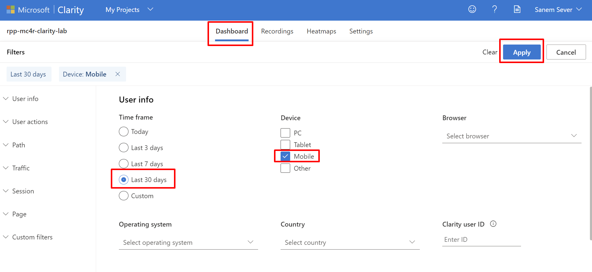

    1.  Select **Save as segment**.

		> [!div class="mx-imgBorder"]
		> 

    1.  A pop-up window will appear, asking whether you want to create a new segment or update an existing one. Select **Save as new**.

		> [!div class="mx-imgBorder"]
		> 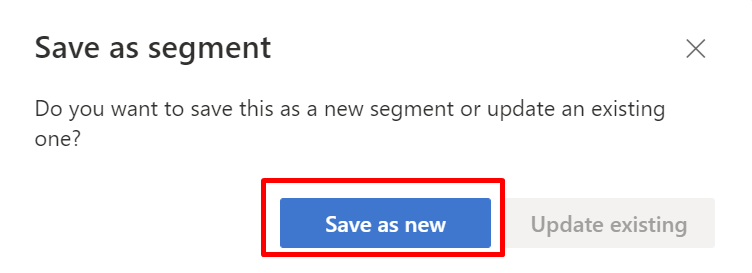

    1.  Choose a name for your segment, enter that name in the **Segment name** field, and then select **Save**. 

    1.  Complete the previous actions for the **PC** device option as well.

    1.  Select **Clear** to clean the remaining filters from the dashboard and return to the default view.

		> [!div class="mx-imgBorder"]
		> 

        Now, you’ll be able to view and change the segments from the **Segments** dropdown list.

		> [!div class="mx-imgBorder"]
		> 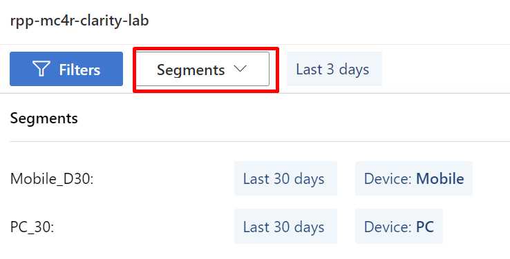

1.  If you integrate with sites that use Product JSON-LD or are hosted on Shopify, you can view more product filters as follows:

	> [!div class="mx-imgBorder"]
	> 

    1. **Price** - Select data for the price value of the product that’s viewed based on the currency that’s used on your site. Choose to view data based on the minimum and maximum values that you enter.

    1. **Brand** - Select data that includes the product brand. This filter helps you view more from the specific brand.

    1. **Product name** - Select data based on a product name.

    1. **Availability** - Select data that includes whether a viewed product was in stock or not. The dropdown list includes **In stock**, **None**, or **Out of stock**.

    1. **Rating** - Select data with an average user rating. Enter the star minimum and maximum rating from one to five.

    1. **Number of ratings** - Select data with the total number of users rated. Enter a numeric value in minimum and maximum count.

    1. **Purchases** - Select the sessions where site visitors did or didn't purchase a product. Choose to view sessions based on **Yes** or **No**.

    1. **Checkout abandonment** - Select sessions where the user abandoned the checkout process at a specific step. Choose to view sessions based on the step in the checkout process that was abandoned.

> [!NOTE]
> Filters **a-f** are available for site instrumenting with Product JSON-LD. Filter **g** is available for Clarity projects of Shopify sites. Filter **h** is available for only Shopify plus sites.

## Task 3: Discover Clarity recording capabilities

Another important capability of Clarity is showing your recordings of user sessions.

1.  Go to [Clarity](https://clarity.microsoft.com/?azure-portal=true) and sign in if necessary.

1.  Select your project.

1.  Select the **Recordings** view and observe the contents in the view. The recordings are tagged with information such as the originating country/region, operating system, device, number of clicks, number of visited pages, and session duration. You can also filter them manually or by creating segments.

	> [!div class="mx-imgBorder"]
	> 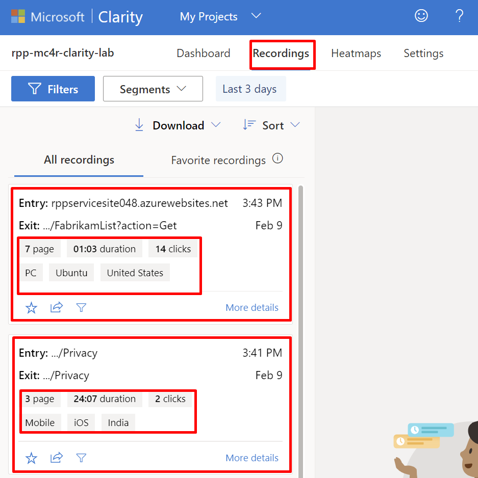

1.  Select the **Mobile** segment and then view one of the recordings. You can watch clicks and scrolls happening, along with mouse movement and hover activity on the page. Also, you can go directly to click moments that are marked on the play bar. This capability is useful in helping you understand how users perceive your webpage and whether they struggle with some menus, buttons, or operations.

	> [!div class="mx-imgBorder"]
	> 

	> [!div class="mx-imgBorder"]
	> 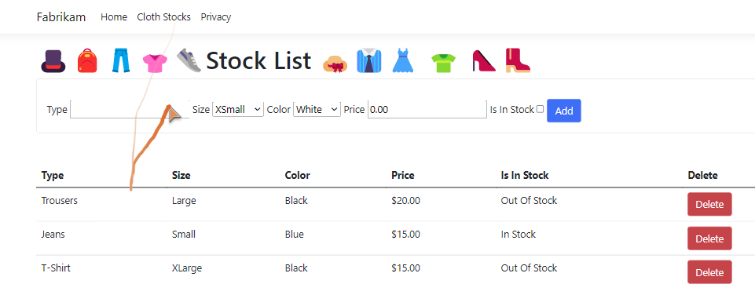

	> [!div class="mx-imgBorder"]
	> 

1.  You can also select **More details** to view more details about the recording. It will show a timeline view of all user clicks on the page, and it will allow you to label the recordings in case you want to find a specific one later. 

	> [!div class="mx-imgBorder"]
	> 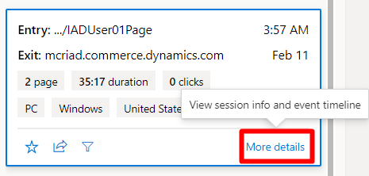

	> [!div class="mx-imgBorder"]
	> 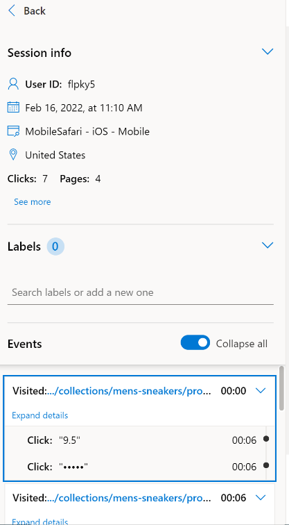

> [!NOTE]
> Clarity provides a **Masking** option, which enables you to mask out certain elements/data on the page that you don’t want to collect from them. 

## Task 4: Discover Clarity heatmap capabilities

Clarity heatmaps allow you to observe locations in your website where users engage the most or the least; in other words, where they click, tap, or scroll. You can analyze this information by device type, such as PC, mobile, or tablet, and you can look at the details by segment filtering and/or custom filters.

For example, you can compare two different heatmaps to understand differences in user behavior after a change in the website UI.

> [!div class="mx-imgBorder"]
> 

1.  Go to [Clarity](https://clarity.microsoft.com/?azure-portal=true) and sign in if necessary.

1.  Select your project.

1.  Select the **Heatmap** view and then observe the contents in the view.

1.  Switch between the **PC**, **Tablet**, and **Mobile** options to discern the difference.

1.  Switch between **Click/Tap**, **Scroll**, and **Area** options to observe the difference.

	> [!div class="mx-imgBorder"]
	> [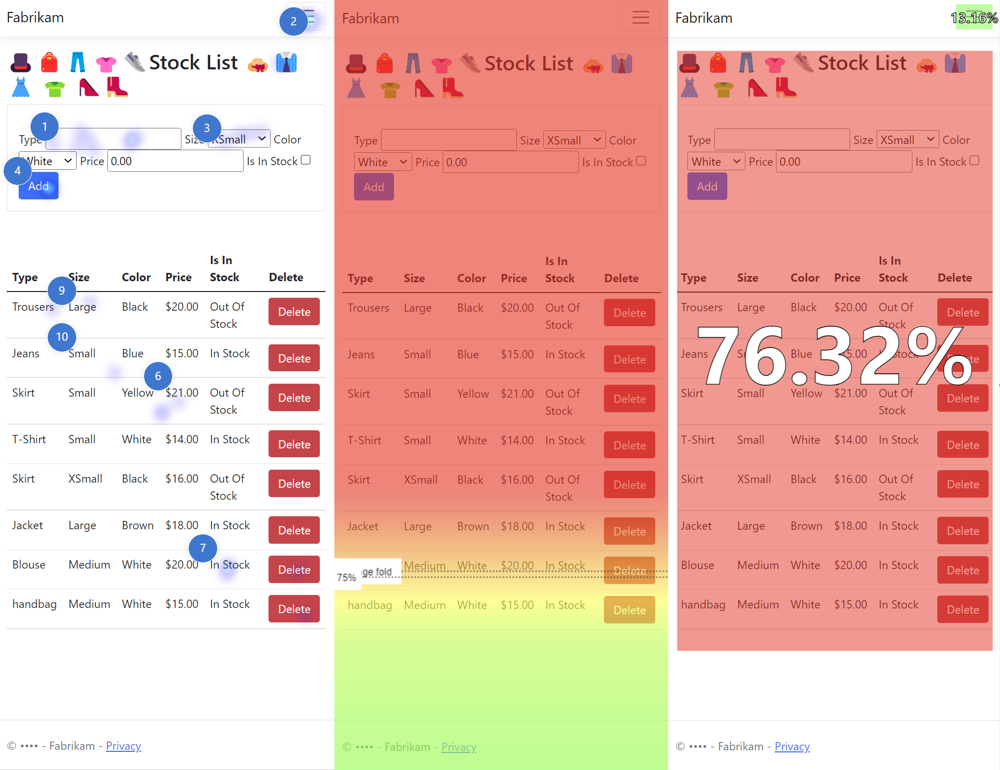](../media/click-tap-scroll-area-maps.png#lightbox)

	-   Select and tap maps help you observe where users are clicking the most, or not at all.
	
	-   Scroll maps show you where users are scrolling to and the percentage of users who do and don't see parts of your site pages.
	
	-   Area maps are aggregate views of click/tap maps. They show you the click rate for a group of elements instead of only one.

1.  To compare two different heatmaps for a different filtering, select **Compare**.

	> [!div class="mx-imgBorder"]
	> 

1.  You can target a specific segment, filter, device, URL, or behavior as your choice.

	> [!div class="mx-imgBorder"]
	> 

    An example comparison is provided in the following image.

	> [!div class="mx-imgBorder"]
	> 

## Task 5: Discover other settings for Clarity

Clarity also provides you with more controls, such as **IP blocking** and **Team** creation.

1.  If you want to eliminate specific IP usage from being captured, you can use the **IP blocking** feature:

    1.  From **Settings**, go to **IP blocking > Block IP address**.

    1.  Enter a descriptive **Name** for the **IP address** that you're blocking and then select **Apply**.

		> [!div class="mx-imgBorder"]
		> 

1.  If you want a team of people to monitor and manage Clarity, you can use the **Team** management feature.

    1.  From **Settings**, go to **Team > Add team member**.

    1.  Fill in the **Email** for the user whom you're adding, select a **Role** (options are **Member** or **Admin**), and then select **Add**.

		> [!div class="mx-imgBorder"]
		> 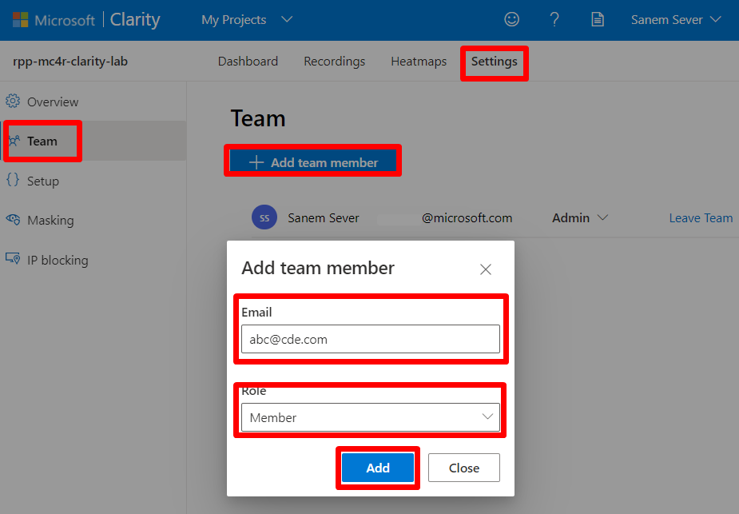

1.  You might want some information to be masked in your recordings. Clarity masks the information that it perceives as confidential, by default, with **Balanced** masking. You can change the masking mode by selecting from three provided options: **Strict**, **Balanced**, or **Relaxed**. Changes won’t be reflected on previous recordings, and it can take an hour for the changes to appear.

	> [!div class="mx-imgBorder"]
	> 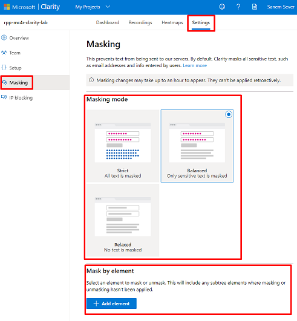

	> [!div class="mx-imgBorder"]
	> 

> [!NOTE]
> You can also mask by using specific CSS elements from your website code. From **Mask by element**, you can enter the **CSS Selector** for the element to be masked and then select **Add**. For example, enter **.class_name** for a class, **#id\_value** for an ID, and **element** for a type. Then, you can adjust whether you want to mask or unmask these specific CSS elements.

> [!div class="mx-imgBorder"]
> 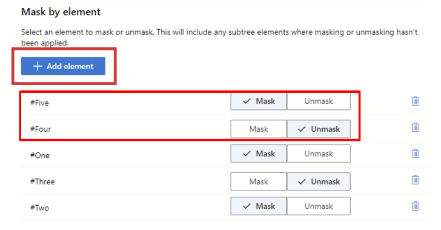

> [!div class="mx-imgBorder"]
> 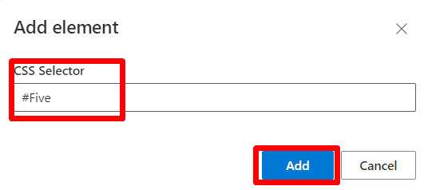

Congratulations, you’ve completed the Clarity lab for Microsoft Cloud for Retail.
