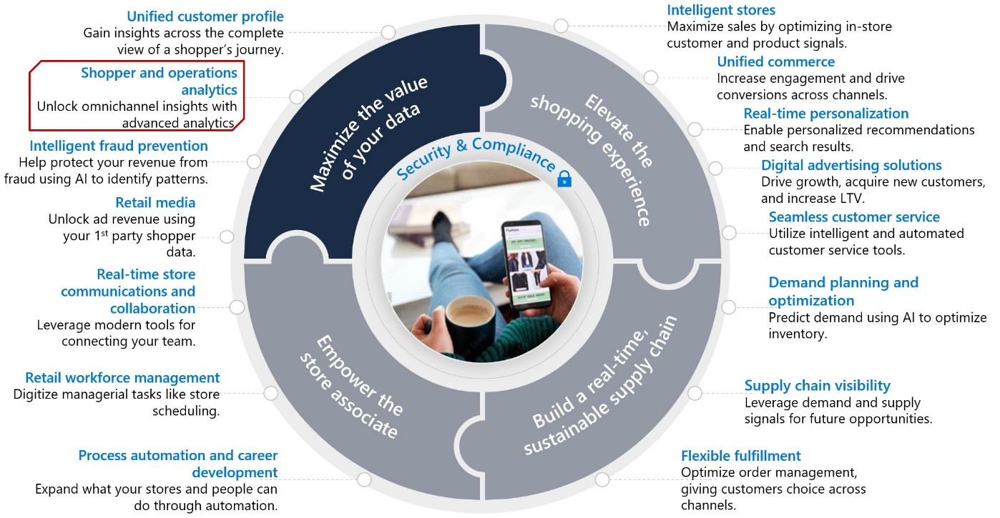
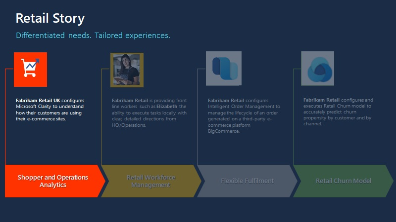
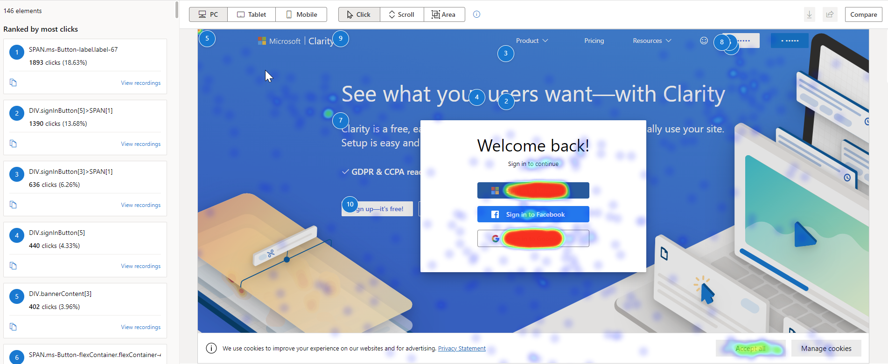
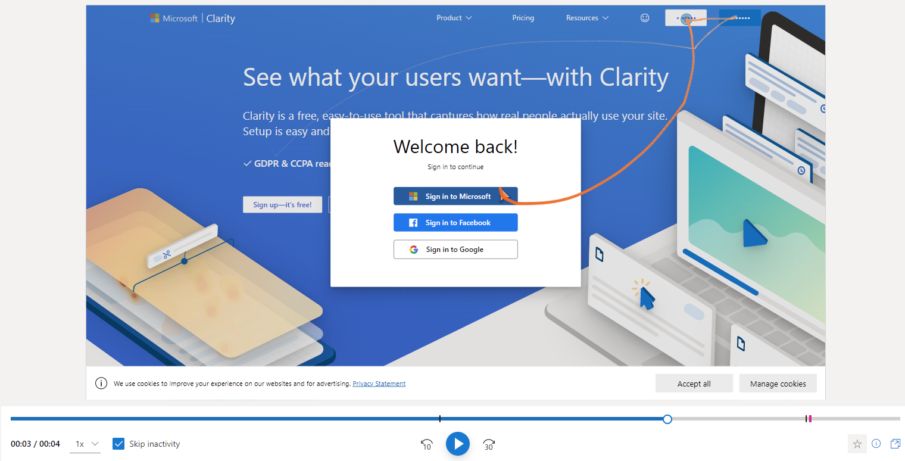
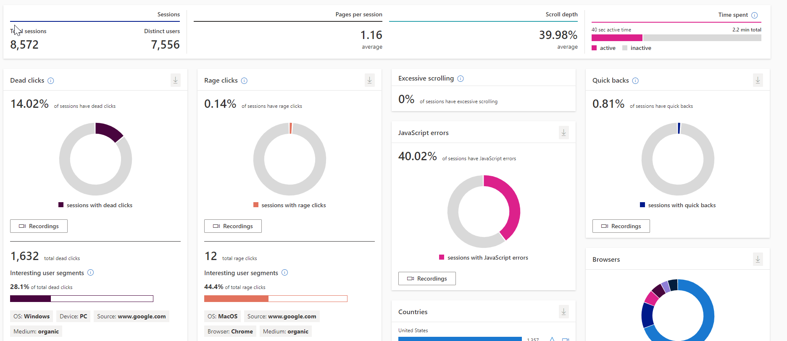
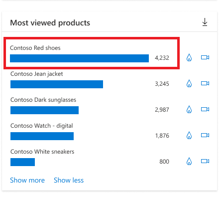

Shopper and operations analytics priority helps you unlock omnichannel insights with advanced analytics. With shopper and operations analytics, you can predict customer and operational needs, monitor and understand online engagement, and unify data integration, warehousing, and analytics.

You can monitor and understand engagement by:

-   Using the Heatmap feature to determine where your site generates the most clicks, what people are ignoring, and how far they're scrolling.

-   Observing how customers use your site with anonymized, hi-definition recordings. Additionally, you can discover user frustrations by documenting rage clicks, dead clicks, and quick-backs with behavior-focused insights, allowing you to develop solutions more efficiently.

-   Learning about customer engagement by using built-in web and mobile analytics and return customer activity recognition, allowing you to create custom reports and views based on real-time customer behavior data.

> [!div class="mx-imgBorder"]
> 

## Learning objectives

This module will focus on the retail story of Fabrikam Retail.

> [!div class="mx-imgBorder"]
> 

In this module, you'll assume the role of a system administrator of Fabrikam UK website. Fabrikam UK is using an ASP.NET website. You want to track, monitor, and analyze the user behavior on both websites to provide a better user experience. For that purpose, you'll integrate both websites with Microsoft Clarity.

> [!NOTE] 
> For the sake of Azure deployment simplicity, you’ve been provided with a basic, multipage, no image-containing web application to represent the Fabrikam UK website.

In this module, you'll learn how to:

-   Create a Microsoft Clarity project.

-   Integrate Microsoft Clarity with a custom website.

-   Interact with Microsoft Clarity dashboards, heatmaps, and recordings.

**Bonus learning opportunity** - Because part of this module needs an up-and-running sample website to do the integration, you'll also learn how to deploy an ASP.NET website to Microsoft Azure App Service with Visual Studio Code in the upcoming exercises.

## Microsoft Clarity

[Microsoft Clarity](https://clarity.microsoft.com/?azure-portal=true) is a free behavioral analysis tool that helps you understand user interaction with your retail website. By using Clarity's analysis tools, you can monitor how your website is used on different platforms, such as PC, mobile, and tablet. Through dashboard insights, session recordings, and heatmaps, Clarity helps you identify usability requirements of your website by allowing you to study user behavior, and enhance your website for clients and business.

Microsoft Clarity focuses on the **Shopper and operations analytics** part of the **Maximize the value of your data** priority scenario of Microsoft Cloud for Retail. It provides insight on your website’s usage patterns as an e-commerce web shop that’s built on [Microsoft Dynamics 365 Commerce](/dynamics365/commerce/?azure-portal=true), a custom e-commerce website, or a website for providing information about your physical shop.

Clarity supports almost any site in any modern browser by using a provided code snippet. You can monitor and understand user engagement by using the following features:

### Heatmaps

Each website has elements to encourage engagement with visitors. The heatmap shows where site visitors are spending their clicks and let's you check if that's the path you're expecting the user to take. Clarity tracks all visitor clicks and scrolls on mobile, desktop, and tablet, and it automatically generates a heatmap. This data helps you identify the most engaged areas and figure out gaps. For example, you can identify if users aren't scrolling down to view valuable information on pages.

> [!div class="mx-imgBorder"]
> 

### Session recordings

Session recordings give a masked view of the user's exact experience. You can observe how customers use your site with anonymized, hi-definition session recordings. You can view the order in which the user navigated or completed tasks. Recordings allow you to analyze user behavior throughout a session. You can replay user actions to understand their perspective, traffic source, session timing, and so on. You can group user sessions through filters and segments. Additionally, you can discover user frustrations by documenting rage clicks, dead clicks, and quick-backs with behavior-focused insights, allowing you to develop solutions more efficiently.

> [!div class="mx-imgBorder"]
> 

### Machine learning insights

Clarity Insights are machine learning based filters and recommendations on what content should be most important for you. The dashboard is helpful for designers, product managers, marketers, and web developers. Through the dashboard, you can understand the users without analyzing the ocean of data from user interactions. The dashboard shares important demographic information about site visitors. You can learn more about the location of your users, how long they spend on your site, and if they're efficiently navigating your site. You can learn about customer engagement by using built-in web and mobile analytics and return customer activity recognition. This data allows you to create custom reports and views based on real-time customer behavior. Deep AI and machine learning algorithms power insights to help you analyze user behavior efficiently.

> [!div class="mx-imgBorder"]
> 

### Product information filters

Product information filters are useful for retail sites because they allow you to filter data from product sessions that matched with the corresponding criteria. This data includes criteria about product name, price, brand, availability, average rating, and number of ratings.

For more information, see [E-Commerce Insights Products](/clarity/e-commerce-insights/?azure-portal=true#products).

Now that you've learned some basics, watch the following video for a demonstration of Clarity in action.

> [!VIDEO https://www.microsoft.com/videoplayer/embed/RWVmnA]

> [!NOTE]
> Clarity won't impede your site's performance. There are no limits on the number of sites for each account. Clarity can scale to support even the largest websites. Clarity processes more than 1 petabyte of data from over 100 million users each month. Also, no traffic limits are placed on these sites. Data is analyzed and ready to view in near real time so that you don't have to wait. For more information, see [Set up Clarity manually](/clarity/clarity-setup/?azure-portal=true).

## Manage Clarity projects

Clarity allows you to have as many projects as you need, and you can manage them from a central location. After you've created a project, you're the Administrator and only administrators can modify project settings. You can select the project that you want to won and manage settings such as name and category, the team, setup, masking, and IP blocking.

### Support team collaboration

You can invite other users to be members of the project. The following image shows how you can manage the project's team members.

:::image type="content" source="../media/team.png" alt-text="Screenshot of the Microsoft Clarity Team page showing the Add team member button.":::

### Review information for setup

On the project setup, you can get the code snippet that needs to be on your site. Additionally, you can set up Google Analytics integration and use of cookies. Integrating your Clarity project with Google Analytics allows Clarity to link session playbacks with your Google Analytics dashboard. After you've identified the sessions that you need more information on, go to Google Analytics Dashboard to debug and understand user pain points.

:::image type="content" source="../media/setup.png" alt-text="Screenshot of Setup with Advanced settings expanded to show Cookies, and How to install Clarity expanded to show Install tracking code manually.":::

### Review and edit masking options

Clarity masks all sensitive content on your website by default. The sensitive content includes all input box content, numbers, and email addresses. Clarity doesn't capture masked content. You can modify the configuration to choose what Clarity will track by either masking or unmasking it.

:::image type="content" source="../media/masking.png" alt-text="Screenshot of Masking options Masking mode and Mask by element.":::

