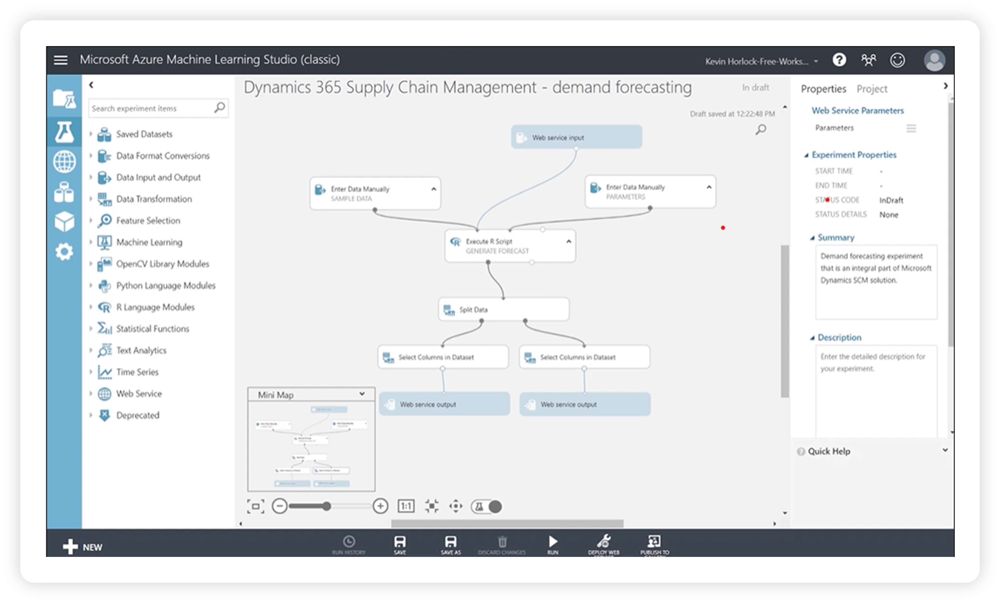
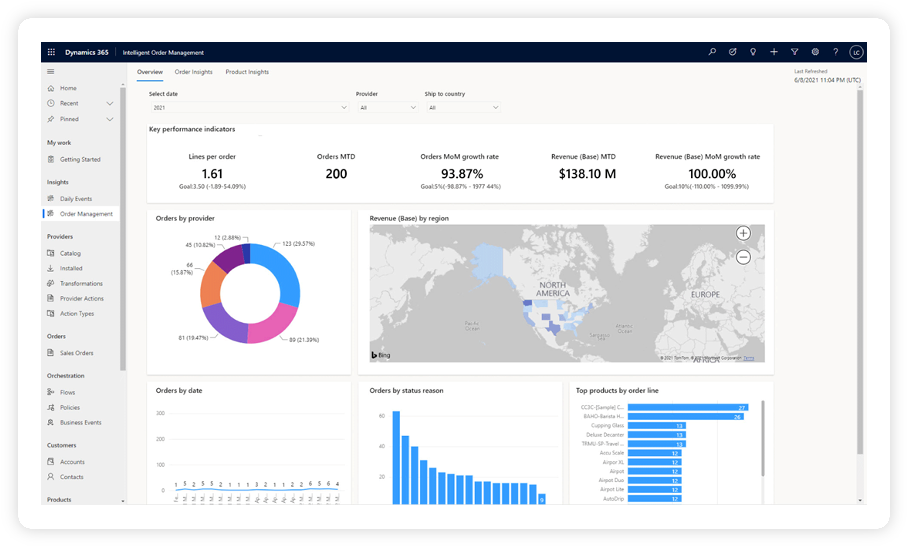
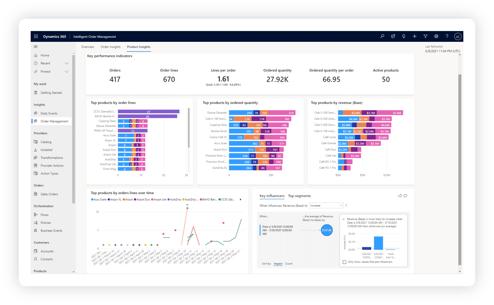

Microsoft Cloud for Retail uses a combination of Microsoft products to address the industry-prioritized scenarios that are focused on building a real-time, retail supply chain. 

### Demand planning and optimization

In this dynamic and shifting market, demand planning and optimization are more challenging than before. Planning optimization ensures correct inventory distribution at all points of the supply chain, from factory lines to shipping. You can set up and automate the real-time planning engine to optimize replenishment based on priority. This approach enables businesses to increase service levels and reduce inventory levels. Additionally, businesses can optimize their supply chains by prioritizing replenishment orders to ensure that urgent demand is prioritized over less important demand. Companies can replan multiple times a day within minutes, instead of waiting eight hours or overnight for a complete Materials Requirements Planning (MRP) run.

With demand planning and optimization, AI helps you:

- Plan for a dynamic and shifting market.
- Optimize your inventory and agile distribution and manufacturing processes.
- Automate replenishment.
- Reduce waste and unnecessary emissions.

> [!div class="mx-imgBorder"]
> 

With this capability, you can have access to real-time inventory visibility:

- Use AI-enriched demand forecasting to help ensure on-time delivery of the correct product and near-real-time production planning to eliminate stockouts.
- Deliver cross-channel inventory visibility and maintain accounting ledgers globally in near-real time.

You can invest in planning optimization, even during disruption:

- Respond intelligently to dynamic shifts in supply and demand with prescriptive analytics by using unified, real-time data from data providers, partners, customers, and suppliers.
- Optimize operations, material handling, workforce planning, and inventory flow with integrated warehouse management.
- Scale distribution during peaks and keep critical warehouse processes running at high throughput, all while ensuring business continuity even when you're disconnected from the cloud.

> [!div class="mx-imgBorder"]
> 

Finally, you can acquire intelligent order management:

- Respond quickly to changing requirements with user-friendly journey orchestration-designer tools to modify the order journey.
- Orchestrate a touchless order system by using architecture for the intake of orders from any e-commerce/electronic order system.
- Deploy a visual interface that lets business users quickly change order-management rules across multiple channels.

### Supply chain visibility

Improving visibility is key to a robust supply chain. Retailers are sitting on a treasure trove of data from across their supply chain, and many can't use it to their full advantage. Supply chain visibility can help you use supply and demand signals for future opportunities.

With supply chain visibility, you can reduce stockouts, automate and optimize fulfillment, boost sustainability, and improve decision-making.

> [!div class="mx-imgBorder"]
> 

With intelligent decision making, you can:

- Use a digital supply chain twin to perform "what-if" simulations, multi-tier supplier visibility, and advanced analytics that are powered by AI.
- Respond to dynamic shifts in supply and demand with prescriptive analytics by using unified, real-time data from data providers, partners, customers, and suppliers.

You can also expect streamlined collaboration:

- Work seamlessly with existing planning and implementation systems, and invite suppliers and partners to more securely receive and share data on one platform.
- Improve collaboration with suppliers, partners, and team members to identity risks early and plan for supply and resource constraints.

You can accomplish these tasks with centralized management:

- Accelerate time-to-market by centrally managing product information and providing a platform for engineers to collaborate with planners.
- Manage product quality more effectively by predicting and resolving quality issues quickly.
- Increase organizational agility by automating and optimizing fulfillment with rules-based orchestration, real-time inventory management, and AI.

### Flexible fulfillment

Flexible fulfillment is the last capability in supply chain, and it can help you optimize order management to give customers choices across channels.

With flexible fulfillment, you can streamline curbside pickup and buy-online-pickup-in-store operations, provide customers with real-time inventory and order status, and gain greater control of the entire order life cycle.

> [!div class="mx-imgBorder"]
> 

Flexible fulfillment helps you offer an enhanced customer experience:

- Streamline returns management and enable flexible return scenarios.
- Use AI and anomaly detection models to identify and address fulfillment constraints and improve delivery times while reducing costs.
- Give customers ordering flexibility, such as home delivery, curbside pickup, and pick up in-store, with connected ordering and fulfillment tools.
- Offer real-time inventory availability and order status with AI, providing a single solution to order-fulfillment orchestration.

Additionally, you gain seamless inventory management:

- Access a single global view of your inventory positions in real-time to ensure that the correct products are available in the right place at the right time.
- Track inventory across channels and make informed inventory supply decisions with advanced analytics and machine learning.
- Use the **Tasks** app in Microsoft Teams to assign associates to stock count, allowing for real-time numbers.

For more information, see the [Official Microsoft Cloud for Retail documentation](/industry/retail/overview).