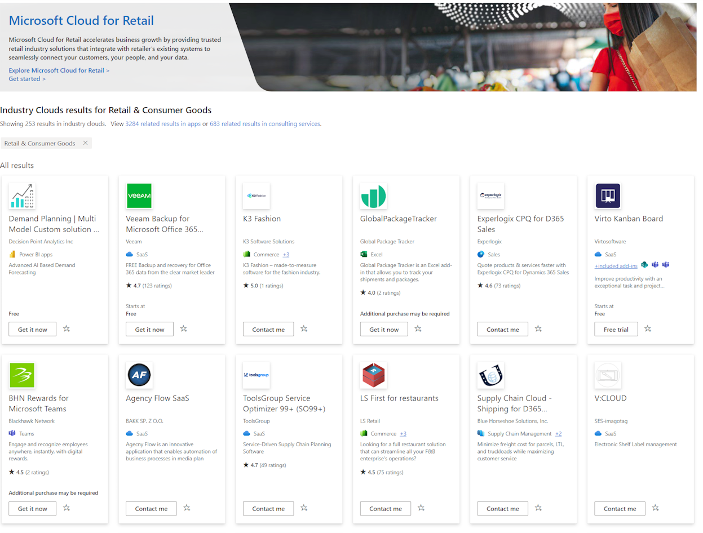

Microsoft Cloud for Retail offers various deployable and configurable solutions and components based on the capabilities you wish to adopt. These solutions are built on capabilities within Microsoft Dynamics 365, Microsoft 365, Microsoft Azure, and Microsoft Power Platform. Each solution has dependencies on other apps and solutions that might require more licenses. 

## Deploy Microsoft Cloud for Retail 

To deploy the solutions from Microsoft Cloud for Retail, you start at the [Microsoft Cloud Solution Center](https://solutions.microsoft.com). You must be a Microsoft Power Platform admin, Dynamics 365 admin, or a tenant admin to deploy solutions in Solution Center. 

You also need licenses for the technologies supporting the Cloud for Retail solutions you're deploying. If your organization doesn't have the necessary licenses, you're notified during the deployment process. For more information, see [How to get Cloud for Retail solutions](/industry/retail/buy).

For more information on the deployment process and post-deployment considerations, see [Set up and configure Microsoft Cloud for Retail](/industry/retail/configure-cloud-for-retail/?azure-portal=true). 

Microsoft Cloud for Retail specifies product requirements for each scenario and feature. These capabilities and solutions are outlined in the following tables; optional capabilities and features aren't included in this learning path.

### Scenario: Maximize the value of your data

Realize the true value of your data by unifying disparate data and ecosystems across the shopper journey, uncovering insights and optimization throughout.

| Capability | Description | Solutions included |
| ----- | ------ | ------ |
| Unified customer profile | Gain insights across the complete view of a shopper's journey | Dynamics 365 Customer Insights    Retail channel churn model |
| Shopper and operations analytics | Unlock omnichannel insights with advanced analytics. | Smart Store Analytics    Dynamics 365 Customer Insights    Azure Synapse Analytics    Microsoft Clarity |
| Retail media | Unlock ad revenue using your shopper data. | Microsoft PromoteIQ |

For more information, see [Maximize the value of your data](/industry/retail/maximize-data).

### Scenario: Elevate the shopping experience

Transform the shopping experience through data analytics, and store technology for creating more engaged shoppers with stronger customer lifetime value.

| Capability | Description | Solutions included |
| ----- | ------ | ------ |
|Intelligent stores | Maximize sales by optimizing in-store customer and product signals. | Smart Store Analytics |
| Unified commerce| Increase engagement and drive conversations across channels. | Dynamics 365 Commerce    Azure Cognitive Search |
| Real-time personalization | Enable personalized recommendations and search results to improve customer engagement and product discovery. | Microsoft Intelligent Recommendations    Azure Cognitive Search    Dynamics 365 Marketing |
|Digital advertising solutions | Enhance your advertising to drive growth and acquire new customers. | Microsoft Advertising |
|Seamless customer service | Utilize intelligent and automated customer service tools to improve the customer experience. | Dynamics 365 Commerce    Omnichannel for Customer Service    Power Virtual Agents |

For more information, see [Elevate the shopping experience](/industry/retail/elevate-shopping-experience).

### Scenario: Build a real-time, retail supply chain

Create an agile, resilient, and sustainable supply chain by connecting data across your ecosystem for identifying issues and optimizing performance.

| Capability | Description | Solutions included |
| ----- | ------ | ------ |
| Demand planning and optimization| Predict demand using AI to optimize inventory. | Dynamics 365 Supply Chain Management    Microsoft 365 Teams for Frontline Workers |
| Supply chain visibility | Use demand and supply signals for future opportunities. | Dynamics 365 Supply Chain Management    Dynamics 365 Supply Chain Insights    Dynamics 365 Intelligent Order Management    Microsoft 365 Teams for Frontline Workers |
| Flexible fulfillment | Optimize order management, giving customers a choice across delivery channels. | Dynamics 365 Commerce    Dynamics 365 Intelligent Order Management    Dynamics 365 Supply Chain Management    Microsoft 365 Teams for Frontline Workers |

For more information, see [Build a real-time, retail supply chain](/industry/retail/supply-chain).

### Scenario: Empower the store associate

Equip your frontline workforce with solutions that increase customer satisfaction while you help reduce their burden so that you can invest in your team's growth.

| Capability | Description | Solutions included |
| ----- | ------ | ------ |
| Real-time store communication and collaboration| Use modern tools for connecting your team. | Microsoft 365 Teams for Frontline Workers | 
| Retail workforce management | Automate managerial tasks such as store scheduling. | Store Operations Assist    Microsoft 365 Teams for Frontline Workers |
| Process automation and career development | Expand what your stores and people can do through automation. | Microsoft Viva Learning    Microsoft Viva Insights    Microsoft Viva Connections |

For more information, see [Empower the store associate](/industry/retail/empower-store-associate).

## Extend Microsoft Cloud for Retail 

Microsoft's ecosystem of trusted retail partners enriches this cloud offering. They add and extend capabilities, which increases customer value. This collaboration between Microsoft and the partner ecosystem empowers customers to meet their own unique needs. To explore partner solutions that are offered for Microsoft Cloud for Retail, go to [Microsoft AppSource](https://appsource.microsoft.com/marketplace/cloudsIndustry?page=1&industry=retail-and-consumer-goods&azure-portal=true).

> [!div class="mx-imgBorder"]
> 