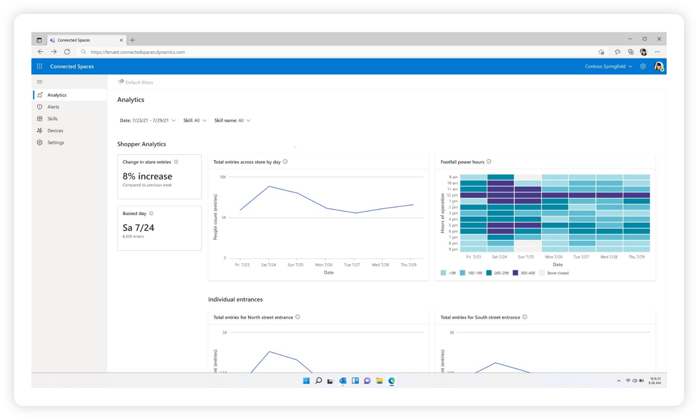
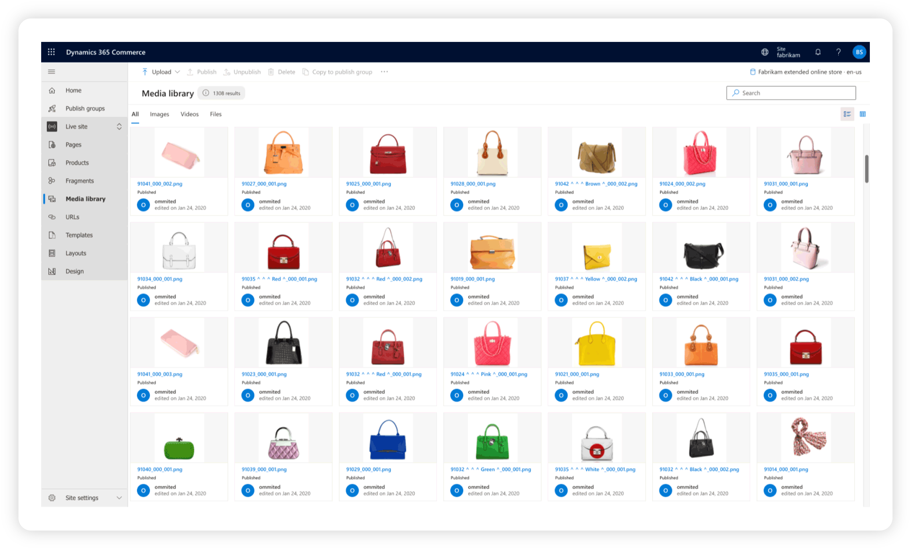
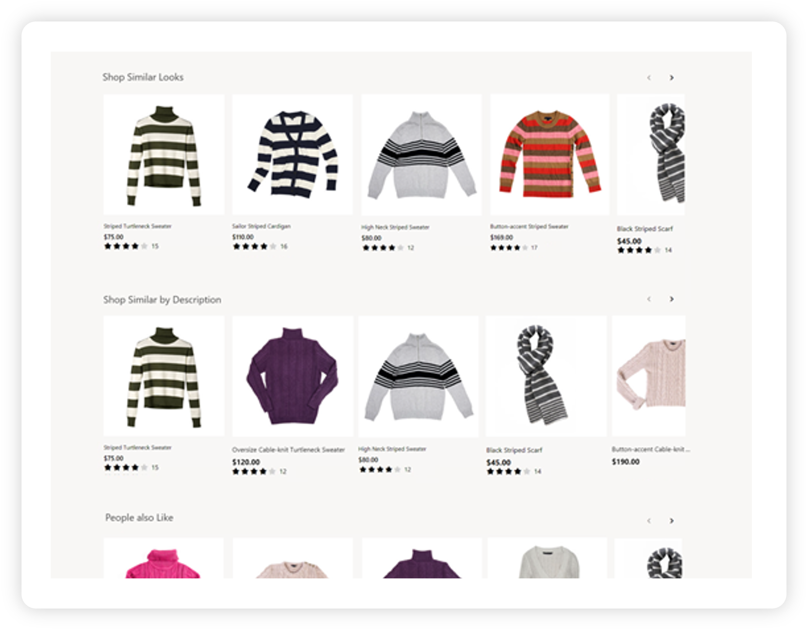
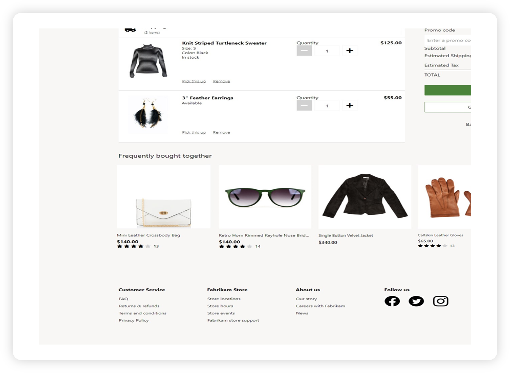
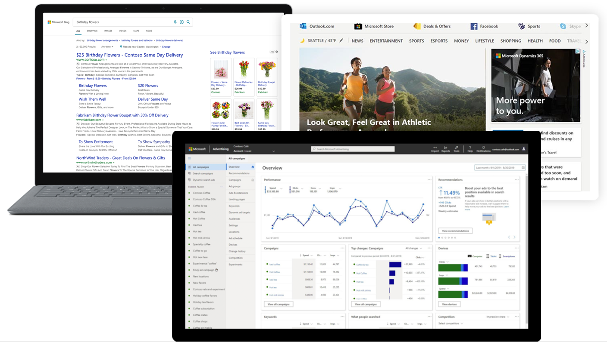
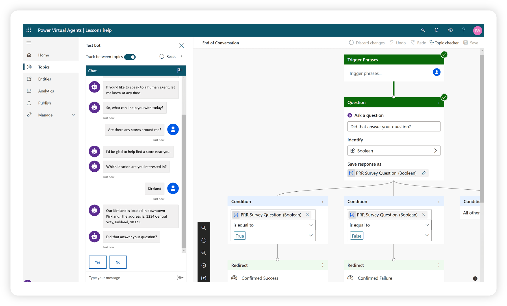

Microsoft Cloud for Retail uses a combination of Microsoft products to address the industry-prioritized scenarios that are focused on elevating the shopping experience. 

### Intelligent stores

Intelligent stores help you protect your revenue from fraud by using AI to identify patterns.

With intelligent stores, you can maximize sales by optimizing in-store customer and product signals.

> [!div class="mx-imgBorder"]
> 

With intelligent stores, you can use actionable insights to improve sales:

- Use prebuilt AI models and existing cameras to unlock trends, patterns, and new data.
- Improve customer and employee experiences with features such as traffic patterns for optimal staffing placement, product display performance, and built-in alerts, to gain real-time insights.
- Deploy scenario-based AI models or skills such as display effectiveness, queue management, and shopper analytics, to target specific business opportunities and pinpoint trouble areas.

Additionally, intelligent stores help you gain a single view into insights, where you can seamlessly view data-driven insights and alerts with a single, unified dashboard.

### Unified commerce

Unified commerce can help increase engagement and drive conversions across channels.

With unified commerce, you can connect operations, enhance and personalize customer experiences, and connect physical and digital storefronts.

> [!div class="mx-imgBorder"]
> 

Unified commerce can allow you to engage across channels:

- Operate on a flexible, unified commerce platform that allows you to connect digital, in-store, and internal operations, with the ability to expand to fit business needs.
- Unify physical and digital storefronts, providing a single view of transactions, observational data, and behavioral data for customers.
- Access real-time omnichannel sales and cost data to centrally manage promotions across all channels. Track inventory across channels to make informed inventory supply decisions with advanced analytics and machine learning.

Additionally, unified commerce can help you predict and personalize to drive conversions:

- Predict customer demand with actionable insights that are provided by historical sales and purchase data.
- Use a modern retail POS and AI-driven recommendations to enhance and personalize the customer experience and to help them discover what's relevant to them.

### Real-time personalization

Real-time personalization helps you enable personalized recommendations and search results.

With real-time personalization, you can help drive conversion and make it easier for customers to find what they're looking for. Additionally, you can offer more relevant options.

> [!div class="mx-imgBorder"]
> 

With real-time personalization, you can offer customers the ability to shop similar looks and similar descriptions:

- Implement popular discover scenarios like **Bring the Look** and **Shop Similar Looks** by using world-class AI machine learning to deliver personalized results.
- Provide relevant discovery from existing user behavior data or item metadata, whether it's structured or unstructured data.

Concurrently, you can offer real-time recommendations:

- Enable personalized product recommendations (not standard, generic recommendations) and customer insights by using modern machine-learning algorithms.
- Use semantic search capability to understand the intent of your customers' searches, offer improved search results, and drive deeper customer engagement.
- Help customers and sellers find products online and in store with intelligent product search.

> [!div class="mx-imgBorder"]
> 

Real-time personalization also introduces hyper-personalized customer journeys, where you can:

- Learn about the customer journey so far and provide the next best action based on your datasets and insights.
- Create multi-touchpoint, personalized journeys by using demographics and behaviors to orchestrate experiences across marketing, commerce, sales, and service.

Moreover, you can have an elevated experience across all channels:

- Experience a quick onboarding process with codeless tooling paired with extensible application programming interfaces (APIs), allowing seamless integration into any ecosystem.
- Deploy capabilities anywhere: e-commerce sites, in-store, email, social media, and more. Align teams across your company by sharing a single, real-time view of customer context.

### Digital advertising solutions

Digital advertising solutions can help drive growth, acquire new customers, and increase lifetime value.

With digital advertising solutions, you can optimize your campaigns across channels, find new customers, increase current customer loyalty, and build stronger customer relationships.

> [!div class="mx-imgBorder"]
> 

You can use digital advertising solutions to propel growth:

- Use Microsoft AI to automatically fine-tune your performance across various channels, aligning with your objectives and budget constraints.
- Use a unified dashboard to monitor the effectiveness of your digital marketing strategies and make necessary adjustments.
- Review and give approval for paid and live ads across various channels in a matter of minutes.

Furthermore, you can engage new and loyal customers:

- Build stronger relationships with your customers by engaging them directly through their preferred online channels (Bing.com, Yahoo.com, AOL.com, DuckDuckGo.com, MSN.com, Outlook.com, and other top publishers).
- Create personalized experiences by using powerful audience intelligence and platform capabilities to boost acquisition of new customers and increase customer loyalty.

### Seamless customer service

Seamless customer service can help you use intelligent and automated customer service tools.

With seamless customer service, you can eliminate problems before they arise, tailor customer engagements, and free up live agents to manage complex problems.

> [!div class="mx-imgBorder"]
> 

With this capability, you can offer help anytime with AI-powered chatbots:

- Create AI-powered chatbots that can resolve common issues and answer questions all day, every day.
- Integrate your chatbots with the products and services that you use daily by allowing them to look up records, hand off conversations to live agents, and call APIs.
- Create personalized conversations with distinct articles by using natural language understanding and entity extraction.
- Monitor and improve your chatbot's performance by using AI and data-driven insights.

You can also extend personalized assistance and tailor customer engagement by providing at-a-glance customer history. You can use AI to classify, prioritize, and assign customers across all channels to the most qualified agent.

> [!div class="mx-imgBorder"]
> 

Furthermore, you can provide smarter services:

- Elevate agent effectiveness with tools, such as giving the option to work across multiple open cases and using Microsoft Teams to connect with subject-matter experts.
- Use the Internet of Things (IoT) to send remote commands to resolve issues quickly and to identify devices in need of attention.
- Build custom workflows by using Microsoft Power Automate and create complex scenarios with Microsoft Bot Framework.

Finally, you can empower customers to resolve issues on their own by providing self-service support with virtual agents, knowledge-base portals, and community support forums.

For more information, see the [Official Microsoft Cloud for Retail documentation](/industry/retail/overview).