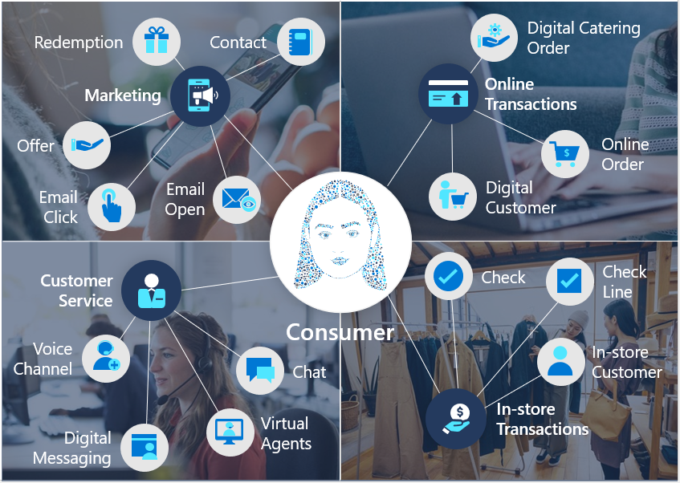
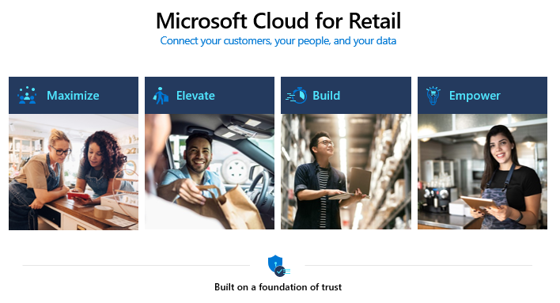
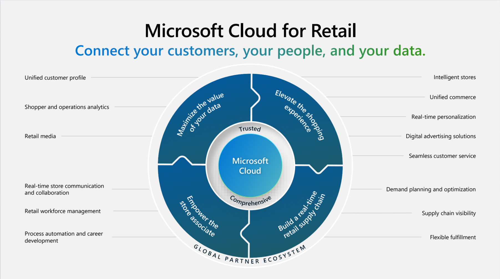

Microsoft Cloud for Retail provides capabilities to help you manage retail data at scale. Additionally, it helps make it easier for retail organizations to improve the customer experience and drive operational efficiency, while helping support security, compliance, and interoperability of retail data.

The following sections explain how retail is currently in transition and how Microsoft Cloud for Retail is helping transform the retail journey.

## Retail industry and shifting priorities

The retail industry is facing a number of challenges trying to ensure the future of retail is meeting today’s consumer needs:

**Personalization**: Providing a personalized experience to customers can be difficult for retailers, especially for those organizations with a large customer base. It requires the ability to gather and analyze customer data, and then use that information to tailor the shopping experience to each individual customer.

**Omnichannel integration**: With customers using various channels to shop (for example, online, in-store, mobile), retailers must ensure that their systems are seamlessly integrated across all channels to provide a consistent experience.

**Data management**: Retail organizations need to be able to effectively manage and analyze large amounts of data in order to make informed decisions about their operations and customer experience.

**Inventory management**: Retailers must be able to effectively manage their inventory in order to ensure that they have the right products available at the right time. This requirement can be challenging, especially in an era of fast-changing consumer demand.

**Supply chain management**: Retailers must be able to efficiently manage their supply chain in order to get products to customers in a timely manner. Various factors, including long lead times, unpredictable demand, and a complex network of suppliers complicates this requirement. 

> [!div class="mx-imgBorder"]
> 

## Microsoft Cloud for Retail 

In response to the industry's focus on cloud services, Microsoft has prioritized the development of services that are specific to the industry. Microsoft Cloud for Retail is a collection of proven tools to connect your customers, your people, and most importantly, your data. Microsoft Cloud for Retail is built on a foundation of privacy, security, and regulatory compliance across Microsoft and the partner ecosystem.

Microsoft Cloud for Retail accelerates business growth by providing trusted retail industry solutions that integrate with retailer’s existing systems. Through this complete set of retail specific capabilities across the Microsoft Cloud portfolio, in addition to partner solutions, it becomes possible to seamlessly connect your customers, your people, and your data. Microsoft Cloud for Retail brings together different data sources across the retail value chain and connects experiences throughout the shopper journey using capabilities from Dynamics 365, Microsoft 365, and Azure.

With Microsoft Cloud for Retail, you're using retail data models to bring multiple systems and applications together by providing a shared language for your applications. This approach helps simplify data management and app development by unifying data into common formats and applying consistency across multiple apps and deployments.

Microsoft Cloud for Retail is supported with retail industry-specific data models, APIs, and an ecosystem of partners that are purpose-built for retail-specific scenarios. All of these components are built on a foundation of trust. Your customers and your data are vital to you, so it's imperative that you own and control it at every stage. Microsoft supports that ideal with identity and data privacy and security. Microsoft's approach to security, compliance, and privacy includes protecting identities and endpoints, defending against threats, securing cloud infrastructure, protecting and governing sensitive data, and using integrated regulatory compliance tools.

## Priority retail scenarios

 Microsoft Cloud for Retail is an industry-specific cloud that introduces capabilities for retail customers across the following four key scenarios:

> [!div class="mx-imgBorder"]
> 

- **Maximize the value of your data** - Retailers are challenged to unify vast and increasing amounts of data across various sources that don't necessarily communicate well with one another. Maximizing the value of your data is about unifying these data sources to realize greater value across your enterprise.

- **Elevate the shopping experience** - Retail customers demand experiences tailored to their tastes and give respect to their time and energy. These tools help foster stronger customer relationships, increase online and offline cart size, and drive loyalty.

- **Build a real-time, retail supply chain** - Currently, supply chain stability and agility are perhaps the most pressing frontiers for retail organizations around the world. As a result, Microsoft has core solutions that include AI to provide visibility across your entire supply chain and to predict and manage changes in supply and demand at all points.

- **Empower the store associate** - Microsoft provides modern work solutions that help manage burnout so that store associates can be as effective and empowered as possible. You can equip your retail workforce with solutions to increase customer satisfaction while reducing the burden on your frontline and empowering your team's growth.

## Featured retail capabilities

Retail capabilities are enabled through the four prioritized scenarios.

> [!div class="mx-imgBorder"]
> 

This module explains the capabilities around the scenarios and the solutions that support them.

