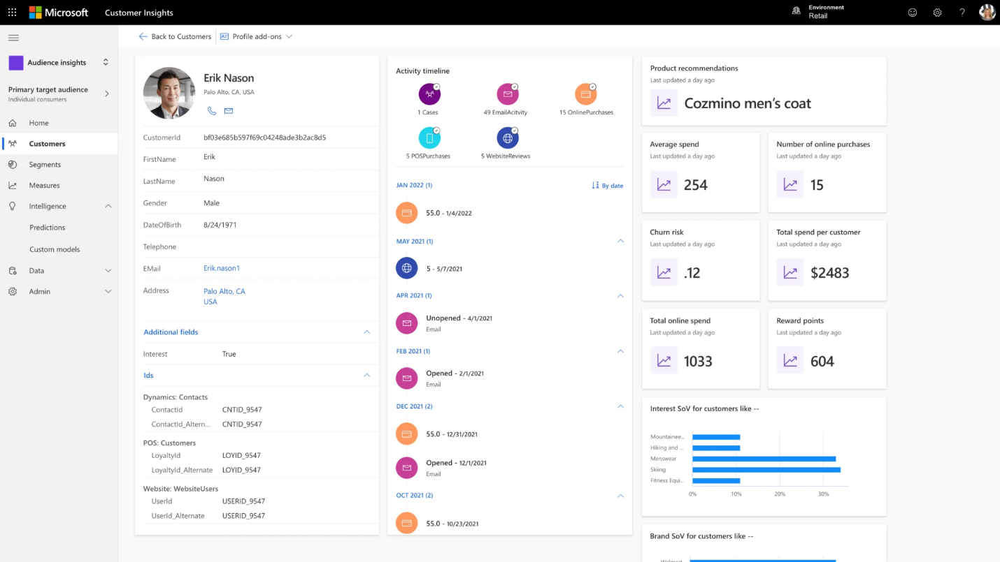
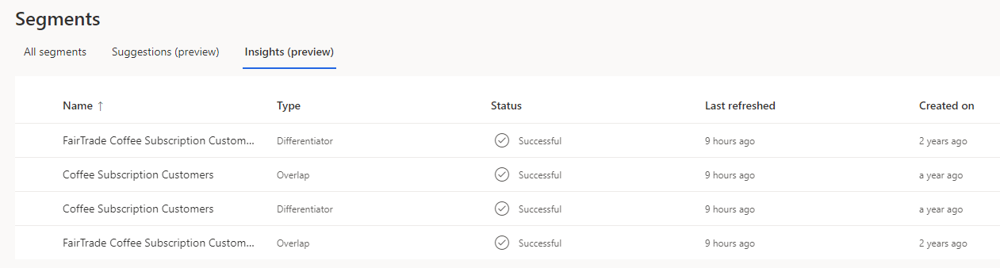
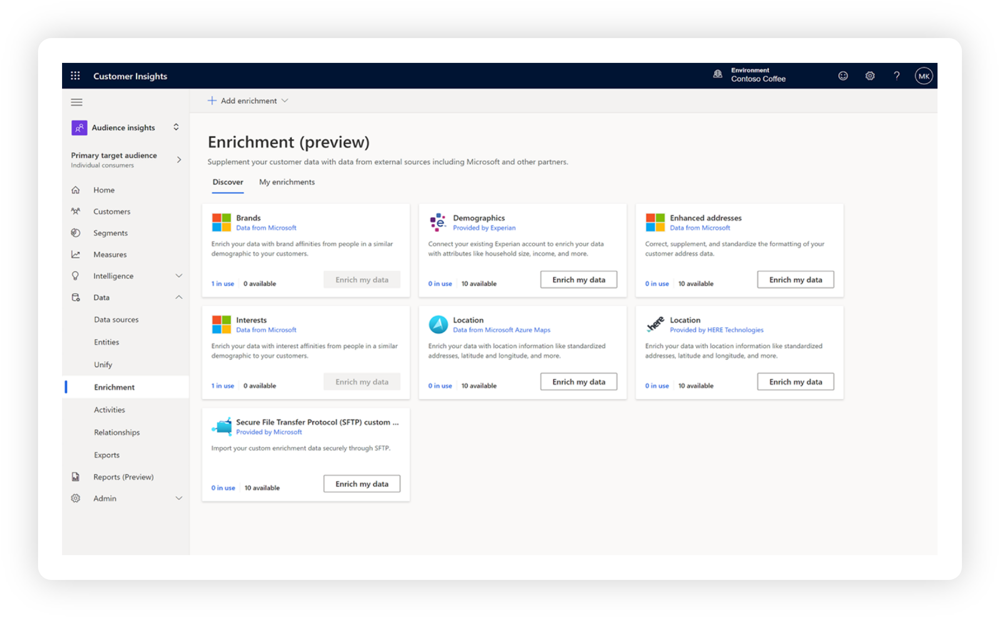
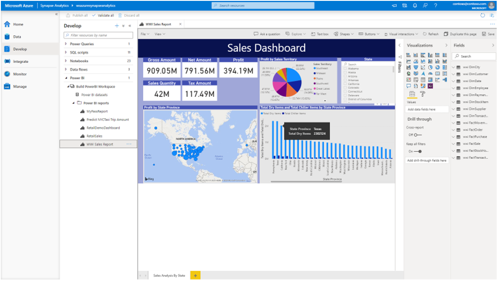
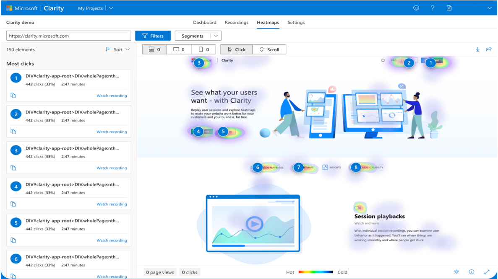
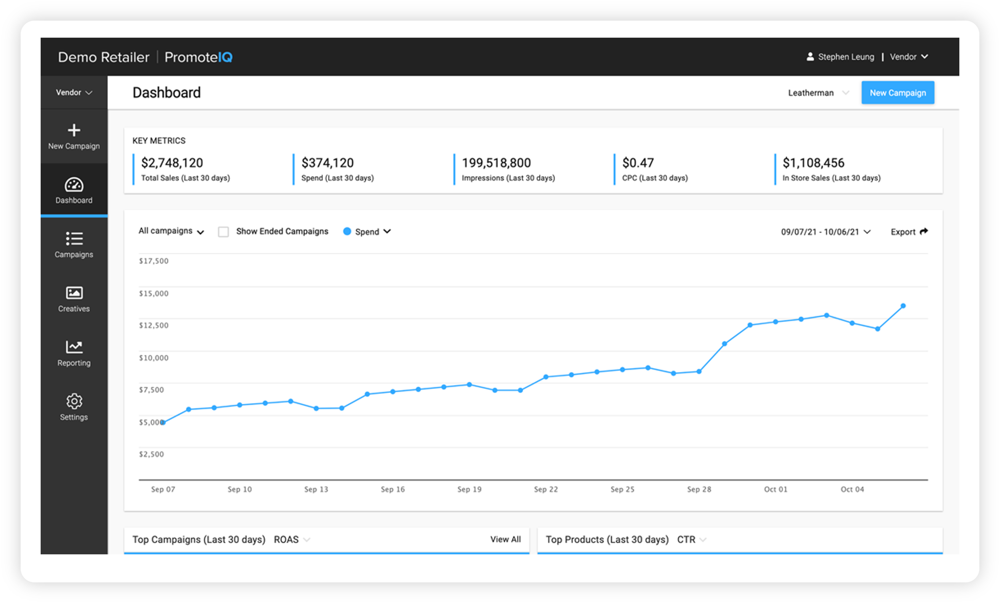

Microsoft Cloud for Retail uses a combination of Microsoft products to address the industry-prioritized scenarios that are focused on maximizing the value of your data. Microsoft Cloud for Retail includes a wide variety of tools to help you make the most of your data.

### Unified customer profile

Unified customer profile in Customer Insights is a key capability of Microsoft Cloud for Retail. To some extent, it's where the data story comes together. With Unified customer profile, you can gain a 360-degree perspective of the customer in a clear and intuitive way. As a result, you can provide personalized experiences, reveal important opportunities, prevent potential loss or churn, and improve customer satisfaction. 

Unified customer profile helps you gain insights across the complete view of a shopper's journey with information and intelligence from several different data sources. 

> [!div class="mx-imgBorder"]
> 

While Customer Insights offers you more information about your customers, if you connect it to external systems, such as Microsoft Dynamics 365 Customer Insights - Data, you can expand that knowledge into action and engagement. For more information, see [Unlock customer intent with Dynamics 365 Customer Insights - Data](/training/paths/build-customer-insights/?azure-portal=true).

With the information in unified customer profiles, you can build segments and micro-segments to better target your customer. Additionally, AI offers insight into the influence of your customer segments.

> [!div class="mx-imgBorder"]
> 

Unified customer profile bolsters unification, where you can:

- Bring multiple identities together to create a 360-degree view of the customer through AI-powered identity resolution.
- Ingest multiple types of data, behaviors, and customer sentiment in real time through more than 500 built-in connectors.

It also fosters unique enrichment, where you can:

- Gain a 360-degree view of the customer with proprietary audience intelligence from Microsoft Graph.
- Use cross-channel behavior to complete the picture of your customer.

> [!div class="mx-imgBorder"]
> 

Furthermore, Unified customer profile gives you better access to customer insights so that you can:

- Gain more nuanced insights by combining digital analytics with customer profiles to create richer segments and use churn models to understand churn risk at a glance.
- Observe customer progress through each defined step of the journey and quickly identify obstacles and opportunities.
- Create custom reports and views based on real-time customer behavior data and use built-in web and mobile analytics to predict customer needs.

Trust, privacy, and consent are essential to the Unified customer profile capability. You can build and uphold customer trust through Microsoft Azure Purview with advanced security capabilities, including consent across workflows, sensitive data security, and regulation compliance.

Watch the following video for a further explanation of Customer Insights and Unified customer profile.

> [!VIDEO https://www.microsoft.com/videoplayer/embed/RWVHaF]

### Shopper and operations analytics

Shopper and operations analytics helps you unlock omnichannel insights with advanced analytics. With shopper and operations analytics, you can predict customer and operational needs, monitor and understand online engagement, and unify data integration, warehousing, and analytics.

> [!div class="mx-imgBorder"]
> 

With shopper and operations analytics, you can predict customer and operational needs:

- Use industry-leading, text-indexing technology to gain customer and operational insights from time-series, log, and customer data.
- Analyze real-time transactional data stored in operational databases, such as Microsoft Azure Cosmos DB, and use end-to-end analytics with deep integration of Azure Machine Learning, Azure Cognitive Services, and Microsoft Power BI.

It also unifies disparate silos so that you can:

- Use database templates to eliminate data silos for shaping your data estate and rapidly building analytics-infused applications.
- Perform data integration, data exploration, data warehousing, big data analytics, and machine learning tasks from a single, unified environment.
- Build ETL/ELT processes in a code-free, visual environment to ingest data from more than 95 native connectors.

> [!div class="mx-imgBorder"]
> 

Shopper and operations analytics can also help you monitor and understand engagement:

- Use the heatmap feature to view where your site generates the most clicks, what people are ignoring, and how far they're scrolling.
- Observe how customers use your site with anonymized, hi-definition recordings. Discover user frustrations by documenting rage clicks, dead clicks, and quick-backs with behavior-focused insights, allowing you to devise solutions more efficiently.
- Understand customer engagement by using built-in web and mobile analytics. Return customer activity recognition, which allows you to create custom reports and views based on real-time customer behavior data.

### Retail media

Retail media unlocks ad revenue by using your Microsoft shopper data.

With retail media, you can unlock high-margin revenue streams, ensure that messaging is consistent, and generate more revenue.

> [!div class="mx-imgBorder"]
> 

With intelligent product promotion, you can:

- Generate five times more revenue than outsourced ad networks by working directly with your existing brands to run vendor-funded product ads on site.
- Gain full enterprise controls over your vendor-marketing program within a single dashboard. Manage vendor access, customize ad placements, and set prices.
- Automate digital vendor marketing campaigns on site, including promoted product delivery, shopper targeting, and campaign reporting. Launch native ad placement that blends with organic site content.

For more information, see the [Official Microsoft Cloud for Retail documentation](/industry/retail/overview).