## Prerequisites

To complete the exercises in this module, you need to meet the following prerequisites:

- Microsoft Power Apps licenses

- Microsoft Teams

- Microsoft Visual Studio 2019 or 2022 licenses to develop a custom plug-in 

  To download these licenses, go to [Visual Studio](https://visualstudio.microsoft.com/vs/?azure-portal=true). Alternatively, for a custom solution package already developed for addressing this requirement, go to the [Fetch Product Details Package](https://github.com/MicrosoftDocs/mslearn-developer-tools-power-platform/blob/master/retail-cloud/FetchProductDetailsPackage.1.0.0.nupkg) documentation.

- [Microsoft Power Platform tools for Visual Studio](https://aka.ms/PowerAppsCLI/?azure-portal=true)

## Personas and scenario 

In this exercise, you assume the role of Oscar, a Microsoft Power Platform developer for Contoso Retail, and perform the following tasks:

- Upload sample files for integration requirements.

- Enable permissions for Store Operations Assist to access the SharePoint site by using client ID and client secret.

- Create a custom solution in Microsoft Power Platform environment to develop Contoso Retail's business requirements.

- Create environment variables for the SharePoint site URL and file.

## Task: Upload sample files for integration requirements

In this task, you assume the role of Oscar and use sample files for integration requirements. You'll  download all the required sample template files and upload them to a SharePoint site for further use in the exercises.

1. Download the following sample files.

   - [PriceData.json](https://github.com/MicrosoftDocs/mslearn-developer-tools-power-platform/blob/master/retail-cloud/PriceData.zip) (extract the .zip file for the JSON file)
   - [ContosoInventorySpotCount.xlsx](https://github.com/MicrosoftDocs/mslearn-developer-tools-power-platform/blob/master/retail-cloud/ContosoInventorySpotCount.xlsx)
   - [ContosoProductPrices.xlsx](https://github.com/MicrosoftDocs/mslearn-developer-tools-power-platform/blob/master/retail-cloud/ContosoProductPrices.xlsx)
   - [ContosoProductReplenishment.xlsx](https://github.com/MicrosoftDocs/mslearn-developer-tools-power-platform/blob/master/retail-cloud/ContosoProductReplenishment.xlsx)
   - [ContosoSurveyResponses.xlsx](https://github.com/MicrosoftDocs/mslearn-developer-tools-power-platform/blob/master/retail-cloud/ContosoSurveyResponses.xlsx)

1. Go to [Microsoft Office](https://www.office.com/) in an InPrivate or Incognito browser session and then sign in by using the admin credentials that you use for this task.

   > [!div class="mx-imgBorder"]
   > [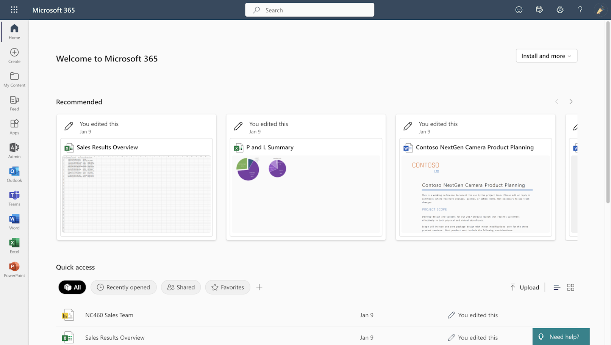](../media/office.png#lightbox)

1.	In the upper left corner of the window, select **App launcher > All apps > SharePoint**.

    > [!div class="mx-imgBorder"]
    > [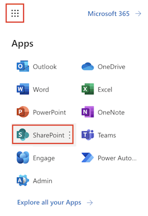](../media/launch-sharepoint.png#lightbox)
 
1. Close the welcome pop-up and select the Microsoft Teams site that's meant for managers of Contoso Store 101, **Contoso Store 101 Managers**, and then select the **General** channel.

   > [!div class="mx-imgBorder"]
   > [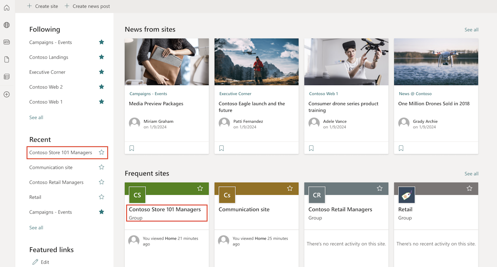](../media/contoso-managers-site.png#lightbox)

1. After you're redirected to the SharePoint site, select **Documents** on the left navigation pane. Select **New > Folder**.

   > [!div class="mx-imgBorder"]
   > [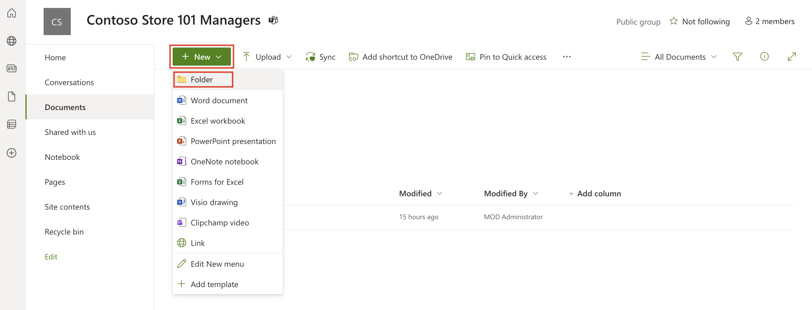](../media/new-folder.png#lightbox)

1. Create folders and name them **Inbound** and **Outbound**.

   > [!div class="mx-imgBorder"]
   > [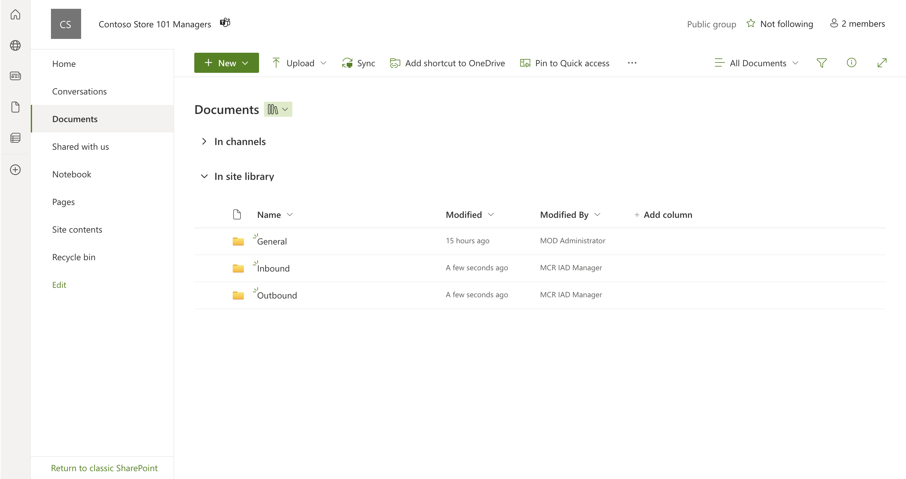](../media/inbound-outbound.png#lightbox)

1.  Select the **Inbound** folder and then select **Upload > Files**.

      > [!div class="mx-imgBorder"]
      > [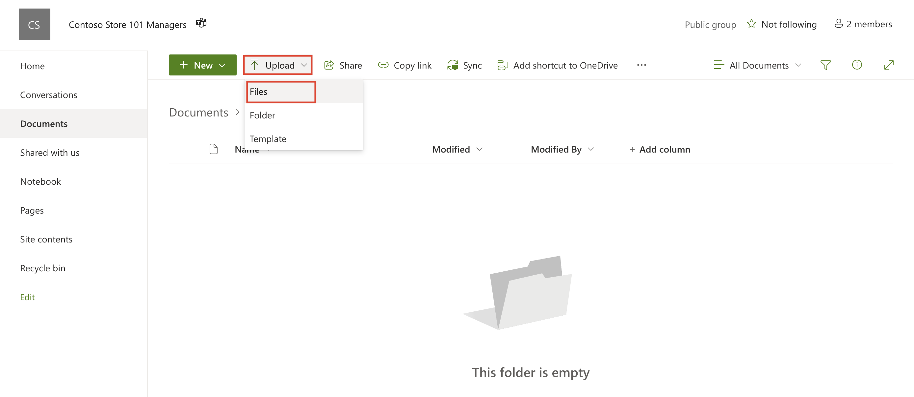](../media/inbound-upload.png#lightbox)

1. Select the **PriceData.Json** sample file and then select **Upload** to upload the file to the **Inbound** folder. This file has the price information for the products with the old price and the updated new price information.

      > [!div class="mx-imgBorder"]
      > [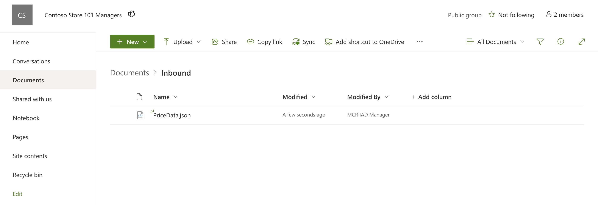](../media/uploaded.png#lightbox)

1. Return to the **Documents** area on the left navigation pane and select the **Outbound** folder.

   > [!div class="mx-imgBorder"]
   > [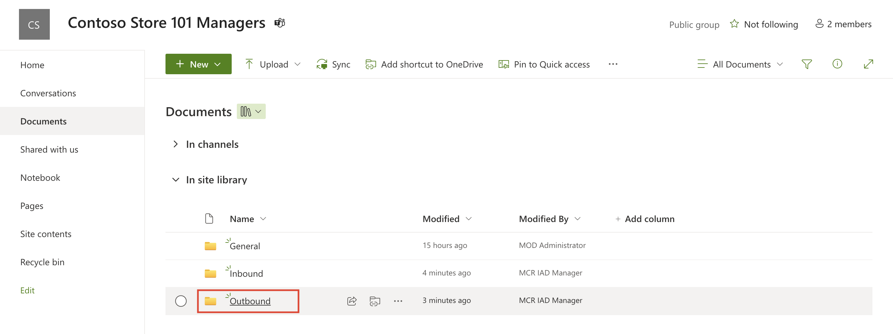](../media/outbound.png#lightbox)

1. Select **Upload > Files** to upload the other four files that you downloaded in the first step.

## Task: Enable permissions for Store Operations Assist to access the SharePoint site

In this task, you act as Oscar and need to register the Store Operations Assist solution and grant it access permissions to the SharePoint site by using a client ID and a client secret. 

1. Go to the app registration page with the following URL: `https://yourtenant.SharePoint.com/sites/yoursitepath/_layouts/15/appregnew.aspx`. Enter the tenant's name in place of **yourtenant**. Enter the SharePoint site name in place of **yoursitepath** to change according to the tenant and the SharePoint site used to read the **Product prices** file (PriceData.json).

   > [!TIP]
   > You can also copy the URL of the SharePoint site that you're using for this exercise up to the site name and then append `_layouts/15/appregnew.aspx`.
   >
   > [!div class="mx-imgBorder"]
   > [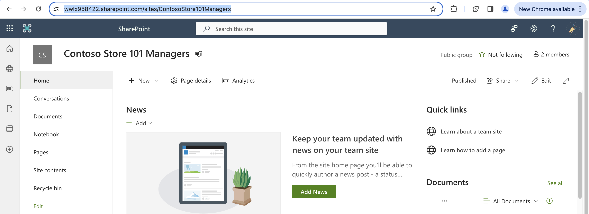](../media/site-url.png#lightbox)

1. On the app registration page, select **Generate** to generate a client ID and a client secret.

   > [!div class="mx-imgBorder"]
   > [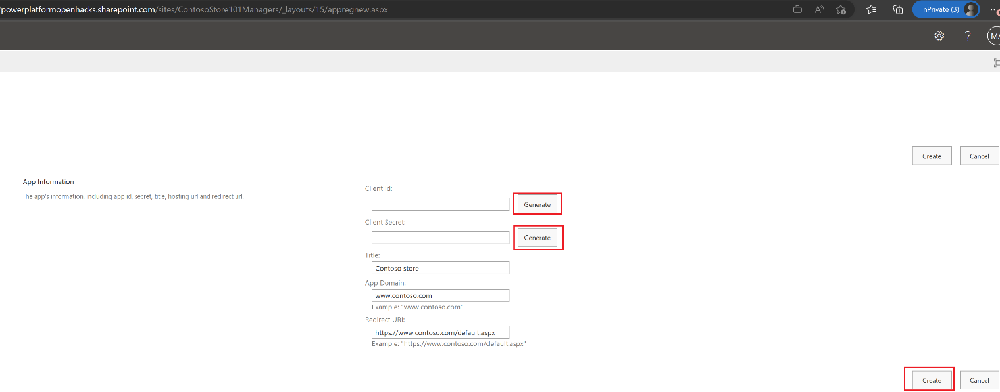](../media/generate.png#lightbox)

1. Copy and paste information from the **Client Id** and **Client Secret** fields to a secure location, such as OneNote or Notepad, because you need these values in the next task.

   > [!IMPORTANT]
   > You won’t have an opportunity to recover the client secret later, so make sure that you save it in a safe place.

1. Enter the following information in the fields:

   **Title** - Contoso store

   **App Domain** - `www.contoso.com`

   **Redirect URL** - `https://www.contoso.com/default.aspx`

   > [!NOTE]
   > The use of `https://` is mandatory in this step.

1. Select **Create** to create and complete the app registration.

   > [!div class="mx-imgBorder"]
   > [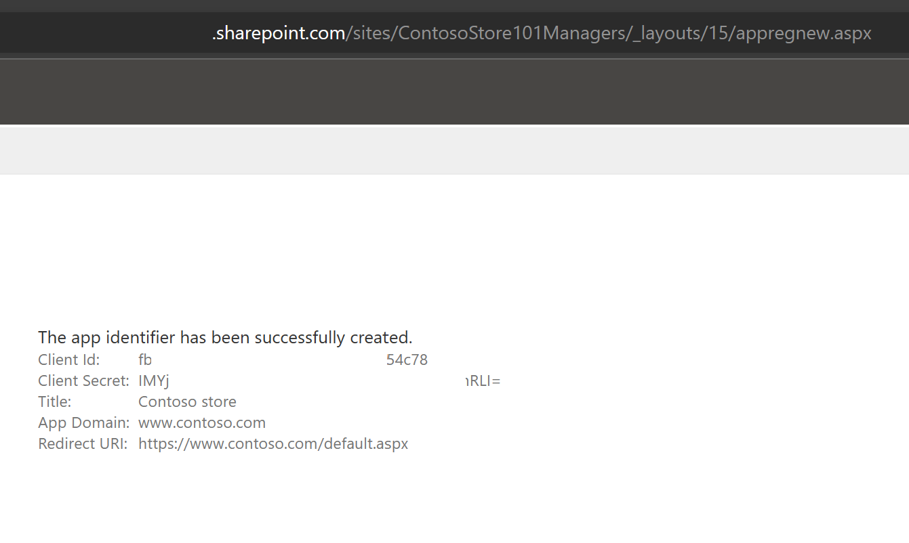](../media/create-registration.png#lightbox)

1. Now that you're registered the application, you need to grant it permission to read data. Go to `https://yourtenant.SharePoint.com/sites/yoursitepath/_layouts/15/appinv.aspx`. Enter the tenant's name in place of **yourtenant**. Enter the SharePoint site name in place of **yoursitepath** to change according to the tenant and the SharePoint site used to read the **Product prices** file (PriceData.json).

   > [!TIP]
   > You can also copy the URL of the SharePoint site that you're using for this exercise up to the site name and then append `_layouts/15/Appinv.aspx`.
   >
   > [!div class="mx-imgBorder"]
   > [](../media/site-url.png#lightbox)

1. Enter the client ID that you previously saved in the **App Id** box and then select **Lookup**. Ensure that the values that appear in the following input boxes correspond to the registered app.

1. In the **App Permission Request** XML field, enter the following markup, select **Create**, and then agree to any prompts.

   ```xml
   <AppPermissionRequests AllowAppOnlyPolicy="true">
   <AppPermissionRequest Scope="http://SharePoint/content/sitecollection/web" Right="Read"/>
   </AppPermissionRequests>
   ```

   > [!div class="mx-imgBorder"]
   > [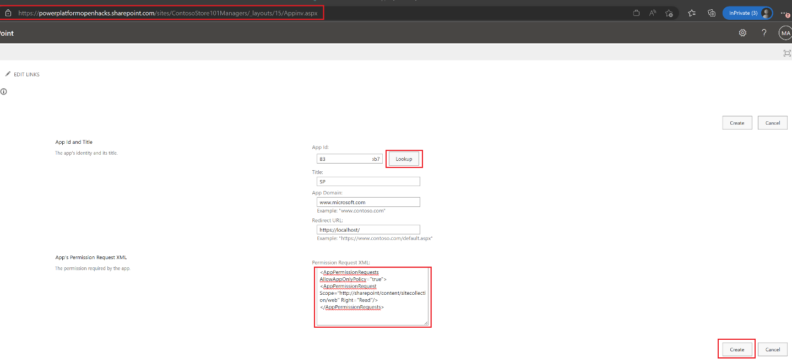](../media/look-up.png#lightbox)

1. Select **Trust It** to trust the site.

   > [!div class="mx-imgBorder"]
   > [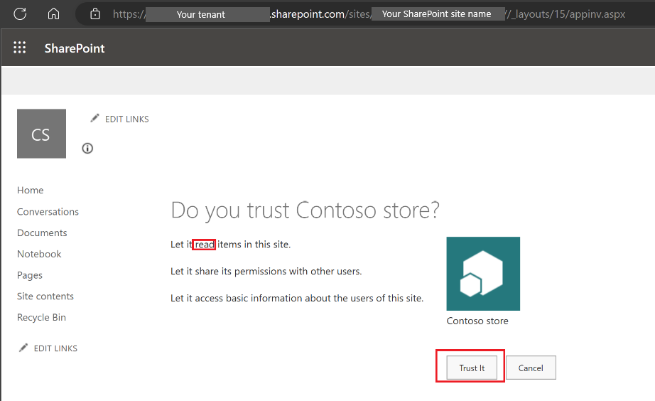](../media/trust-it.png#lightbox)

Congratulations, in this task you assumed the persona of Oscar and set up the SharePoint site with permission to make it accessible from the Store Operations Assist solution.

## Task: Create a custom solution in Power Platform environment to develop Contoso Retail's business requirements

In this task, you assume the role of Oscar, Microsoft Power Platform developer for Contoso Retail, and create a custom solution.  

1. Go to [Microsoft Power Automate](https://powerautomate.microsoft.com/?azure-portal=true) in an InPrivate or Incognito browser session.

1. Sign in and then search for and select the correct environment from the upper-right **Environment** dropdown menu.

   > [!div class="mx-imgBorder"]
   > [](../media/select-environment.png#lightbox)

1. Go to **Solutions** in the left navigation pane and then select **New solution** to create a new solution.

   > [!div class="mx-imgBorder"]
   > [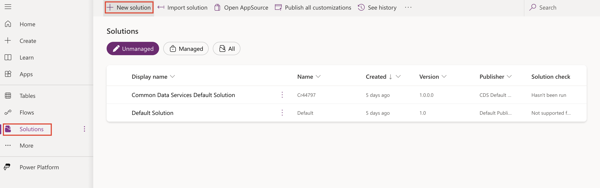](../media/new-solution.png#lightbox)

1. Name the solution **Contoso customizations** and then select **New publisher**.

   > [!div class="mx-imgBorder"]
   > [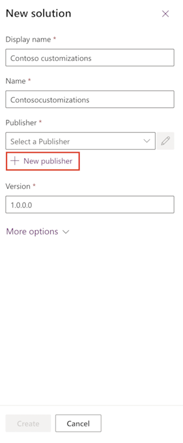](../media/new-publisher.png#lightbox)

1. Enter the details as follows to create a new publisher and then select **Save**.

   > [!NOTE]
   > In a customer deployment project, we recommend that you create a publisher for the organization to identify consistently across the environments where the solution is deployed and used.

   **Display name** - Contoso Retail Customizations

   **Name** - ContosoRetailCustomizations

   **Description** - Customizations developed for Contoso Retail’s requirements

   **Prefix** - cont

   > [!NOTE]
   > Make sure that **cont** is the prefix because it's used in the plug-in environment variables.

   > [!div class="mx-imgBorder"]
   > [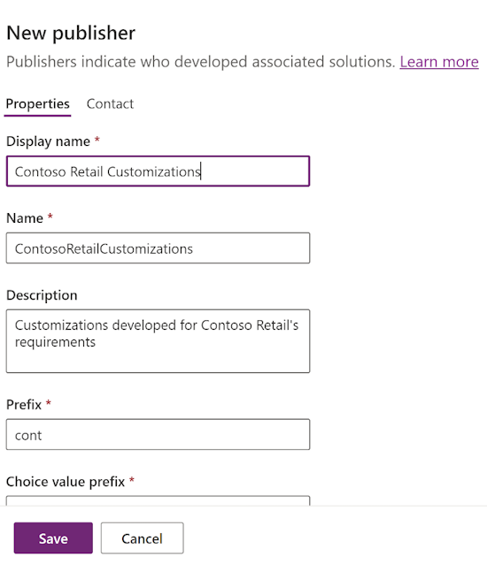](../media/new-publisher-filled.png#lightbox)

1. Return to the **Create solution** form, select the publisher that you created, and then select **Create**. The package type is set to **unmanaged** by default. 

In this task, you've acted as the persona of Oscar and created a new solution called Contoso customizations. Use this solution to add all code artifacts created for customizing the Store Operations Assist solution.

## Task: Create environment variables for the SharePoint site URL and file

In this task, you act as Oscar and create the environment variables for the SharePoint site URL, folder, and file name so that you can refer to it and use it in the plug-in in the next exercise. 

1. Go to [Power Apps](https://make.powerapps.com/?azure-portal=true) in an InPrivate or Incognito browser session and select the environment that you're using for this exercise.

1. Go to **Solutions > Contoso Customizations** and select **Edit**.

   > [!div class="mx-imgBorder"]
   > [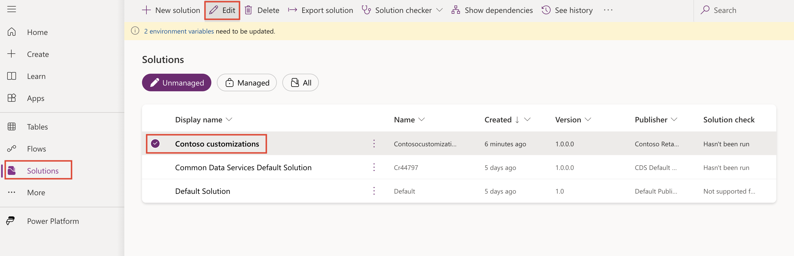](../media/edit.png#lightbox)

1. In the solution, select **New > More > Environment variables**.

   > [!div class="mx-imgBorder"]
   > [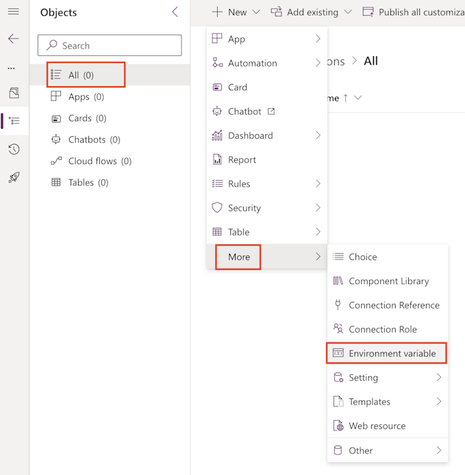](../media/environment-variable.png#lightbox)

1. To create an environment variable for the client ID, enter the values as shown and then select **Save**. The names are case sensitive, so enter them exactly as specified.

   **Display name** - ClientId

   **Name**: ClientId (the *cont* prefix is automatically added)

   **Description** - ClientId of the SharePoint App registration

   **Data Type** - Text

   **Current Value** - Select **New value**. Enter the client ID value that you captured in the previous exercise (Enable permissions for Store Operations Assist to access the SharePoint site)

   > [!div class="mx-imgBorder"]
   > [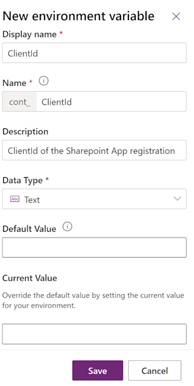](../media/new-environment-variable.png#lightbox)

1. To create an environment variable for the client secret, enter the values as shown and then select **Save**.

   **Display name** - ClientSecret

   **Name** - ClientSecret (the *cont* prefix is automatically added; the name is case sensitive, so enter it exactly as specified)

   **Description** - Client secret of SharePoint site

   **Data Type** - Text

   **Current Value** - Select **New value**. Enter the client secret value that you captured in a previous exercise (Enable permissions for Store Operations Assist to access the SharePoint site)

   > [!div class="mx-imgBorder"]
   > [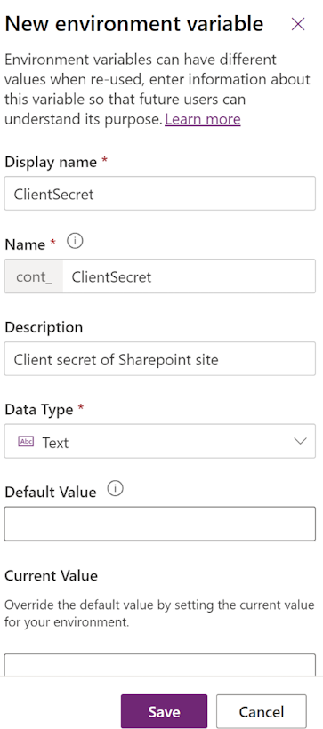](../media/client-secret.png#lightbox)

1. To create an environment variable for the prices file name, enter the values as shown, and then select **Save**.

   **Display name** - FileName

   **Name** - FileName (the *cont* prefix is automatically added; the name is case sensitive, so enter it exactly as specified)

   **Description** - File name of the product prices information file

   **Data Type** - Text

   **Current Value** - Select **New value**. Enter **PriceData.json** (the file name of the price information .json file.)

1. To create an environment variable for the folder name, enter the values as shown, and then select **Save**.

   **Display name** - FolderName

   **Name** - FolderName (the name is case sensitive; enter it exactly as specified)

   **Description** - Name of the folder in SharePoint

   **Data Type** - Text

   **Current Value** - Select **New value**. Enter **Inbound**.

1. To create an environment variable for SiteURL of the SharePoint site, enter the values as shown, and then select **Save**.

   **Display name** - SiteURL

   **Name** - SiteURL (the name is case sensitive, so enter it exactly as specified)

   **Data Type** - Text

   **Description** - URL of SharePoint site

   **Current Value** - Select **New value**. Use the SharePoint site that you're using for this exercise if you're in instructor-led training. If you're training independently, use the SharePoint site that you uploaded the inbound price information file to. To retrieve the SharePoint site URL (highlighted in red), copy the URL and paste it in the **Current Value** field.

   > [!div class="mx-imgBorder"]
   > [](../media/site-url.png#lightbox)

   > [!div class="mx-imgBorder"]
   > [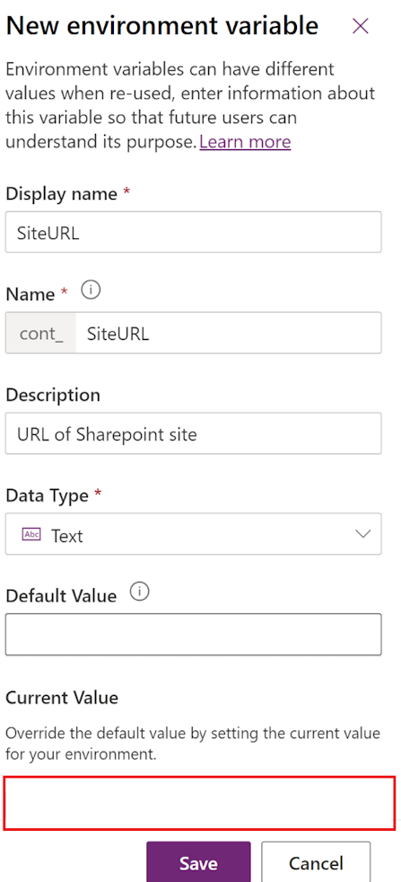](../media/current-value.png#lightbox)

1. After you add all environment variables, your screen should resemble the following image. Select **Publish all customizations** in the Contoso customizations solution to publish all changes.

   > [!div class="mx-imgBorder"]
   > [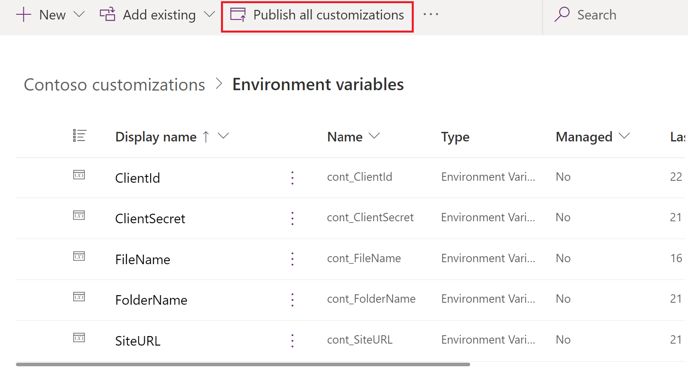](../media/publish-all.png#lightbox)

Congratulations, you now meet all prerequisites for completing the upcoming exercise. In the next exercise, you create a plug-in to read the price information file from SharePoint and update the product prices and inventory stock count when plans are implemented.
