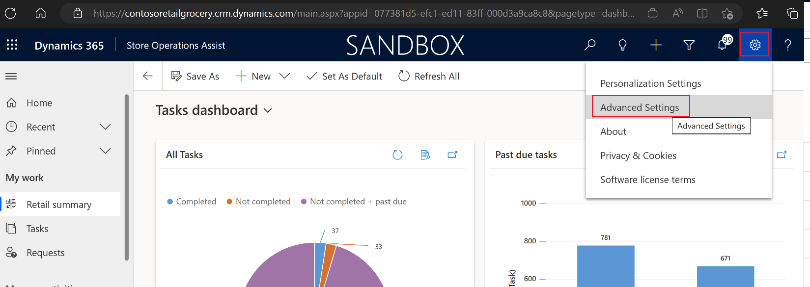
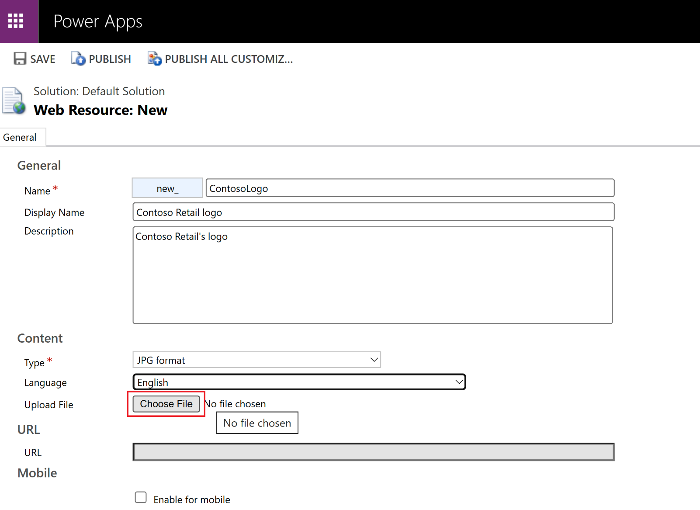
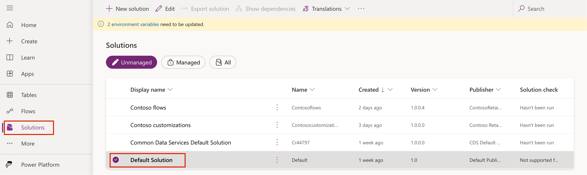
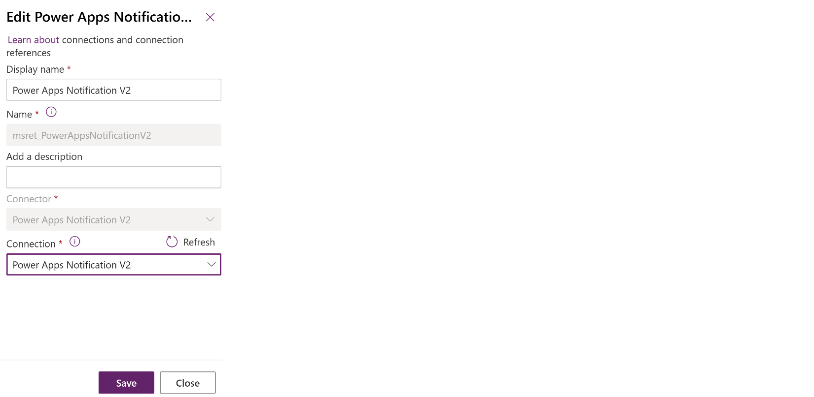

# Retail story

Contoso Retail wants to provide its users with a customized experience of Store Operations Assist by updating their company logo on the app and providing coloring that's specific to forms. Also, they plan to change the default theme of the application for the users. 

You can personalize the Store Operations Assist solutions by creating a custom appearance and behavior. You can change the default colors and visual elements that are provided in the default theme of the application. Additionally, you can set up the theme colors and apply them globally throughout the application. Store Operations Assist supports themes that the Dynamics 365 platform provides.

## Personas and scenario 

In this exercise, you assume the role of Oscar and perform the following tasks:

- Customize the theme for the Store Operations Assist Admin.

- Change the default background color for Store Operations Assist Mobile.

- Enable push notifications for Store Operations Assist Mobile.

## Task: Customize the theme for Store Operations Assist Admin

In this task, you act as Oscar and change the logo and theme of Store Operations Assist Admin.

1. Go to [Microsoft Power Apps](https://make.powerapps.com/?azure-portal=true) in an Incognito or InPrivate browsing session. Ensure that you're in the correct environment.

1. On the left navigation pane, select **Apps**. Select the play button that appears near Store Operations Assist.

   > [!div class="mx-imgBorder"]
   > 

1. Select **Settings > Advanced Settings**.

   > [!div class="mx-imgBorder"]
   > 

1. Select **Settings > Customizations**.

   > [!div class="mx-imgBorder"]
   > 

1. Select **Themes** in the **Customization** area.

   > [!div class="mx-imgBorder"]
   > 

1. Select **New** to create a new theme.

   > [!div class="mx-imgBorder"]
   > 

1. On the **New Theme** form, enter these details:

   - **Theme Name** - Enter **Contoso Retail Theme**.

   - **Logo** - Select **New resource** to upload and assign a new logo for Contoso Retail. 
                [Download the Contoso logo.](https://github.com/MicrosoftDocs/mslearn-developer-tools-power-platform/blob/master/retail-cloud/Contosologo.jpg)

   > [!div class="mx-imgBorder"]
   > 

   > [!div class="mx-imgBorder"]
   > 

1. In the new resource form, enter these details:

   - **Name** - new_ContosoLogo

   - **Display Name** - Contoso Retail Logo

   - **Description** - Contoso Retail's Logo

   - **Type** - JPG format

   - **Language** - English

   - **Upload file** - Upload the JPG file that's provided in the previous step

   - **Mobile** - Select **Enable for mobile**

   > [!div class="mx-imgBorder"]
   > 

1. After entering the details, select **Save**.

1. Select **Publish** to publish the logo for use.

   > [!div class="mx-imgBorder"]
   > 

1. In the **Themes** form, for **the Contoso Retail** theme, look up the **logo** field and then select the **new_ContosoLogo** resource.

1. Search for **new_ContosoLogo** and then select **Add**.

   > [!div class="mx-imgBorder"]
   > 

1. Update the **Default Entity Color** field to **001CA5**. (The default color is grey. It's updated to blue.)

   > [!div class="mx-imgBorder"]
   > 

1. Select **Save** and then select **Publish** to make the theme the **Default** theme.

   > [!div class="mx-imgBorder"]
   > 

1. Go to the home page to view the updated logo and color theme.

   > [!div class="mx-imgBorder"]
   > 

## Task: Change the default background color for Store Operations Assist Mobile

In this task, you act as Oscar and change the default background color of Store Operations Assist Mobile:

1. Go to [Power Apps dashboard](https://make.powerapps.com/).

1. Select your Store Operations Assist environment in the upper right.

1. Select **Solutions** in the left pane and under **Unmanaged** tab, select **Default Solution**.

   > [!div class="mx-imgBorder"]
   > 

1. Go to **Setting definitions** in the left navigation pane, search for and select the **MobileBackgroundColor** setting, and then select **Edit**.

   > [!div class="mx-imgBorder"]
   > 

1. On the right pane, under the **Setting environment value** area, select **New environment value**.

   > [!div class="mx-imgBorder"]
   > 

1. Enter the hex color that you want the background to be (such as **CEEAFF**), and then select **Save** to override the default value.

   > [!div class="mx-imgBorder"]
   > 

1. After the mobile background color has been updated, publish the changes by selecting **Publish all customizations**.

   > [!div class="mx-imgBorder"]
   > 

1. Go to Store Operations Assist Mobile, which shows that the background color is updated.

   > [!div class="mx-imgBorder"]
   > 

   > [!NOTE]
   > Currently, no scope is available for changing font text colors in Store Operations Assist Mobile.

## Task: Set up push notifications

Store Operations Assist offers push notifications capability in Store Operations Assist Admin and Store Operations Assist Mobile. You can use push notifications to send updates to store associates through their devices. Push notifications use Microsoft Power Automate and they're triggered by many scenarios, such as task assignment, task review, and so on. Contoso Retail uses the push notifications feature to keep store associates updated with the latest task assignment and completion.

### Prerequisites

Make sure that you meet the following prerequisites before starting this exercise:

- A Microsoft Power Automate license

- Consent for notifications in your device's settings (allow notifications in device settings)

In this exercise, you act as Oscar, the IT administrator for Contoso Retail, to enable push notifications:

1. Go to [Power Apps](https://make.powerapps.com/?azure-portal=true). In the upper-right corner, select the Store Operations Assist environment that you created in the prerequisites.

1. Select **Solutions** in the left pane. Go to **Default Solution** and select **Edit**.

   > [!div class="mx-imgBorder"]
   > 

1. In **Connection references**, edit the **Power Apps Notification V2** connection.

   > [!div class="mx-imgBorder"]
   > 

1. On the edit screen, select **New connection** under **Connection**.

   > [!div class="mx-imgBorder"]
   > 

1. On the **New connection** screen, search for and select **Power Apps Notification V2**.

   > [!div class="mx-imgBorder"]
   > 

1. Select **Create** to create a connection for **Power Apps Notification V2**.

   > [!div class="mx-imgBorder"]
   > 

1. Select the new connection that you created for **Power Apps Notification V2** on the **Edit connection reference** screen and then select **Save**.

   > [!div class="mx-imgBorder"]
   > 

1. Similarly, edit the **Microsoft Dataverse msret_RetailConnectUI-576c7** connection and then select **New connection**.

   > [!div class="mx-imgBorder"]
   > 

1. Create a **Microsoft Dataverse** connection by using the administrator credentials that you're using for this exercise.

   > [!div class="mx-imgBorder"]
   > 

1. Save the connection reference.

   > [!div class="mx-imgBorder"]
   > 

1. In the **Cloud flows** section, ensure that the following flows are turned on. If not, select **Turn on** from the ribbon to start the flows.

   - When a Request Row is added or modified

   - When a task row is added, modified

   > [!div class="mx-imgBorder"]
   > 

