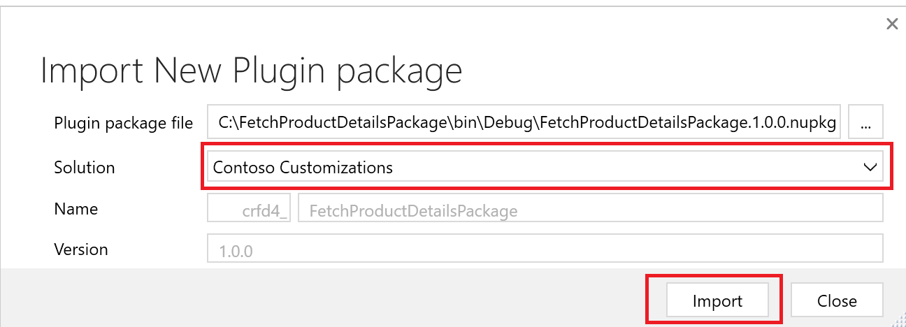

## Prerequisites
Make sure that you meet the following prerequisites prior to completing this exercise:

- [Microsoft Visual Studio 2019 or 2022](https://visualstudio.microsoft.com/vs/?azure-portal=true) 

   If you don’t have a Visual Studio license, you can also try downloading the [community version](https://visualstudio.microsoft.com/vs/community/?azure-portal=true).

- [Microsoft Power Platform CLI for Windows](https://aka.ms/PowerAppsCLI/?azure-portal=true)

- [Microsoft .NET Framework 4.6.2](https://dotnet.microsoft.com/download/dotnet-framework/thank-you/net462-developer-pack-offline-installer/?azure-portal=true) for plug-in or custom workflow activity development

- Microsoft Power Apps subscription or a trial environment

## Personas and scenario 

In this exercise, you assume the role of Oscar, the Microsoft Power Platform developer for Contoso Retail, and perform the following steps:

 - Create and register a custom solution package in a Microsoft Power Platform environment. 

 - Develop a custom plug-in to read product prices and stock count data from an external application. The plug-in is programmed to read the **PriceData.json** file that you uploaded in the Microsoft SharePoint site in the **Inbound** folder that you created as part of the prerequisite task. The data read from the file is updated in Store Operations Assist against the products parts of the **Inventory spot count** and **Product price update** tasks that are generated when you create and publish a plan. 

## Task (Optional): Develop a custom solution package to integrate product prices and stock in the application 

> [!NOTE]
> It’s optional to develop the custom solution package. To skip developing the package, move directly to the **Task: Register the custom solution package in a Dataverse environment** task of this exercise where the solution package is already available to download and register in the Microsoft Power Platform environment.

### Create a plug-in project (optional)

In this task, you act as Oscar and create a custom plug-in by using the Microsoft Power Platform CLI command.

1. Create a folder on your laptop or computer and name it **FetchProductDetailsPackage**.

   > [!div class="mx-imgBorder"]
   > [](../media/file-explorer.png#lightbox)

1. Type **cmd** in the search bar to open the **Command Prompt** app.

   > [!div class="mx-imgBorder"]
   > [](../media/command-prompt.png#lightbox)

1. To take advantage of the latest capabilities, update the Microsoft Power Platform CLI tool to the latest version by using this command: `pac install latest`

1. Go to the **FetchProductDetailsPackage** folder in the **Command Prompt** app by using these commands:

   ```dos
   cd\
   cd C:\FetchProductDetailsPackage
   ```

   > [!div class="mx-imgBorder"]
   > [](../media/command.png#lightbox)

1. Run the [`pac plugin init`](/power-platform/developer/cli/reference/plugin?azure-portal=true#pac-plugin-init) command.

   > [!div class="mx-imgBorder"]
   > [](../media/plugin-init.png#lightbox)

1. Observe that the `pac plugin init` command creates a .NET Framework Class library project.

   > [!div class="mx-imgBorder"]
   > [](../media/class-library.png#lightbox)

1. Open the project in Visual Studio 2022.

   > [!div class="mx-imgBorder"]
   > [](../media/open-visual.png#lightbox)

1. Select **Build** to build the project. A **NuGet package** is created.

   > [!div class="mx-imgBorder"]
   > [](../media/nuget-package.png#lightbox)

1. Add dependent NuGet packages for developing this plug-in. Right-click **Packages** and then select **Manage NuGet Packages**.

   > [!div class="mx-imgBorder"]
   > [](../media/manage-nuget.png#lightbox)

1. In the **Manage NuGet packages** screen, select **Browse** and then search for **Pnp.Framework**.

   > [!div class="mx-imgBorder"]
   > [](../media/framework.png#lightbox)

1. Select **Install** to install the package.

1. A prompt request confirms the installation. Select **OK**.

   > [!div class="mx-imgBorder"]
   > [](../media/installing-prompt.png#lightbox)

1. When installation is complete, **Pnp.Framework** should appear in the list of packages.

   > [!div class="mx-imgBorder"]
   > [](../media/packages.png#lightbox)

1. On the **Manage NuGet Packages** screen, select **Browse**, search for **Newtonsoft.json**, and then select **Install** to complete the installation.

   > [!div class="mx-imgBorder"]
   > [](../media/install.png#lightbox)

1. On the **Manage NuGet Packages** screen, select **Browse**, search for **Microsoft.Sharepoint.Client**, and then select **Install** to complete the installation.

   > [!div class="mx-imgBorder"]
   > [](../media/nuget-sharepoint.png#lightbox)

  After all three NuGet packages have been installed, they appear in the list of packages, as shown in the following screenshot.

   > [!div class="mx-imgBorder"]
   > [](../media/more-packages.png#lightbox)

You've now created a plug-in project and added the necessary dependency packages for development. The next step is to add the code to the plug-in to implement the business logic to read the product prices and stock count information from the **Prices** information file.

### Develop a plug-in for fetching product prices (optional)

In this task, you act as Oscar and add required code to the plug-in.

1. Rename the **Plugin1.cs** file to **FetchProductData.cs** and then select **Save**. Select **Yes** on any prompts.

   > [!div class="mx-imgBorder"]
   > [](../media/rename.png#lightbox)

1. Double-click and open the **FetchProductData.cs** plug-in project that you created in the previous step.

1. Completely replace the code in the editor with the code in the **CodeForPlugin.txt** file. Download the file by going to [CodeForPlugin.zip](https://github.com/MicrosoftDocs/mslearn-developer-tools-power-platform/blob/master/retail-cloud/CodeForPlugin.zip) and then extract the **CodeForPlugin.txt** file.

1. After copying the code from the **FetchProductData** class file, add the following methods: 

    - **GetEnvironmentVariables** – This method is to read and return the environment variables, which you can use to locate the SharePoint file for the prices information PriceData.json file.

    - **GetInputParameters** – Use this method to read the input parameters, which is the query that contains the product identifiers and store identifier.

    - **ExecuteDataVersePlugin** – The system overrides this method with custom logic that you can implement for the plug-in.

    - **ProductList class** – This property class is for the product variables with get and set methods.

   > [!div class="mx-imgBorder"]
   > [](../media/methods.png#lightbox)

1. After making the changes to the project, select **Build** to build the solution. Then, select **Rebuild Solution** and ensure that the build succeeds. If you encounter errors, hover your mouse cursor over the code with the error and then look for potential fixes to solve the error.

   > [!div class="mx-imgBorder"]
   > [](../media/rebuild.png#lightbox)

Rebuilding the solution will update the NuGet package with the updated code. Now that a custom package is created and the build is successful, the next step is to register the package in the Microsoft Power Platform environment.

## Task: Register the custom solution package in Dataverse environment

In this task, you act as Oscar and register the custom solution package in the Dataverse environment. If you skipped the first task to develop the custom solution, you can download the sample solution package named [**FetchProductDetailsPackage.1.0.0.nupkg**](https://github.com/MicrosoftDocs/mslearn-developer-tools-power-platform/blob/master/retail-cloud/FetchProductDetailsPackage.1.0.0.nupkg) and then use that solution to register in the Microsoft Power Platform environment.

 > [!IMPORTANT]
 > If you're in instructor-led training and you've skipped developing the plug-in from the previous task, use the package file that the instructor has already developed and provided for you. Also, if you skipped installing prerequisites as part of the first exercise, download and install [Microsoft Power Platform CLI tools](https://aka.ms/PowerAppsCLI/?azure-portal=true).

To register the plug-in in the Dataverse environment, use the Plugin Registration Tool. The following steps cover how to register the plug-in to fetch product prices and inventory stock from the file that you received from the ERP application. Additionally, you learn how to integrate with the Store Operations Assist solution.

In this task, you complete the following steps:

- Download and install the **Plugin Registration Tool**.

- Connect to the Microsoft Power Platform environment.

- Register the new package for the solution.

1. Open the command prompt and run the `pac tool prt` command to install and launch the Plugin Registration Tool.

   > [!div class="mx-imgBorder"]
   > [](../media/tool.png#lightbox)

1. Select **Create New Connection** to connect to your instance.

   > [!div class="mx-imgBorder"]
   > [](../media/new-connection.png#lightbox)

1. For **Deployment Type**, ensure that **Office 365** is selected.

1. Select **Show Advanced** and then enter your credentials.

1. If your Microsoft account provides access to multiple environments, select **Display list of available organizations**.

1. Select the organization that you want to connect to and then select **Login**. If you're in instructor-led training, connect to the environment that's been allocated to you.

   > [!div class="mx-imgBorder"]
   > [](../media/environments.png#lightbox)

1. After you're connected, you can view any existing registered plug-ins, custom workflow activities, and data providers.

1. Select **View** and then change the view from **Display by Assembly** to **Display by Package**.

   > [!div class="mx-imgBorder"]
   > [](../media/display-package.png#lightbox)

1. After you've changed the view to **Display by Package**, all packages that are available in the environment appear. Select **Register > Register New Package** to register the Dataverse package that you created for this solution to the respective Microsoft Power Platform environment.

   > [!div class="mx-imgBorder"]
   > [](../media/register-package.png#lightbox)

1. In the prompt screen, select the ellipsis (**...**) menu, find and select the NuGet package that you created in the `C://FetchProductDetailsPackage` folder, and then select **Open**.

   > [!div class="mx-imgBorder"]
   > [](../media/select-package.png#lightbox)

1. Select the solution that you created in the prerequisite exercise task for the package. Select the **Contoso Customizations** solution and then select **Import** to import the plug-in package.

   > [!div class="mx-imgBorder"]
   > [](../media/import-plugin.png#lightbox)

    The package is imported into the environment with the assembly and plug-in.

   > [!div class="mx-imgBorder"]
   > [](../media/assembly-plugin.png#lightbox)

1. When the package has imported, you need to add a step to the plug-in to run the business logic for fetching product prices from the external application. Go to [Power Apps](https://make.powerapps.com/?azure-portal=true) in an InPrivate or Incognito browser session and then sign in with admin credentials that you used to start this exercise.

1. Select the correct environment that you used for this exercise in the upper corner of the screen.

   > [!div class="mx-imgBorder"]
   > [](../media/environment.png#lightbox)

1. Select and open the **Contoso Customizations** solution.

   > [!div class="mx-imgBorder"]
   > [](../media/customizations.png#lightbox)

1. Select **Add existing > More > Other > Custom API** to add the existing, out-of-the-box `msret_FetchProducts` API to the solution.

   > [!div class="mx-imgBorder"]
   > [](../media/custom-api.png#lightbox)

1. Search for and select the **Fetch Products** API and then select **Add**.

   > [!div class="mx-imgBorder"]
   > [](../media/fetch.png#lightbox)

   The **Fetch Products** API will show as added to the solution.

   > [!div class="mx-imgBorder"]
   > [](../media/fetch-products.png#lightbox)

1. Open the **Fetch products** API. The API opens in the Microsoft Power Platform environment.

1. In the **Plugin Type** field, the default plug-in type is set to `RetailConnectApp.plugins.FetchProductPlugin`. Remove the default plug-in and search by starting to type the word **Fetch**.

   > [!div class="mx-imgBorder"]
   > [](../media/plugin-type.png#lightbox)

1. In the **Plugin Type** field, look up and assign `FetchProductDetailsPackage.FetchProductData`. Select **Save & Close**.

   > [!div class="mx-imgBorder"]
   > [](../media/save-close.png#lightbox)

   > [!NOTE]
   > To make sure that the specific code that Contoso Retail has designed to retrieve information about their products is implemented, you need to call it when the Fetch Products API is invoked by the application. This action occurs when tasks, such as an inventory spot count or a product price update, are performed as part of a plan. By completing this step, you ensure that the custom business logic that's developed by Contoso Retail is implemented to fetch the necessary product details.

1. After the Fetch Products API is modified to run the custom business logic in the **FetchProductDetailsPackage.FetchProductData** plug-in, your next step is to publish this customization to the **Contoso Customizations** solution.

1. Switch to Power Apps maker portal by going to [Power Apps](https://make.powerapps.com/?azure-portal=true) and signing in with the account that you've been using for this exercise. Ensure that the correct Microsoft Power Platform environment is selected.

1. Select and open the **Contoso Customizations** solution.

   > [!div class="mx-imgBorder"]
   > [](../media/customizations-solution.png#lightbox)

1. Select **Publish all customizations** to publish the changes to the API.

   > [!div class="mx-imgBorder"]
   > [](../media/publish-custom.png#lightbox)

1. To check whether the new step to call the Fetch Products API (msret_FetchProducts) is available in the plug-in, return to the Plugin Registration Tool, select the **FetchProductDetailsPackage.FetchProductData** plug-in, and then select **Refresh**.

   > [!div class="mx-imgBorder"]
   > [](../media/refresh.png#lightbox)

After the page has refreshed, the new step appears in the plug-in.

   > [!div class="mx-imgBorder"]
   > [](../media/new-step.png#lightbox)

Now that the API is available in the plug-in, the customizations to address the requirement to integrate the product information with the Store Operations Assist solution is complete.
