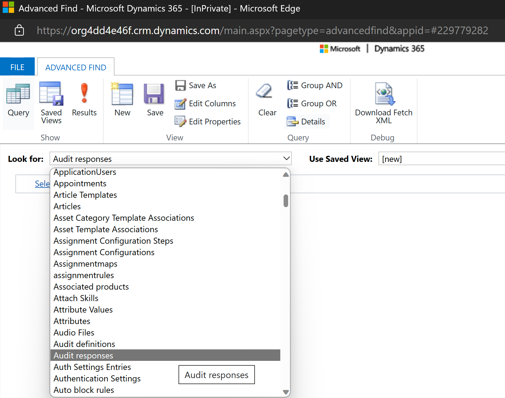
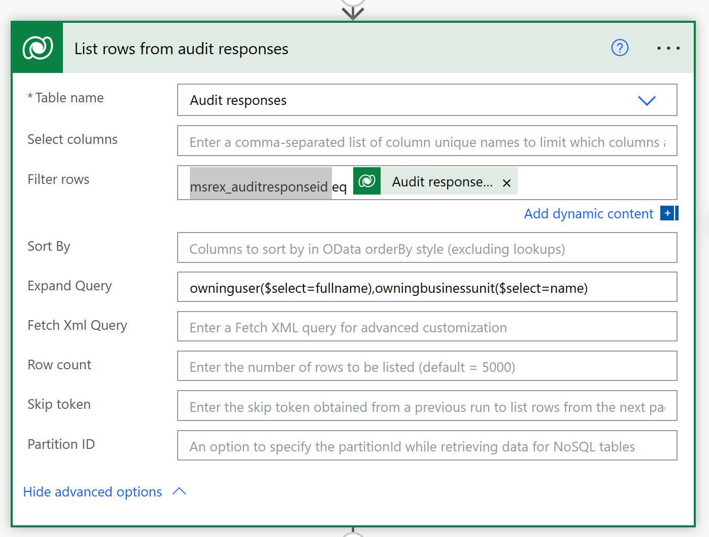
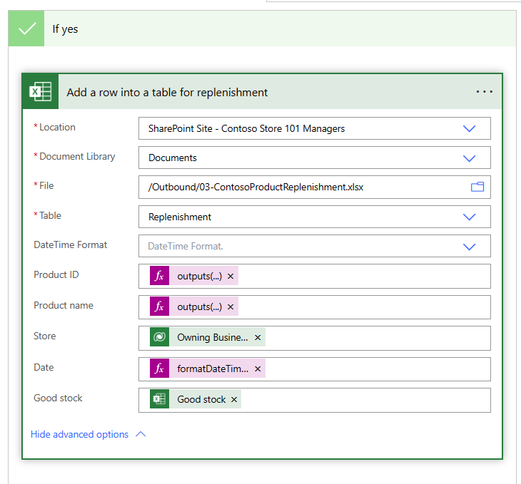

# Retail story

Consider an example of a retail store by Contoso Retail with store operations across the US. Contoso Retail wants to automate the product inventory spot checks to ensure accuracy and save time for store associates.

## Personas and scenario 

Alex Serra, the retail manager, creates a template and a plan and then includes a product inventory spot count task for associates to complete daily for all products in the footwear section. Alex creates and publishes the plan and then assigns the tasks to all store associates.

Riley is the retail store associate who works at Contoso Retail store 101. Riley performs the task of product inventory check for the footwear section of the store. As a part of the daily routine, Riley performs product inventory spot count checks to ensure that the inventory quantity of products in the store match the stock quantity in the Store Operations Assist solution. Riley opens the task with a set of products and then enters the response against each product if the new quantity has been updated. Riley enters all responses and then marks the activity as complete.

Contoso Retail wants to extract the product audit responses and integrate the data with an external application for reporting. To meet this requirement, Oscar, a Microsoft Power Platform developer, develops a solution by using a Power Automate flow. The solution is triggered whenever Riley performs a product inventory spot count task and updates the actual quantity in the store. The Power Automate flow extracts the responses from the task that Riley completes. It also stores the product details and the product inventory quantity data in an Excel file that's stored on a Microsoft Teams SharePoint site.

This solution helps keep track of product inventory in all Contoso Retail stores. Additionally, Riley can use it to integrate the extracted responses with external applications or ERP systems, such as Microsoft Dynamics 365 ERP or any business application for price management of products in a retail organization. Additionally, Riley can use this solution to automate the process of reporting issues that are encountered while performing the product inventory check task. This low-code solution for Contoso Retail automates repetitive tasks and reduces errors. 

In this exercise, you assume the role of Oscar and review the **Contoso Inventory Spot Count** flow. Then, you modify the flow to write the results of the Inventory spot count task to the **ContosoInventorySpotCount.xlsx** file in your SharePoint site for this module. When a store associate records the responses to a product inventory spot task, the system stores the answers to each question as JSON in the **Audit responses** entity.

> [!div class="mx-imgBorder"]
> 

1. Select and edit the **Contoso Inventory Spot Count** flow.

1. Review the connector by selecting the **When a product inventory count is completed** step.

   - **Change type** - Modified (the trigger is expected to run only when the task is completed and the status code is set as **completed**)

   - **Table name** - Visit activities
   
   - **Scope** - Organization

   - **Filter rows** - Set the task name (msrex_name) to be filtered as **Inventory spot count** and the status code as **Completed**: 

       `msrex_name eq 'Inventory spot count' and statuscode eq 4`

   - **Run as** - Flow owner

   > [!div class="mx-imgBorder"]
   > 

1. Review the **List rows from audit responses** connector.

   - **Table name** - Audit responses

   - **Filter rows** - Set the task name to be filtered as `msrex_auditresponseid eq Audit response id`

   - **Expand Query** -  Use this entry to retrieve the name and the business unit of the user who's submitting the response:

     `owninguser($select=fullname),owningbusinessunit($select=name)` 

   > [!div class="mx-imgBorder"]
   > 

1. Review the **Apply to each item** connector and then select the **Add a row into a table for stock count** connector.

    - **Location** - Replace the SharePoint Site with your SharePoint site (use the SharePoint site that you set up as part of the **Exercise - Set up prerequisites** unit in the **Task: Create and upload sample files for integration requirements** section)

    - **Document Library** - Remove and select **Documents**

    - **File** - Remove and select `/Outbound/ContosoInventorySpotCount.xlsx`

    - **Table** - Remove and select **InventoryCount**

    - **DateTime Format** - ISO 8601

    - **Product ID** - `outputs('List_rows')?['body/value'][0]['productnumber']`

    - **Product name** - `outputs('List_rows')?['body/value'][0]['name']`

    - **Store** - Set to the **Owning Business Unit Name** value from the **List rows from audit responses** connector

    - **Date** - `formatDateTime(parseDateTime(triggerOutputs()?['body/modifiedon']),'MM/dd/yyyy', 'en-US')`

    - **Good stock** - `items('Apply_to_each_item')?['resp'][0]?['a']`

    - **Damaged stock** - `items('Apply_to_each_item')?['resp'][1]?['a']`

   > [!div class="mx-imgBorder"]
   > 

1. Review the **Condition - Check good stock is less than 5** connector. The condition checks whether good quantity stock is less than five, and if it is, it creates a replenishment entry.

   > [!div class="mx-imgBorder"]
   > 

1. In the **If yes** condition, select and modify the **Add a row into a table for replenishment** connector.

   > [!div class="mx-imgBorder"]
   > 

1. Enter the details in the connector as follows:

   - **Location** - Replace SharePoint with your SharePoint site

       (Use the SharePoint site that you set up as part of the **Exercise - Set up prerequisites** unit in the **Task: Create and upload sample files for integration requirements** section.)

   - **Document Library** - Replace and select **Documents**

   - **Files** - Replace and select `/Outbound/03-ContosoProductReplenishment.xlsx`

   - **Table** - Replace and select **Replenishment**

   - **DateTime Format** - ISO8601

   - **Product ID** - `outputs('List_rows')?['body/value'][0]['productnumber']`

   - **Product name** - `outputs('List_rows')?['body/value'][0]['name']`

   - **Store** - Use the **Owning Business Unit Name** value from the **List rows from audit responses** connector

   - **Date** - `formatDateTime(parseDateTime(triggerOutputs()?['body/modifiedon']), 'MM-dd-yyyy', 'en-US')`

   - **Good stock** - Use the **Good stock** value from the **Add a row into a table for stock count** connector

1. Save the flow. Check if issues are reported as errors and then resolve them. If no errors have occurred, the flow is ready to run.

The flow is automatically triggered when a record is modified in **Visit activities** with the name of **Contoso Inventory Spot Count** and the activity status set to **Completed**.

The inventory spot responses are updated to the **ContosoInventorySpotCount.xlsx** Excel file in your SharePoint site, as shown in the following example.

   > [!div class="mx-imgBorder"]
   > 

The replenishment entries are written to **ContosoProductReplenishment.xlsx**, as shown in the following example.

   > [!div class="mx-imgBorder"]
   > 

Congratulations, you've used a Power Automate flow to automate the process of capturing inventory spot count responses and creating replenishment entries.

