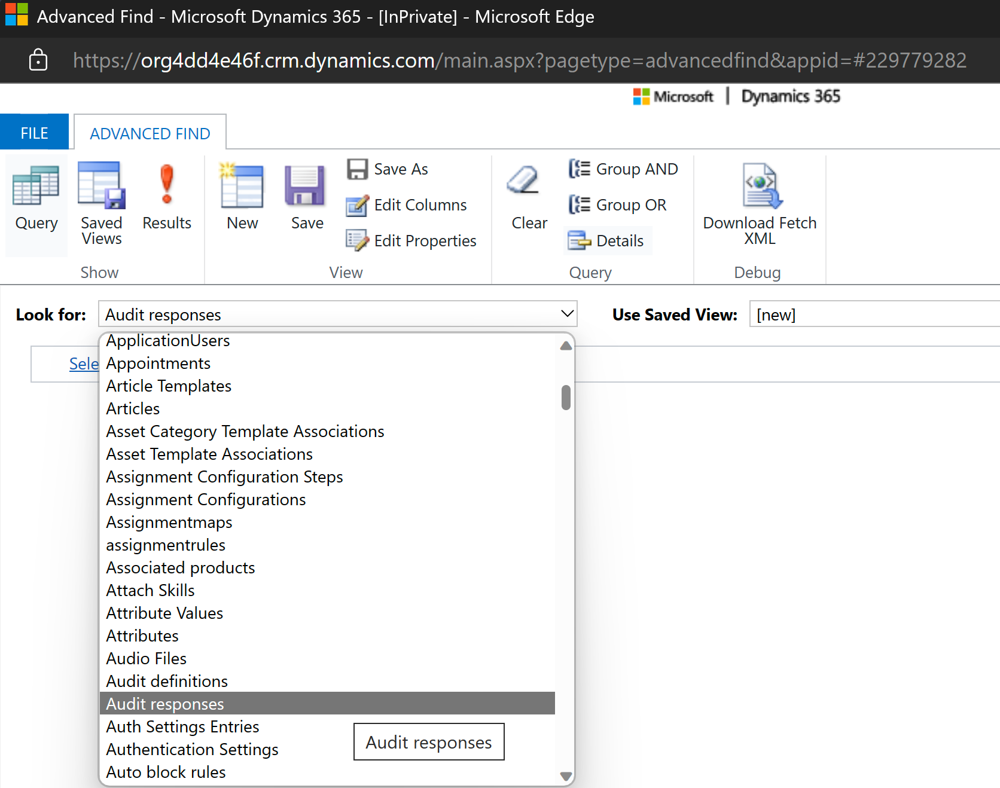
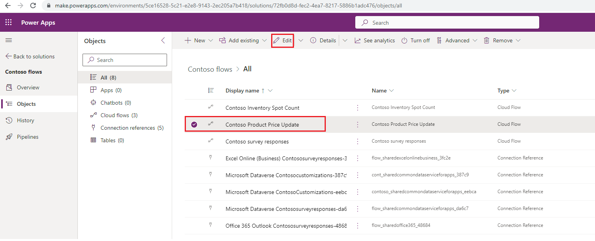
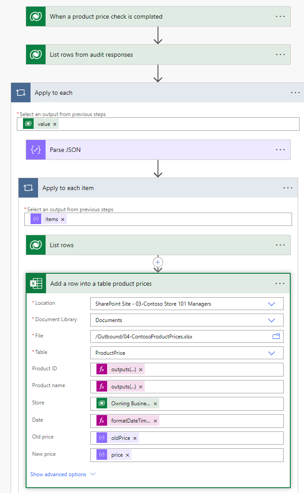
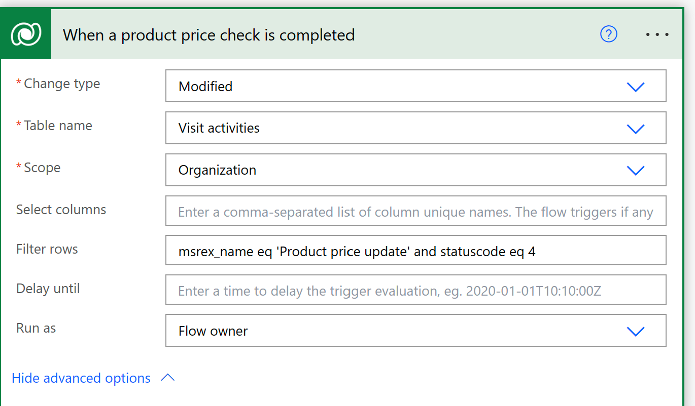
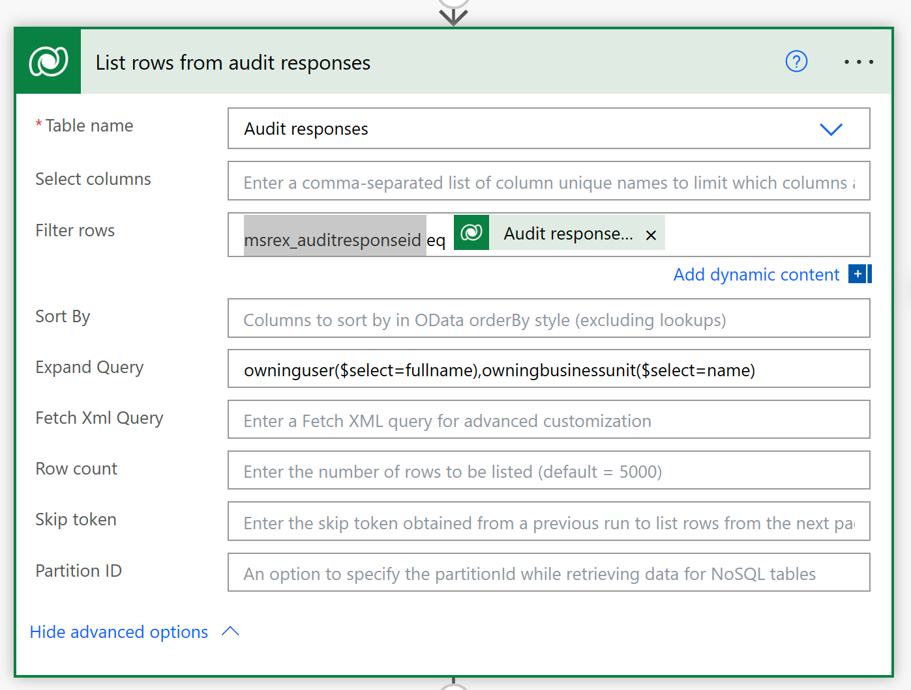
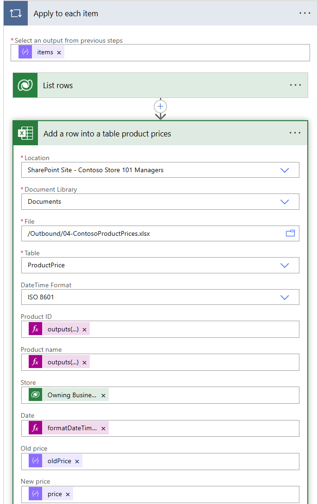
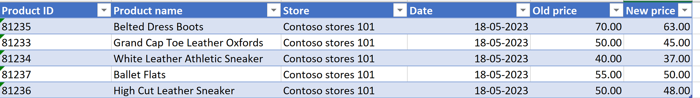

# Retail story

Consider an example of a retail store by Contoso Retail with store operations across the US. Contoso Retail wants to automate the product price audit checks to ensure accuracy and save time for store associates.

## Personas and scenario 

Alex Serra, the regional manager, creates a template and a plan and then includes a product price update task that associates should complete daily for all products in the footwear section. Alex creates and publishes the plan and then assigns the tasks to all store associates.

Riley is the retail store associate who works at Contoso Retail Store 101. Riley, as part of the daily routine, performs product price checks for the footwear section of the store to ensure that the price that's displayed on the products matches the prices in the application. Riley opens the assigned task that displays a set of products and then enters the response against each product if the price has been updated. Riley enters the responses and then marks the activity as complete.

Contoso Retail wants to create a sample Power Automate flow to parse the audit responses entity and extract the response for the product price update task. Then, they want to integrate the data with an external application for reporting. To meet this requirement, Oscar, a Microsoft Power Platform developer at Contoso Retail, develops a solution by using a Power Automate flow. The solution is triggered whenever Riley performs a product price check task. The Power Automate flow extracts the responses from the task that Riley completes and then stores the product details and the price update data in an Excel file that's stored on a Microsoft Teams SharePoint site.

This solution helps track product prices, and Riley can also use it to integrate the extracted responses with external applications or ERP systems, such as Microsoft Dynamics 365 ERP or any business application for price management of products in a retail organization. Riley can also use this solution to automate the process of reporting issues that occur while performing the product inventory check task.

In this exercise, you assume the role of Oscar and review the **Contoso Product Price Update** flow. Then, you modify the flow to write the results of the product price update task to the **ContosoPRoductPrices.xlsx** file in your SharePoint site for this module. When a store associate records the responses to a price update task, the system stores the answers to each question as JSON in the **Audit responses** entity.

 > [!div class="mx-imgBorder"]
 > 

1. Select and edit the **Contoso Product Price Update** flow.

   > [!div class="mx-imgBorder"]
   > 

1. Follow the steps in the flow, as shown in the following image.

   > [!div class="mx-imgBorder"]
   > 

1. Review the **When a product price check is completed** connector.

   - **Change type** - Modified (the trigger is expected to run only when the task is modified and the status code is set to **Completed**)

   - **Table name** - Visit activities
   
   - **Scope** - Organization

   - **Filter rows** - The task name (msrex_name) to be filtered is set to **Product price update** and the status code is **Completed**:

      `(msrex_name eq ‘Product price update’ and statuscode eq 4)`

   > [!NOTE]
   > The filter is set to the **Product price update** task name (case-sensitive) because you used it as the task name when creating a plan for the store opening checklist in this exercise. If you used a different name for the task, use the same name to filter.

   > [!div class="mx-imgBorder"]
   > 

1. Review the **List rows from audit responses** connector.

   - **Table name** - Select **Audit responses**.

   - **Filter rows** - The task name is set to `msrex_auditresponseid eq Audit response id` (choose audit response ID). Filter the audit response based on the audit response identifier.

   - **Expand Query** - Set to `owninguser($select=fullname),owningbusinessunit($select=name)`. You can use this entry to retrieve the name and the business unit of the user who's submitting the response.

   > [!div class="mx-imgBorder"]
   > 

1. Review the **Apply to each item** connector, and then within it, open the **Add a row into a table product prices** connector.

    - **Location** - Replace SharePoint Site with your SharePoint site (use the SharePoint site that you set up as part of the **Exercise: Set up prerequisites** unit in the **Task: Create and upload sample files for integration requirements** section)

    - **Document Library** - Remove and select **Documents**

    - **File** - Remove and select **/Outbound/ContosoProductPrices.xlsx**

    - **Table** - Remove and select the **ProductPrice** table

    - **DateTime Format** - ISO 8601

    - **Product ID** - `outputs('List_rows')?['body/value'][0]['productnumber']`

    - **Product name** - `outputs('List_rows')?['body/value'][0][‘name’]`

    - **Store** - Owning Business name

    - **Date** - `formatDateTime(parseDateTime(triggerOutputs()?['body/modifiedon']),'MM/dd/yyyy', 'en-US')`

    - **Old price** - oldPrice

    - **New Price** - price

    > [!div class="mx-imgBorder"]
    > 

1. Save the flow. Check if any issues are reported as errors and then solve them. If no errors have occurred, the flow is ready to run.

The flow is automatically triggered when a record is modified in **Visit activities** with the name **Product price update** and the activity status set to **completed**. The responses will be updated to an Excel file. This exercise demonstrates a scenario to capture the responses in a file that you can further use for external reporting or integration.

   > [!div class="mx-imgBorder"]
   > 

Congratulations, you've used a Power Automate flow to parse the audit responses entity and extract the response for the product price update task. Then, you integrated the data with an external application for reporting. 
