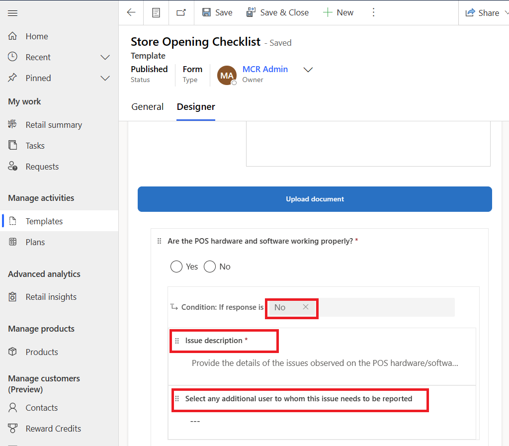

# Retail story

You can customize and extend Microsoft cloud solutions to meet the unique needs of your organization. This level of automation can improve productivity, reduce errors, and lead to better business outcomes. Recently, Contoso Retail decided to automate the store opening process with a survey that contains a set of questions to be performed daily when their store associates are opening stores. The survey includes questions such as whether the point-of-sale (POS) software application and hardware (printers or handheld) are working properly. Additionally, the survey requests details about POS hardware or software issues, if the store is clean and hygienic, and if the store layout is compliant.

Contoso Retail also wants to integrate the survey response data in the Microsoft Excel file with external applications such as ERP, Inventory Management Systems, or other retail applications.

## Personas and scenario 

Alex, the district manager, creates a plan template with a defined set of activities for the store associate to perform. 

Monica, the store manager for Contoso Stores 101, is assigned with tasks for the store. Then, Monica assigns the completion of these tasks to store associates of respective sections of the store.

Riley is a store associate who works at Contoso Retail Store 101. Riley completes the survey and marks the store opening activity as complete. After Riley answers all questions of the survey checklist, the system stores the answers to each question as JSON in the **Survey responses** entity.

  > [!div class="mx-imgBorder"]
  > 

Oscar, the Microsoft Power Platform developer for Contoso Retail, develops a low-code solution by using a Power Automate flow to parse the survey responses for the **Store Opening Checklist** survey. Then, Oscar uses the flow to write the responses to an Excel file in a SharePoint site. Also, if the store associate encounters issues in the point-of-sale application, the Power Automate flow triggers an automatic email to the IT help desk of Contoso Retail so that someone can create a case for faster resolution.

In this exercise, you assume the role of Oscar, the Microsoft Power Platform developer for Contoso Retail, and you perform the following tasks. 

- **Import a sample solution for Power Automate flows** - This task is an example of the customization and extension capabilities of the Microsoft Cloud for Retail - Store Operations Assist solution. It outlines the steps that are required for creating a custom solution that includes a Power Automate flow triggered by a store associate's response to a survey list of questions.

- **Extract survey responses** - In the custom solution, the survey responses and the product audit responses are automatically written to an Excel file stored in a Microsoft Teams site. You can use this flexibility to integrate the responses with an external application, if necessary. Additionally, if issues are reported, an email is automatically triggered to the correct department for appropriate action.

## Task: Import the sample solution for Power Automate flows

In this task, you act as Oscar and import a sample Microsoft Power Platform solution called [**Contosoflows_1_0_0_4.zip**](https://github.com/MicrosoftDocs/mslearn-developer-tools-power-platform/blob/master/retail-cloud/Contosoflows_1_0_0_4.zip). You use this solution to extract the survey responses and product audit responses and write them to Excel files.
> [!NOTE]
> The Power Automate flows are provided for ease of understanding and reusing them to complete the exercise. However, in an ideal customer’s environment, you need to develop the Power Automate flows based on specific customer requirements.

Follow these steps to import the solution:

1. Go to [Power Apps](https://make.powerapps.com/?azure-portal=true) in an InPrivate or Incognito browser session and sign in with the **MCR IAD Manager** email account. (If you're in instructor-led training, use the store manager account that is allocated to you.)

1. In the upper-right corner of the screen, select the correct environment that you used so far for this exercise.

   > [!div class="mx-imgBorder"]
   > 

1. Select **Import solution** to import the solution to the environment.

   > [!div class="mx-imgBorder"]
   > 

1. **Browse** and select the solution that you downloaded.

   > [!div class="mx-imgBorder"]
   > 

1. Select **Next**.

   > [!div class="mx-imgBorder"]
   > 

1. In the **Import a solution** screen, ensure that the **Enable Plugin steps and flows included in the solution** option is selected and then select **Next**.

   > [!div class="mx-imgBorder"]
   > 

1. In the next screen, you need to establish the connections that you use in the flows before you import. Select **New connection** to create a connection of the respective type of connector, such as the Microsoft Excel, Outlook, and Dataverse types.

1. Select the **New connection for Excel** connector.

   > [!div class="mx-imgBorder"]
   > 

1. In the next screen, you're prompted with an Excel connector. Select **Create** and then sign in with the **MCR IAD Manager** credentials with administrative privileges for this exercise.

   > [!div class="mx-imgBorder"]
   > 

1. After the connection is created, it appears in the list of connections, as shown in the following screenshot.

   > [!div class="mx-imgBorder"]
   > 

1. Repeat steps 8 and 9 for all five connections for the Outlook and Dataverse connectors.

   > [!div class="mx-imgBorder"]
   > 

1. After you create and set all connections, select **Import** to import the solution.

1. Select the solution to observe the flows and connections that are imported.

   > [!div class="mx-imgBorder"]
   > 

## Task: Extract survey responses

In this task, you act as Oscar and review the Contoso survey responses. You modify the flow to write the results of the survey responses to the **ContosoSurveyReponses.xlsx** file uploaded in your SharePoint site.

1. Go to [Power Apps](https://make.powerapps.com/?azure-portal=true) in an InPrivate or Incognito browser session and sign in with the **MCR IAD Manager** email account that you used to complete this exercise.

1. In the upper-right corner of the screen, select the correct environment that you've been using in this exercise.

   > [!div class="mx-imgBorder"]
   > 

1. Select the **Contosoflows_1_0_0_4.zip** solution and then select **Edit** to open the solution.

   > [!div class="mx-imgBorder"]
   > 

1. Select to open the **Contoso survey responses** flow.

   > [!div class="mx-imgBorder"]
   > 

1. Select **Edit** to review and modify the flow.

   > [!div class="mx-imgBorder"]
   > 

   - The trigger to start the flow is the **When a visit activity for Store opening is completed** connector. 

   - The change type is **Modified**. (The trigger is expected to run only when the task is modified and the status code is set to **completed**, not when the task is created.)

   - The table name is **Visit activities** and the scope is set to **Organization**.

1. Contoso Retail's requirement is to only have the survey response for the **Store Opening Checklist** plan integrated into external applications. Hence, in the **Filter rows** field, filter the task name (msrex_name) as **Store Opening Checklist** and the status code as **Completed** `(msrex_name eq 'Product price update' and statuscode eq 4)`.

   > [!NOTE]
   > The filter that's set for the task name, **Store Opening Checklist**, is case sensitive and exactly matches the task name that's used in the implementation plan. If you've used a different name for the task in your plan, modify it accordingly.

   > [!div class="mx-imgBorder"]
   > 

1. Complete the **Get survey definition and response of visit** action, which is the next step in the process. This step retrieves the **Visit activity** record based on the visit activity ID returned from the connector. You also use this action to retrieve the survey definition and survey response records.

   > [!div class="mx-imgBorder"]
   > 

   - The **Table name** is **Visit activities**.

   - The **Row ID** is **Visit activity**.

   - The **Expand Query** is set to return the survey definition and survey response records to use further in the flow.

      `msrex_Surveydefinition($select=msrex_jsoncontent, msrex_name),msrex_Surveyresponse($select=msrex_jsoncontent),owninguser($select=fullname),owningbusinessunit($select=name)`

      You can use this code to retrieve the survey responses, username, and the business unit of the user who's submitting the response.

1. The flow has a set of steps to initialize variables. Your next step is to use Parse JSON to retrieve responses from the JSON response.

   > [!div class="mx-imgBorder"]
   > 

1. Use the **Apply to each answer** connector to extract the responses and append to an array. In the **Store Opening Checklist** survey definition used in this exercise, the ninth question in the survey is of type **task**; therefore, you'll only extract and store the first eight responses in an array.

   > [!div class="mx-imgBorder"]
   > 

1. Add the **Condition check for POS issues** connector to identify if branching questions exist. You can use this condition to check if more than six questions exist in the array of answers because six were direct questions in the **Store Opening Checklist** survey. If the answer to the **Are the POS hardware and software working properly** question is **No**, then you need two more branching questions, such as **Issue description** and **Select any additional user to whom this issue needs to be reported**, as shown in the following image.
   
   > [!div class="mx-imgBorder"]
   > 

   In the **Yes** branch of the condition to check POS issues, a couple of conditions are added to retrieve the issue description and the user to notify for the issues.

   > [!div class="mx-imgBorder"]
   > 

1. Further down is the **Apply to each response** connector, which has the **Add a row into a table** connector for you to write the responses to the Excel file. You need to modify the location of the file based on your environment by following the steps as shown in the following images.

   > [!div class="mx-imgBorder"]
   > 

   > [!div class="mx-imgBorder"]
   > 

   > [!NOTE]
   > Integration to an Excel file is only an example to illustrate the method for extracting the JSON format responses. In a real-life customer integration scenario, the implementation might vary. You could integrate the data by writing the data to a Microsoft Azure Blob or data lake storage or to a file system that's used as a middleware, or you can integrate it by using API calls to an external application.

1. Enter the details in the connector as follows.

      - **Location** - Replace the SharePoint site

         (This location is the SharePoint site that you set up as part of the **Exercise - Set up prerequisites** unit in the **Task: Create and upload sample files for integration requirements** section.)

      - **Document Library** - Remove the contents and select **Documents** again

      - **File** - Remove and select **Outbound/ContosoSurveyResponses.xlsx** (select from the **Outbound** folder of the SharePoint site)

      - **Table** - Remove and select **CheckListData**

          (After you enter the table name, all questions set up as columns in the Excel file will appear in the connector, as shown.)

      - **Task owner** - Owning user full name

      - **Store** - Owning business unit

      - **Are the POS hardware and software working?** - Review if the expression is set to `Variables('Updatedresponsesarray')[0]` because it's the first element in the array of responses

      - **Issue description** - Review if the expression is set to `Variables('issuedescription')`

      - **Cash in register** - Review if the expression is set as `Variables('Updatedresponsesarray')[1]`

      - **Date in calendar** - Review if the expression is set to `formatDateTime(Variables('Updatedresponsesarray')[2],'MM-dd-yyyy', 'en-US')`

      - **Cleanliness rating** - Review if the expression is set to `Variables('Updatedresponsesarray') [3]`

      - **Is store layout compliant?** - Review if expression is set to `Variables('Updatedresponsesarray') [5]`

1. Review the Outlook email connector to send an email.

   > [!div class="mx-imgBorder"]
   > 

1. Modify the **Send an email (V2)** connector to send an email to the IT help desk email account. (You can enter the email account that you're using for this exercise.)

   - **To** - (your email); usertonotify

      Enter your email address, followed by a semicolon, and then select the **usertonotify** variable.

   - **Subject** - Hardware issue in store “Owning business unit name.” (Select the owning business unit name from dynamic content.)

   - **Body** - Enter the following message:

      Hi Team,

      User:

      `'@{outputs('Get_survey_definition_and_response_of_visit')?['body/owninguser/fullname']}'` from Store `'@{outputs('Get_survey_definition_and_response_of_visit')?['body/owningbusinessunit/name']}'` has identified issues with point-of-sale devices.

      Additional Details on the issue: `''@{variables('issuedescription')}''`

   > [!div class="mx-imgBorder"]
   > 

1. Save the flow. Verify if issues are reported as errors and then resolve them. Now, the flow is ready to run.

1. After the flow is run successfully, the responses are written to the **ContosoSurveyReponses.xlsx** Excel file in your SharePoint site **Outbound** folder, as shown in the following screenshot.

   > [!div class="mx-imgBorder"]
   > 

The flow is automatically triggered when a record is modified in **Visit activities** with the task name of **Store Opening Checklist** and the status is set to **completed**.

The responses are updated to the **ContosoSurveyResponses.xlsx** Excel file in your SharePoint site. You can use the captured responses in a file for external reporting or integration.

Congratulations, you learned how to use a Power Automate flow for the customization and extension capabilities of the Store Operations Assist solution. You can further enhance Power Automate to gather store associates' responses and integrate with a ticketing or case management application to automate ticket creation for prompt resolution.
