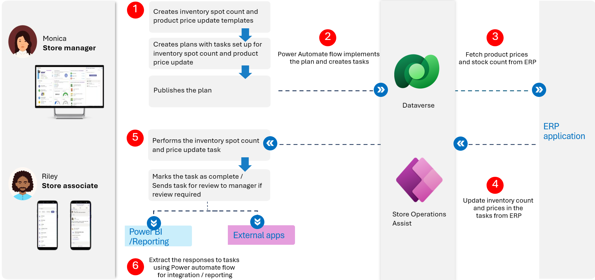
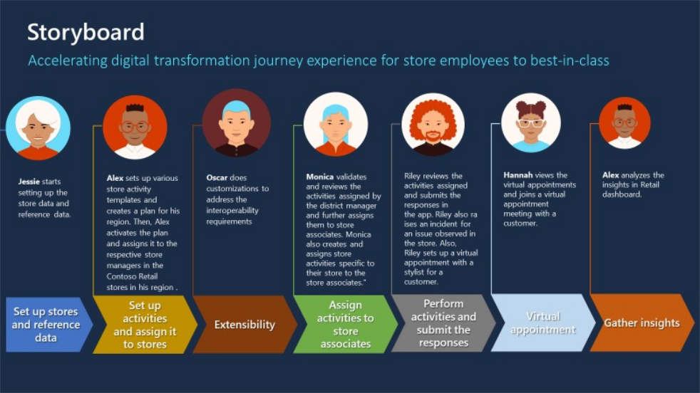

This module focuses on how Contoso Retail addresses their business requirements by customizing the Store Operations Assist solution to integrate with their line-of-business applications.

## Retail story

To meet their business requirements, Contoso Retail needs to complete the following tasks to integrate the Store Operations Assist solution with their line-of-business applications:  

- Update the product prices data in the Store Operations Assist solution from Contoso's ERP application. 

- Extract and integrate survey responses into their line-of-business applications to improve the retail store operations. 

- Complete a daily product price check task for products in the footwear section and if product prices have been updated, record the responses as part of the task, and then mark the task as complete. Contoso Retail plans to integrate these recorded responses about price updates into an external application for their business requirements. 

- Conduct regular product inventory spot count checks for the footwear section of the store to maintain optimal inventory levels. Based on the stock-level checks, Contoso wants to automatically raise replenishment orders if stock for the product falls below threshold level. Replenishment orders ensure that the stores always have optimal stock levels to fulfill customer demand for products.

The following illustration shows the process flow of integrations for products data with ERP application. 
 
> [!div class="mx-imgBorder"]
> 

## Personas and scenarios

In this module, you assume different personas to solve the integration requirements of Contoso Retail.

> [!div class="mx-imgBorder"]
> 

Acting as these various personas, you perform the following exercises (in the order shown): 

- Set up the prerequisites for completing the rest of the exercises in this module. You need sample template files with fields for developing the integration requirements. In a typical integration scenario, you would use Microsoft Azure Integration Services and Microsoft Azure Storage. However, for this training, you use sample template files that are available for download. Then, you complete the following tasks:

   - Enable the Store Operations Assist solution to read data that's stored in SharePoint. 

   - Create a new custom solution for Contoso Retail's business requirements. You develop the code artifacts for this custom solution and then publish all customizations. 

   - Create the environment variables that are used in the plug-in to read the price information file from SharePoint and then update the product prices and inventory stock count when plans have been implemented.

- Create and register a customized Store Operations Assist solution. 

- Develop a low-code based solution by using Microsoft Power Automate flows that extracts the survey responses and exports this data to a file on Contoso Retail's Microsoft Teams site to integrate with Contoso's other line-of-business applications. 

- Record survey responses as part of the Store Opening Checklist survey.

- Develop a low-code based solution by using Power Automate flows to extract the inventory stock with good stock and damaged stock of the products in Contoso Retail's pilot Store 101 in Redmond. Also, if the good stock of the product is less, then you segregate such products into a separate file that you can use to place replenishment orders.

- Use the Dataflows feature from Microsoft Power Platform to extract the product price data from the ERP application and load it into the Store Operations Assist solution.

- Customize the forms in the Store Operations Assist solution for special themes and background colors.

- Publish and implement the plans, assign tasks to store associates, and set up push notifications. 
