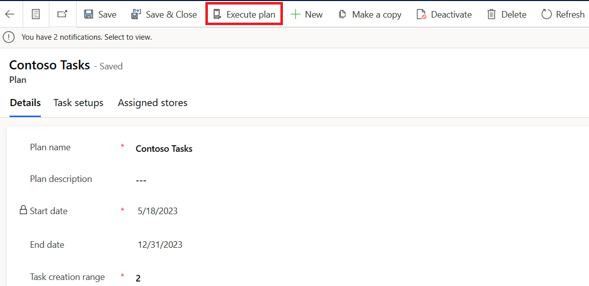

# Retail story

Contoso Retail has automated the task creation process based on plans that the district manager has created. After the district manager creates and publishes the plan, a Power Automate flow triggers in the background that implements and creates tasks. 

## Personas and scenario 

In this exercise, you play the role of different personas and perform the following tasks:

- Publish and implement the plan.

- Assign tasks to appropriate retail store associates by doing a bulk edit of tasks.

 > [!NOTE]
 > The exercise to publish the plan is the last exercise. The reason is so that the extensibility requirements for fetching the product prices from ERP, in addition to the flows that have been developed to extract the responses that retail store associates have made, are available before you publish the plan.

## Task: Publish a plan

In this task, you act as Alex, the retail manager, and publish the plan that you created in a previous exercise. 

1. Go to [Microsoft Power Apps](https://make.powerapps.com/?azure-portal=true) in an Incognito or InPrivate browsing session. Ensure that you're in the correct environment.

1. On the left navigation pane, select **Apps**. Select the play button that appears near Store Operations Assist.

   > [!div class="mx-imgBorder"]
   > 

1.	Change the navigation area on the lower left of the screen to **Action center**.

1. On the left navigation pane, select **Templates**.

1. Select the **Contoso Tasks** plan in draft status. This plan is the one that you created for the **Store Opening Checklist** task setups of inventory spot count and product price update as part of the **Manage templates and plans** exercise. Publish the plan by selecting **Publish**, as shown in the following image.

   > [!div class="mx-imgBorder"]
   > 

   When the plan is published, the status of the plans is updated to **Published**.

1. Select **Execute plan** to run the plan and create tasks.

   > [!div class="mx-imgBorder"]
   > 

## Task: Reassign tasks to retail store associates by doing a bulk edit

After the plan is published, the Power Automate flow picks up the plan to create tasks automatically. The created tasks are automatically assigned to the store manager of the associated business by default. In this task, you act as Monica Rodriguez, store manager of Contoso store 101, to reassign the **Store Opening Checklist** tasks to the retail store associates of Contoso Store 101. After being reassigned to the respective retail store associates, the tasks appear on the list of open tasks on the respective retail store associates' Store Operations Assist mobile app.

1. Go to the **Tasks** screen on the left navigation pane. Change the view to **All Tasks** and then filter on the **Owner** field for Store Opening Checklist.

   > [!div class="mx-imgBorder"]
   > 

1. After the tasks are filtered, select all records on the page. Then, select **Assign** from the ribbon menu. If you have more items in subsequent pages, repeat steps 3 and 4.

1. In the **Assign** dialog, complete the following details:

   - **Assign To** - User or team

   - **User or team** - Select the FLW user (in instructor-led training, use the FLW account that's allocated to you)

   > [!div class="mx-imgBorder"]
   > 

1. Select **Assign** to view all selected items that are assigned to FLW user as the owner. With this task, you can bulk assign tasks to retail store associates.

Congratulations, you've now completed the extensibility exercise part of the learning path.
