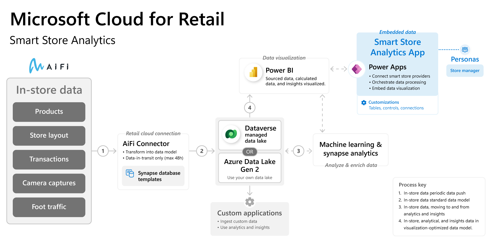

## Features of Smart Store Analytics

The features of Smart Store Analytics are:

- **AiFi Connector** - Smart Store Analytics seamlessly integrates with AiFi data, providing retailers with a centralized source for comprehensive retail data.

- **Analytics**

  - **Key performance indicators (KPIs)** - Monitor crucial metrics such as orders, shopper count, basket size, and checkout time.

  - **Sales growth analysis** - Compare sales growth against market share and shelf placement.

  - **Visualizations** - Use heat maps and customer journey analysis for a deeper analysis of customer behavior.

- **Insights**

  - **Data science/machine learning-backed product recommendations** - Enhanced with advanced algorithms for personalized and effective product catalogs.

## Architecture of Smart Store Analytics

Standardized metadata and self-describing data in Common Data Model facilitates metadata discovery and interoperability between data producers and apps, such as:

- Microsoft Power BI

- Microsoft Azure Data Factory

- Microsoft Azure Databricks

- Microsoft Azure Machine Learning packages

> [!div class="mx-imgBorder"]
> 

As shown in the preceding diagram, the facilitation of metadata discovery and interoperability in Smart Store Analytics works as follows:

1. Smart Store Analytics brings frictionless checkout data from AiFi through the AiFi Connector. The app transforms data into standard retail data models from Microsoft Azure Synapse database templates.

1. Customers can select Microsoft Dataverse-managed data lake or Azure Data Lake Gen2 (use your own data lake). Smart Store Analytics supports continuous replication of in-store data from the smart store provider to Microsoft Azure Data Lake Storage. Power Apps admin users can also access the managed Azure Data Lake directly for more extensibility and customization.

1. Smart Store Analytics runs analytics, aggregations, and machine learning.

1. The generated results and analytics are visualized in Power BI embedded in Power Apps.

For more information, see the [Smart Store Analytics architecture](/industry/retail/architecture/ra-smart-store-analytics/?azure-portal=true) documentation.
