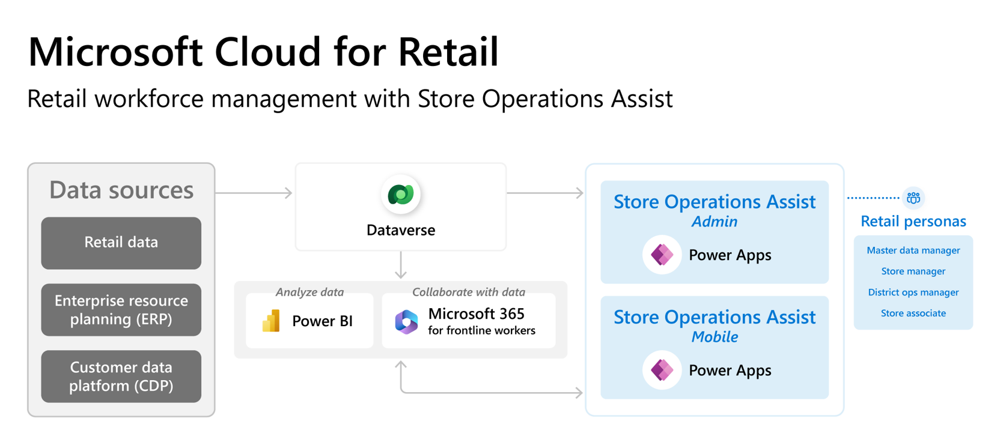

> [!div class="mx-imgBorder"]
> 

Store Operations Assist is built on Microsoft Power Platform and integrates with existing systems through  Microsoft Power Platform connector framework. 

Store Operations Assist can connect to multiple disparate systems. It provides the flexibility that companies need to capture product details, customer details, and transactions from any order source, such as:

- Retail point-of-sale (POS) systems

- Enterprise resource planning (ERP) systems

- Customer data platform (CDP)

- Inventory management systems

- Traditional sources, such as Electronic Data Interchange (EDI)

With a low-code, no-code experience in Microsoft Power Platform, retailers can integrate Store Operations Assist solutions with their existing ecosystem of applications and customize the application as required.

The two components that have been developed in Microsoft Power Platform for Store Operations Assist are:

- **Store Operations Assist Admin** - A model-driven app that empowers district managers and store managers to oversee store operations. With this app, they can create retail tasks, assign them to store associates with accompanying guidelines, review completed tasks, and provide detailed feedback.

- **Store Operations Assist Mobile** - A mobile app that provides store associates with a self-service tool on their mobile devices to enhance productivity during their shifts. Through this app, they can access store data and insights, carry out store operations, assist customers, and facilitate product and service sales. It facilitates seamless communication and collaboration. The retail operations team can effortlessly create, distribute, and monitor task assignments that are targeted to specific locations. This process helps store associates to effectively complete tasks with clear and detailed directions that have been provided by headquarters/operations.
