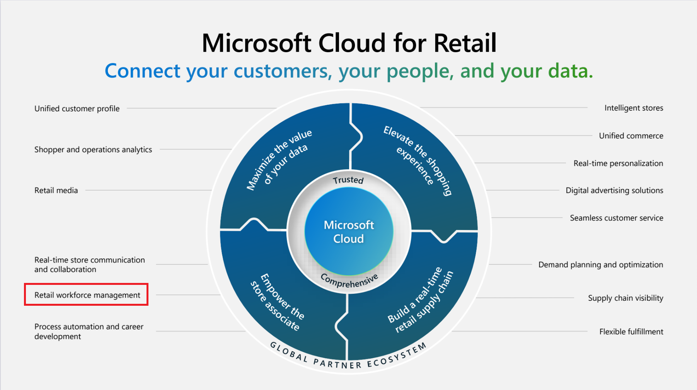

One key priority scenario addressed by Microsoft Cloud for Retail is Retail workforce management, which helps you digitize managerial tasks.

With retail workforce management, you can manage shift scheduling seamlessly, connect and collaborate with your existing workforce, simplify task dissemination, and help your team complete tasks successfully.

  > [!div class="mx-imgBorder"]
  > 

For retail workforce management, the **Store Operations Assist** solution simplifies retail store scheduling, employee communication, and other store manager tasks. It also provides store associates with access to data and insights into their workflow. With this solution, retailers can:

- Improve the bottom line by driving the efficiency of store operations.
- Improve customer experience by connecting store associates with customers.
- Provide store associates with tools for assistive selling.

The two components to this solution are **Intelligent store operations** and **Clientel'ing**.

## Intelligent store operations

With Intelligent store operations, retailers can improve their bottom line by driving the efficiency of the store operations. Retailers provide tools to store associates for their daily activities and tools to store leadership for analytics and insights. Store Operations Assist Admin for the managers and Store Operations Assist Mobile for the store associates help to digitize and automate store tasks, such as:

- Cash operations
- Physical inventory
- People management
- Supply chain
- Store layout
- Master data management
- Promotions
- Pricing

Key functionalities of Intelligent store operations include:

- District operations managers and store managers can use Store Operations Assist Admin to:

  - Manage their store operations through business-aware activity templates.
  - Prioritize effectively and plan their store activities.
  - Enable corrective actions through productivity analytics.

- Store associates can use Store Operations Assist Mobile, a self-service tool that can help them be productive during their shift and manage activities, such as:

  - Store walks and safety audits
  - Shift change checks
  - Planogram implementation enabled through AI
  - Visual merchandising
  - Product and asset quality checks
  - Stock audits
  - Request support or assets
  - Submit incidents for follow-up actions

## Clientel'ing

Clientel'ing is a technique that retailers can use to foster enduring relationships with customers by using data that pertains to their preferences, behaviors, and purchases.

Clientel'ing helps store associates in gaining a deeper understanding of their customers' needs and preferences, enabling them to make well-informed choices regarding product offerings, inventory management, and marketing strategies. By using customer data, store associates can deliver more personalized and relevant shopping experiences, thereby enhancing customer satisfaction and driving sales. This added value enhances the overall shopping experience and fosters customer loyalty because individuals are more inclined to revisit stores where they feel understood and valued.

Key capabilities of Clientel'ing include:

- Conduct targeted conversations with customers identified through a unified Customer 360° view of their profile, preferences, and order history.
- Capture leads and fix appointments with experts (such as for wardrobe design, interior design, and so on).
- View product recommendations that are specific to a customer for assistive selling.
- Query regarding the availability of on-hand stock across stores, warehouses, and retail locations.
- Take orders, including pick-ups from the store and home deliveries.

