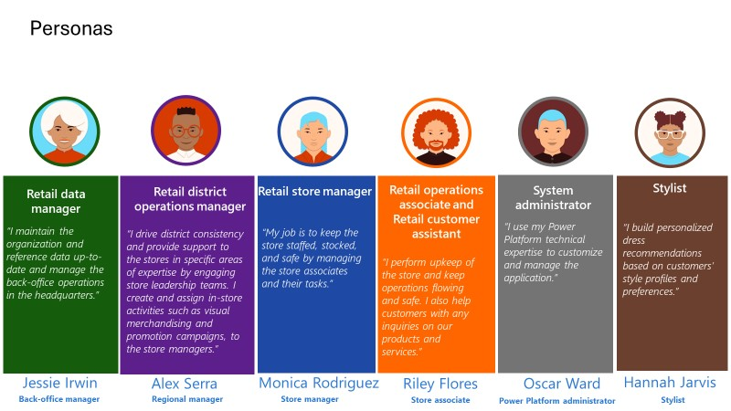
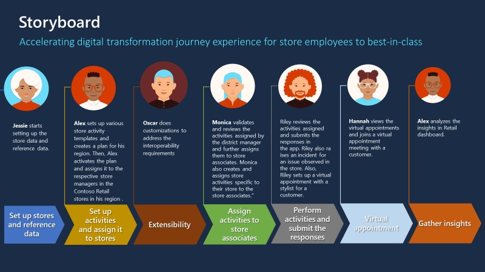

This learning path focuses on the story of Contoso Retail. 

**Contoso Retail** is a luxury fashion company with retail store operations across different regions in the US and is a subsidiary of Contoso, Ltd. It also has a discount store chain called Fabrikam Retail. The same regional/district manager manages the operations across stores in Contoso Retail and Fabrikam Retail stores in a region.

Contoso Retail wants store managers and store associates at Contoso Retail and Fabrikam Retail stores to have the following capabilities:

- Digitize the entire store operations.

- Enhance their daily experience.

- Provide assistive selling tools by using the Store Operations Assist solution, which has the potential to integrate with their line-of-business systems.

The following diagram describes Contoso Retail's fictional personas.

> [!div class="mx-imgBorder"]
> 

In the upcoming exercises, you'll assume the roles of fictional personas to complete the associated tasks. The following diagram shows the storyboard and how each persona contributes.

> [!div class="mx-imgBorder"]
> 

- **Exercise - Set up a training environment for Store Operations Assist** - You assume the role of Oscar Ward, Microsoft Power Platform administrator/developer in the Retail Store Operations team for Contoso Retail, with the System Administrator security role. You acquire the necessary licenses, create a new Microsoft Power Platform environment and deploy the Store Operations Assist solution in a training environment.

- **Exercise - Set up organization and reference data** - You assume the role of Jessie Irwin, back office manager, in Retail Store Operations for Contoso Retail, with the Retail Data Manager security role assigned in Microsoft Power Platform environment. You set up the organization data and reference data.

- **Exercise - Use Store Operations Assist Admin** - You assume the role of Alex Serra, regional manager in Retail Store Operations for Contoso Retail and Monica Rodriguez, store manager for Contoso Store 101. You set up activity templates and plans in Store Operations Assist Admin.

- **Exercise - Extend Store Operations Assist** - You assume the role of Oscar Ward and construct customizations and automate store operations, which includes the use of plug-ins and the creation of Microsoft Power Automate flows.

- **Exercise - Use Store Operations Assist Mobile** - You assume the role of Riley Flores, store associate for Contoso Store 101, with the Retail operations associate and Retail customer assistant security roles assigned in Microsoft Power Platform environment. You access Store Operations Assist Mobile to review and complete the assigned tasks according to the guidelines. You also create service requests, view a 360-degree profile for a customer, and create a virtual appointment for a customer.

- **Exercise - View Retail Insights** - You assume the role of Alex Serra, regional manager in Retail Store Operations for Contoso Retail. You review the data and reports in the Retail Insights dashboard.

