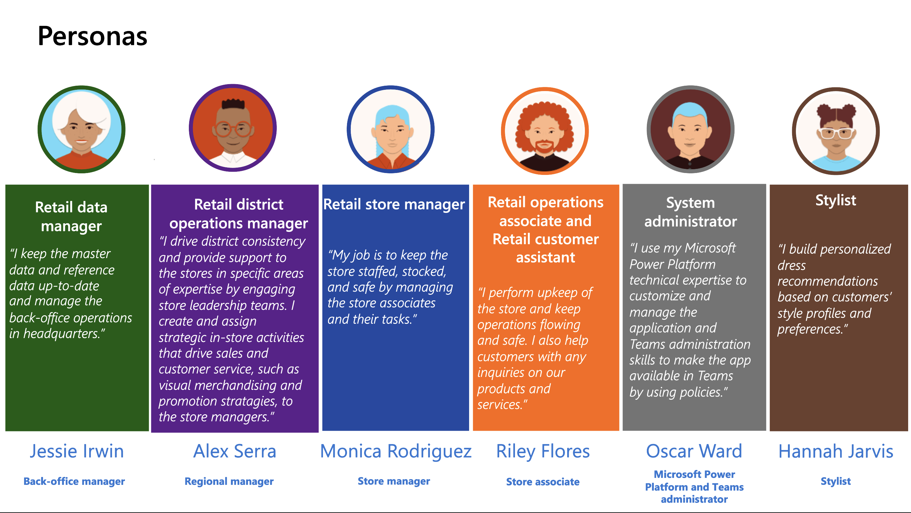
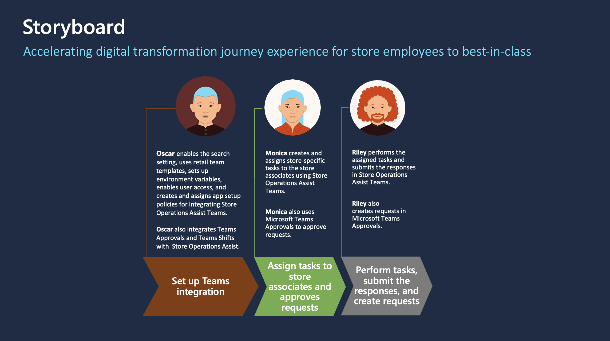

This learning path continues to focus on the story of Contoso Retail.

Contoso Retail aims to revolutionize how their employees interact with the tools and information that are vital to their roles. They want to empower their frontline workforce and admin/retail managers with digital tools and modern devices that offer the best experiences for collaboration and productivity by integrating Store Operations Assist with Microsoft Teams.

- Contoso Retail wants to elevate their frontline workforce, providing them with advanced tools, such as Store Operations Assist Teams. The objective is to establish Store Operations Assist Teams seamlessly and facilitate its adoption among store managers and associates. The goal is to cultivate improved collaboration and productivity, reshaping the dynamics of teamwork within the organization.

- Microsoft Teams Approvals enables store managers in Contoso Retail to conveniently review and respond to requests made by store associates. Within the Approvals app, store managers can easily access and manage requests originating from the Store Operations Assist Mobile or Teams application. This integration streamlines their workflow by eliminating the necessity to switch between Teams and Store Operations Assist, saving their time and enhancing efficiency.

- Microsoft Teams Shifts automates manual staff scheduling related tasks. It frees up store managers from trying to fill shifts manually (that is, call individuals to validate, sometimes multiple folks to coordinate swaps etc.). Integration of Store Operations Assist with Microsoft Teams Shifts gives store managers of Contoso Retail with a holistic view of their store's schedule, enabling them to make informed decisions.

The following diagram describes Contoso Retail's fictional personas.

> [!div class="mx-imgBorder"]
> 

In the upcoming exercises, you'll assume the roles of few fictional personas to complete the associated tasks. The following diagram shows the storyboard and how each persona contributes.

> [!div class="mx-imgBorder"]
> 

- **Exercise - Set up Store Operations Assist Teams** - You assume the role of Oscar Ward, Microsoft Power Platform administrator/developer, and Microsoft Teams administrator in the Retail Store Operations team for Contoso Retail, with the System Administrator security role assigned in Microsoft Power Platform environment. You set up Store Operations Assist Teams and enable users to access Store Operations Assist Teams in Contoso Retail's Microsoft Teams.

- **Exercise - Use Store Operations Assist Teams** - You assume the role of Monica Rodriguez, store manager for Contoso Store 101 and Riley Flores, store associate for Contoso Store 101 and use Store Operations Assist Teams to complete the assigned tasks according to the guidelines.

- **Exercise - Use Store Operations Assist with Microsoft Teams Approvals** - You assume the role of Oscar Ward and enable integration between the Microsoft Teams Approvals app and Store Operations Assist. You also assume the role of Monica and Riley to use the Approval app to complete the associated tasks.

- **Exercise - Use Store Operations Assist with Microsoft Teams Shifts** - You assume the role of Oscar Ward and enable integration between the Microsoft Teams Shifts app and Store Operations Assist.

