Oscar is also responsible for Microsoft Teams administration in Contoso Retail. Taking on Oscar's responsibility as Teams Administrator, you use app setup policies to pin and automatically install Store Operations Assist Teams for store managers and associates.

> [!NOTE]
> In the following tasks, you're using the teams that you created in the ["Microsoft Teams and Dataverse security setup"](/training/modules/retail-setup-master-data/microsoft-teams-dataverse/?ns-enrollment-type=learningpath&ns-enrollment-id=learn-bizapps.retail-store-operations-assist) exercise in the ["Set up reference data and security"](/training/modules/retail-setup-master-data/) module. The name of the teams that you'll use are **Contoso Store 101 Associates** and **Contoso Store 101 Managers**.

## Task - Create an app setup policy

To create an app setup policy, follow these steps:

1. Go to [Microsoft Teams admin center](https://admin.teams.microsoft.com/?azure-portal=true) in a new tab page in the same InPrivate or Incognito browser.

1. Sign in with the admin tenant.

1. Expand **Teams apps** in the left navigation pane, select **Manage apps**, and then select **Upload new app**.

	> [!div class="mx-imgBorder"]
	> [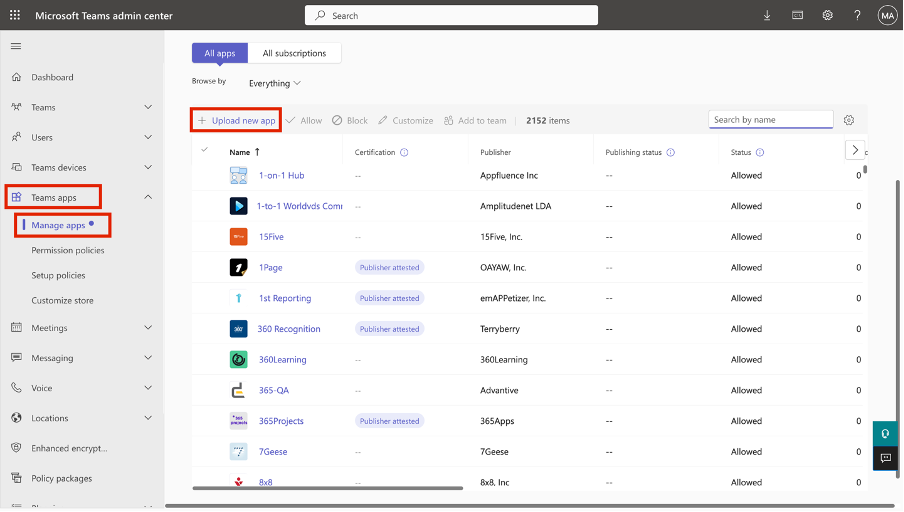](../media/upload.png#lightbox)

1. On the pop-up window, select **Upload**.

	> [!div class="mx-imgBorder"]
	> [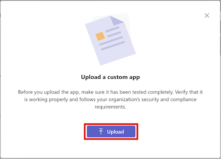](../media/upload-button.png#lightbox)

1. Select the **Store Operations Assist Teams.zip** file that you downloaded in the previous exercise.

1. Expand **Teams apps** in the left navigation pane, select **Setup policies**, and then select **Add**.

	> [!div class="mx-imgBorder"]
	> [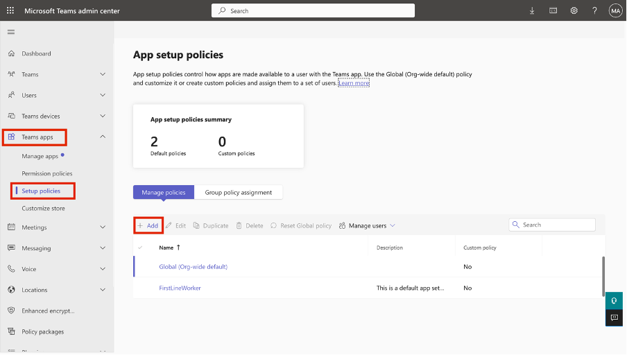](../media/add-policy.png#lightbox)

1. Enter the name **ContosoStore101**. Under **Installed apps**, select **Add apps**.

	> [!div class="mx-imgBorder"]
	> [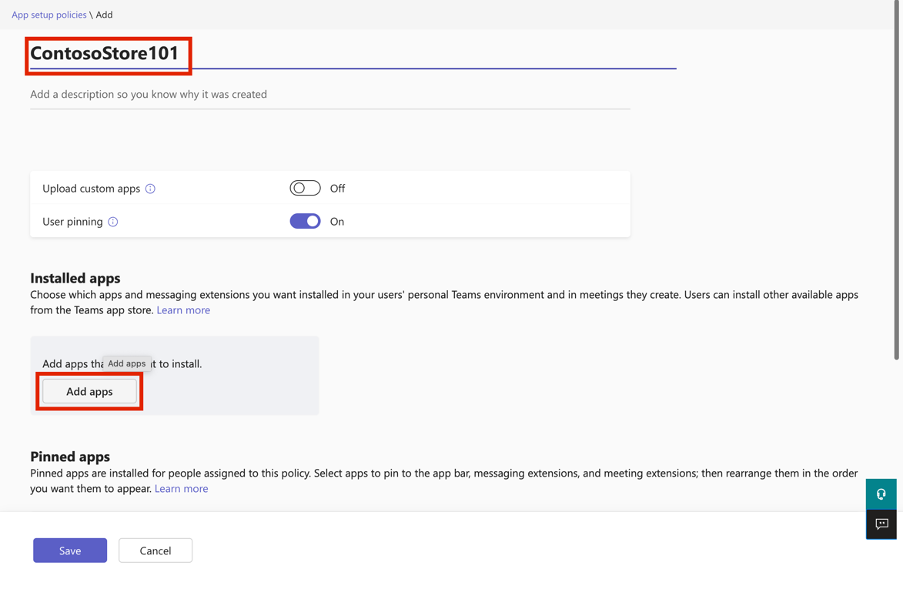](../media/add-apps.png#lightbox)

1. In the right pane, search for **Store Operations Assist Teams**. From the dropdown menu, select **Add**.

	> [!div class="mx-imgBorder"]
	> [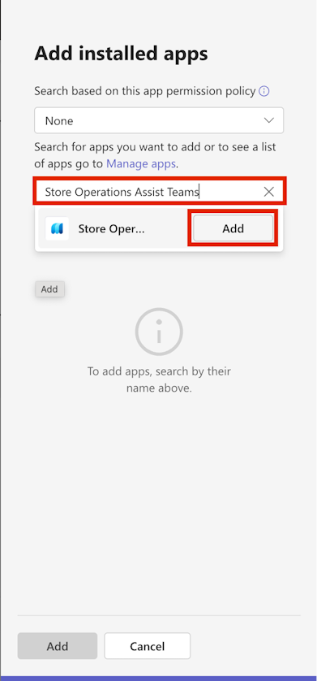](../media/add-store-operations-assist-teams.png#lightbox)

1. Select **Add**.

	> [!div class="mx-imgBorder"]
	> [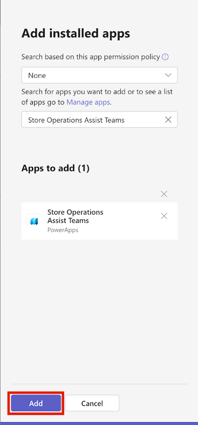](../media/add-installed-apps.png#lightbox)

1. Under **Pinned apps**, select **Add apps**.

	> [!div class="mx-imgBorder"]
	> [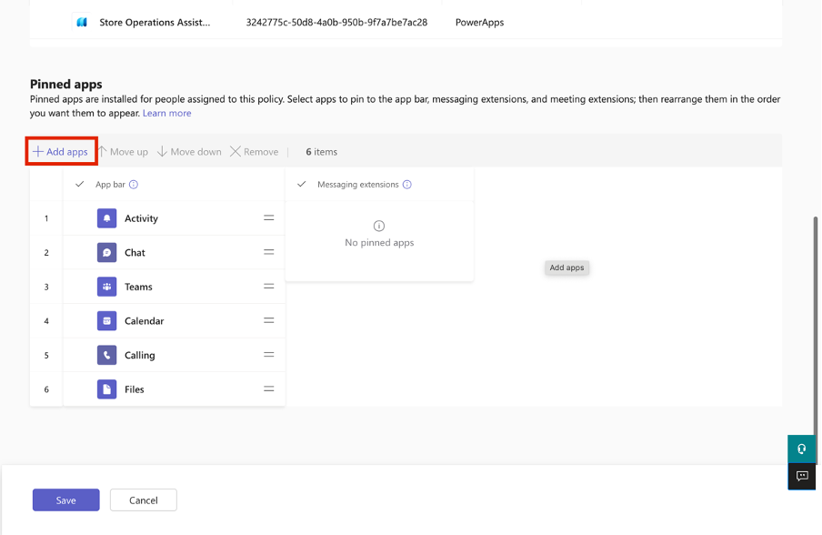](../media/pinned-apps-add.png#lightbox)

1. In the right pane, search for **Store Operations Assist Teams**. From the dropdown menu, select **Add**.

	> [!div class="mx-imgBorder"]
	> [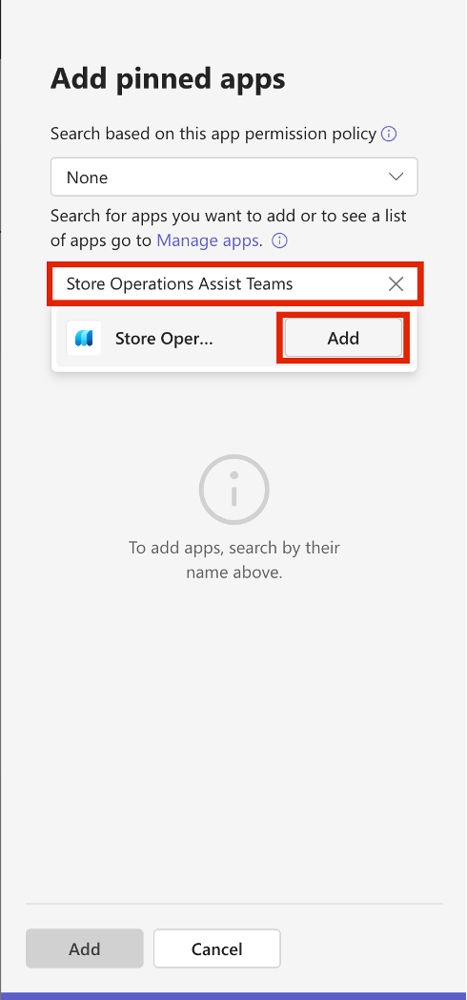](../media/menu-add.png#lightbox)

1. Select **Add**.

	> [!div class="mx-imgBorder"]
	> 

1. Select the equal (**=**) sign near **Store Operations Assist Teams** and then drag it to the top position. Select **Save**.

	> [!div class="mx-imgBorder"]
	> [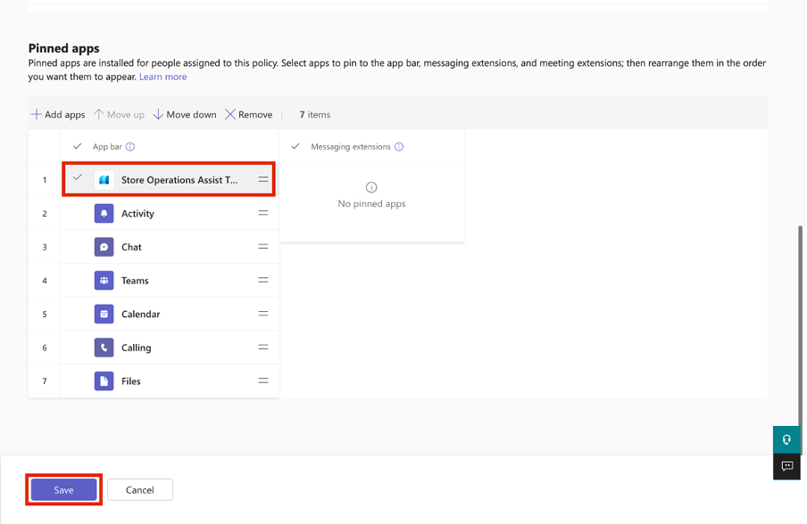](../media/position.png#lightbox)

	 > [!NOTE]
	 > Ensure that Store Operations Assist is pinned as the first app on the Teams ribbon. This action ensures that you return to Store Operations Assist Teams and not to the **Teams Activity** page when you select **Back to Teams** or **Complete** while completing tasks.

1. You're redirected to the **App setup policies** page in the Teams admin center. The policy that you created should display on this page. Stay on this page and continue to the next task.

	> [!div class="mx-imgBorder"]
	> [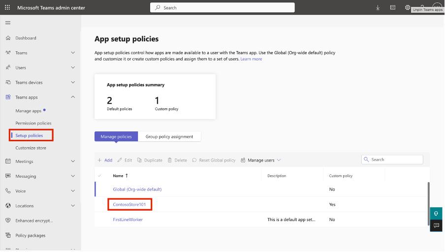](../media/policies.png#lightbox)

## Task - Assign an app setup policy to users

To assign an app setup policy to users, complete these steps:

1. On the **App setup policies** page, select the **Group policy assignment** tab and then select **Add**.

	> [!div class="mx-imgBorder"]
	> [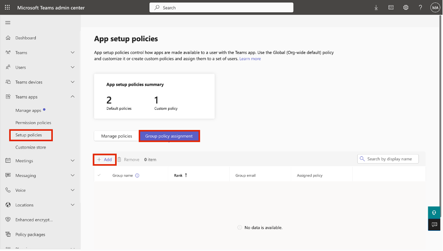](../media/group-policy-assignment.png#lightbox)

1. On the right pane, search for **Contoso Store 101 Associates** and then select **Add** from the dropdown menu.

	> [!div class="mx-imgBorder"]
	> [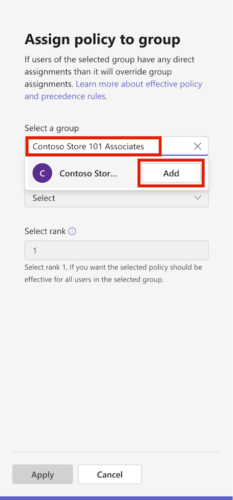](../media/group-add.png#lightbox)

1. Under **Select a policy**, select **ContosoStore101**.

1. Select **Apply**.

	> [!div class="mx-imgBorder"]
	> [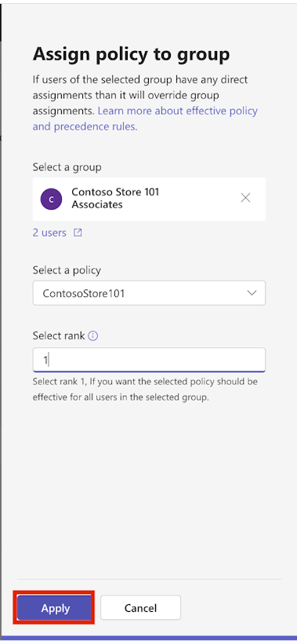](../media/apply.png#lightbox)

1. On the pop-up window, select **Confirm**.

	> [!div class="mx-imgBorder"]
	> [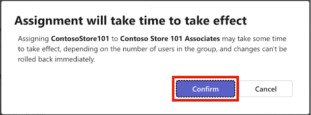](../media/confirm.png#lightbox)

1. Repeat the steps to assign the same policy to **Contoso Store 101 Managers**.
