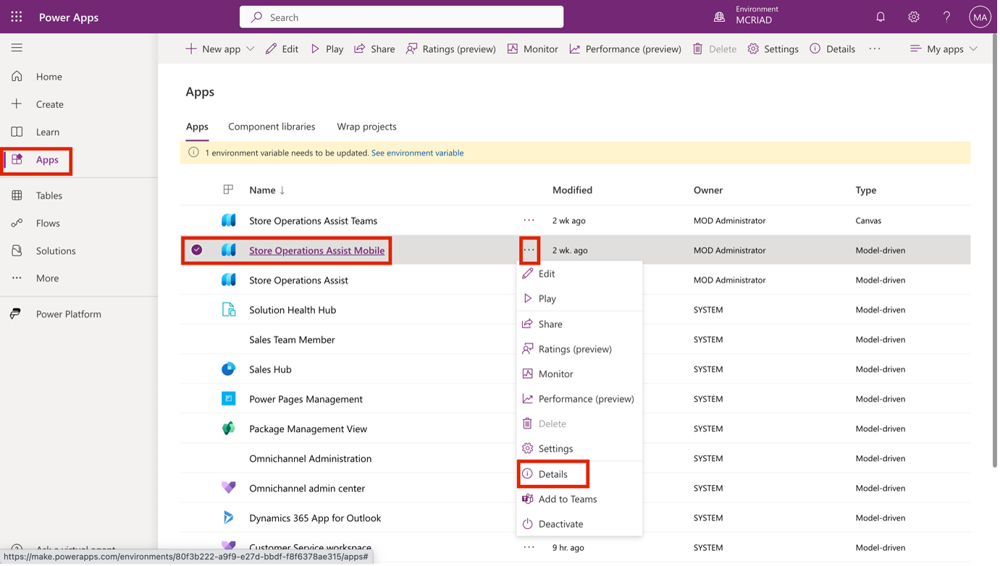
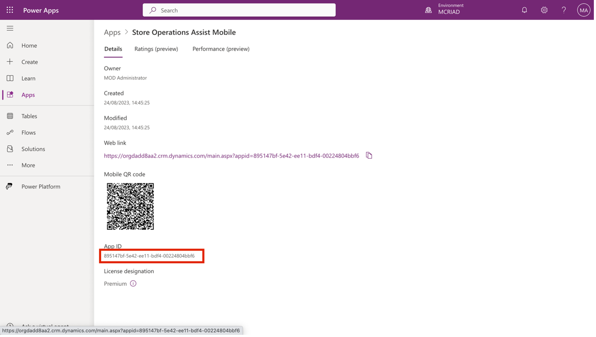
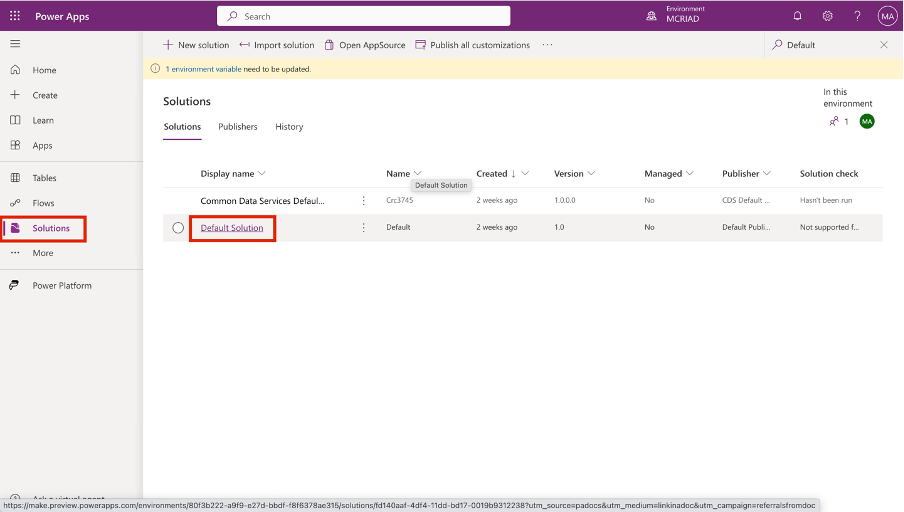
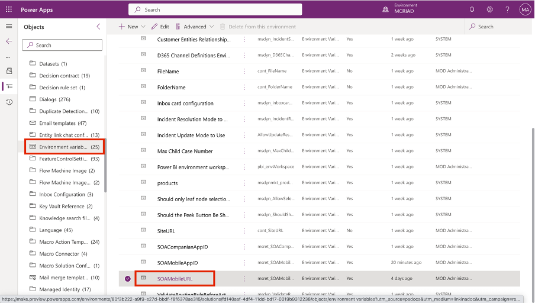
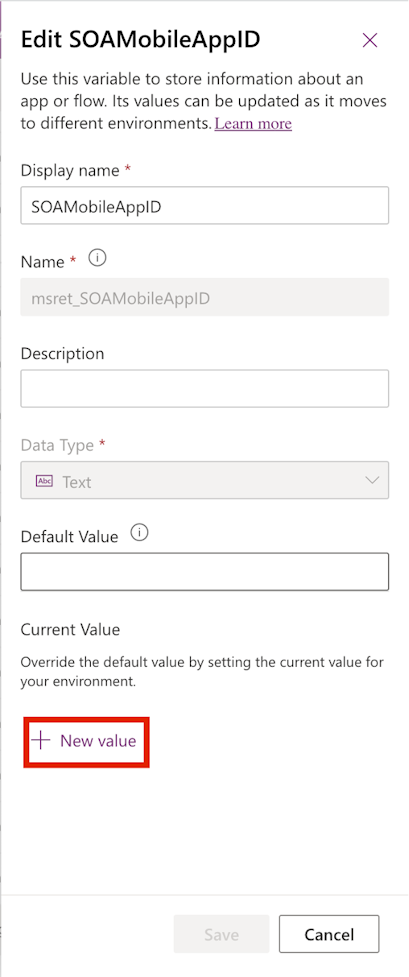
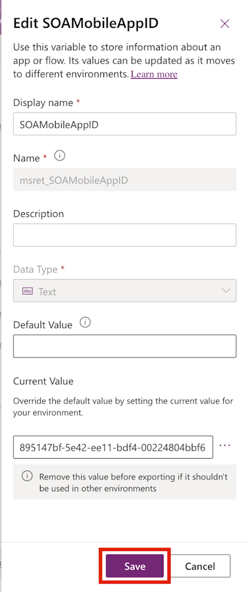
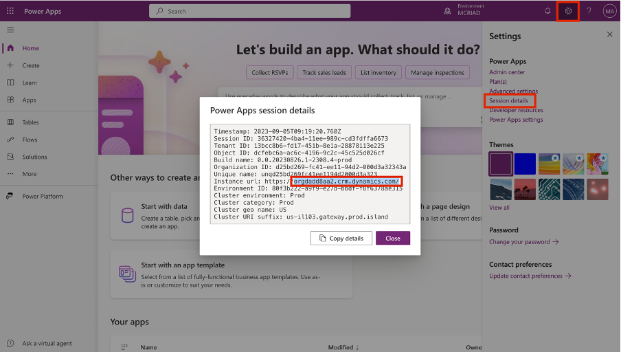
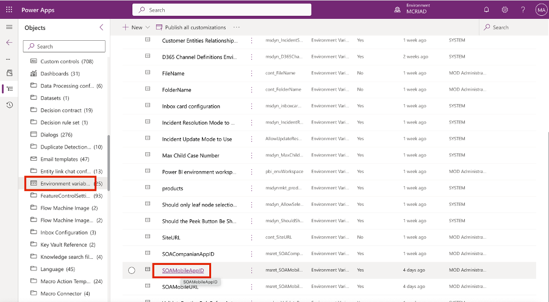
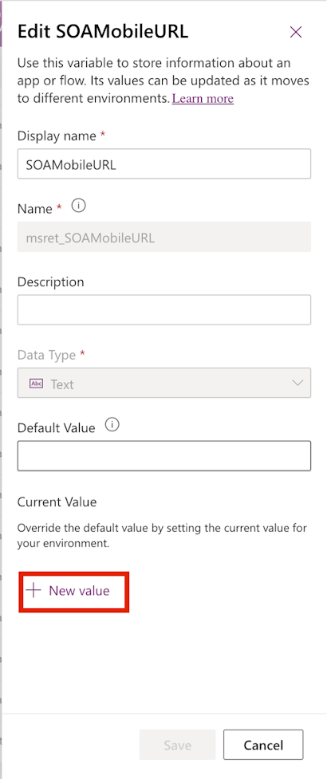
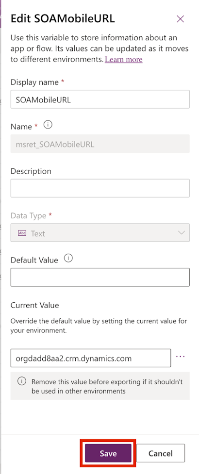

In this exercise, you set up the mobile App ID and the mobile URL environment variables.

  > [!NOTE]
  > This setup is specific only for setting up Store Operations Assist Mobile within Microsoft Teams. 

## Task - Set up the mobile App ID environment variable

As Oscar, the Microsoft Power Platform administrator, you need to set up the mobile App ID so that store associates can navigate from Store Operations Assist Teams to Store Operations Assist Mobile.

1. Sign in to [Power Apps](https://make.preview.powerapps.com/?utm_source=padocs&utm_medium=linkinadoc&utm_campaign=referralsfromdoc).

1. Ensure that you're in the correct environment.

1. Select **Apps** in the left navigation pane, select **Store Operations Assist Mobile**, and then select **Details** from the **More Commands (...)** dropdown menu.

	> [!div class="mx-imgBorder"]
	> 

1. Copy the **App ID** and then save it for use in a later step.

	> [!div class="mx-imgBorder"]
	> 

1. Select **Solutions** in the left navigation pane.

1. In the search area, search for **Default**. Select **Default Solution**.

	> [!div class="mx-imgBorder"]
	> 

1. Select **Environment variables** and then select **SOAMobileAppID**.

	> [!div class="mx-imgBorder"]
	> 

1. In the right pane, select **+ New value** under **Current Value**.

	> [!div class="mx-imgBorder"]
	> 

1. Paste the copied App ID in the **Current Value** field for the **SOAMobileAppID** environment variable. Select **Save**.

	> [!div class="mx-imgBorder"]
	> 

## Task - Set up the mobile URL environment variable

As Oscar, the Microsoft Power Platform administrator, you need to set up the URL of the Store Operations Assist environment that you want your store associates to access through Teams.

1. Sign in to [Power Apps](https://make.preview.powerapps.com/?utm_source=padocs&utm_medium=linkinadoc&utm_campaign=referralsfromdoc).

1. Ensure that you're in the correct environment.

1. To get the app URL, go to **Settings > Session details**.

1. Copy the instance URL without the **https://www** part and the last forward slash (**/**) and then save it for use in a later step.

	> [!div class="mx-imgBorder"]
	> 

1. Select **Solutions** in the left navigation pane.

1. In the search area, search for **Default**. Select **Default Solution**.

	> [!div class="mx-imgBorder"]
	> 

1. Select **Environment variables** and then select **SOAMobileURL**.

	> [!div class="mx-imgBorder"]
	> 

1. In the right pane, select **+ New value** under **Current Value**.

	> [!div class="mx-imgBorder"]
	> 

1. Paste the copied URL in the current value for the **SOAMobileURL** environment variable. Select **Save**.

    > [!div class="mx-imgBorder"]
    > 

