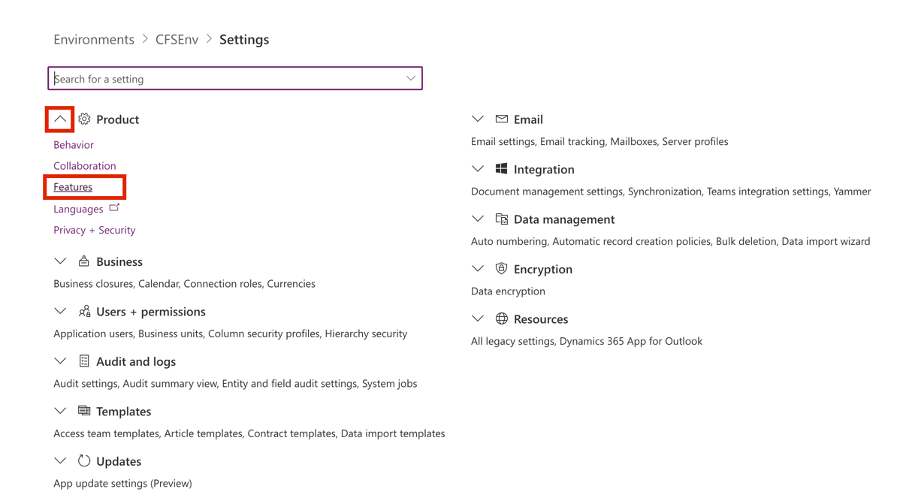

In the trial environment that's slated for the upcoming exercises, the default configuration has the search setting turned off which restricts access to the Microsoft Dataverse tables for conducting searches. To enable contact searching, you need to manually activate this setting.

To turn on the search setting, perform the following steps:

1.  Sign in to [Microsoft Power Platform admin center](https://admin.powerplatform.microsoft.com/?azure-portal=true) by using the admin tenant.

1.  On your left navigation pane, select **Environments** and then select your environment.

1.  Select **Settings**.

	> [!div class="mx-imgBorder"]
	> 

1.  Expand **Product** and then select **Features**.

	> [!div class="mx-imgBorder"]
	> 

1.  Set the **Dataverse search** toggle to **On (recommended)**.

	> [!div class="mx-imgBorder"]
	> 

1.  Scroll down and select **Save**.

	> [!div class="mx-imgBorder"]
	> 
