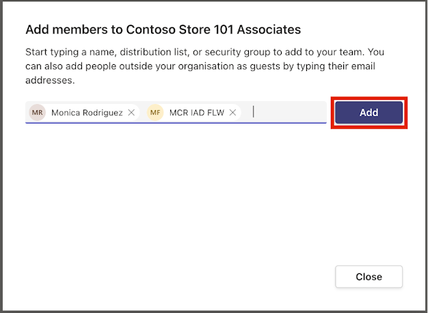
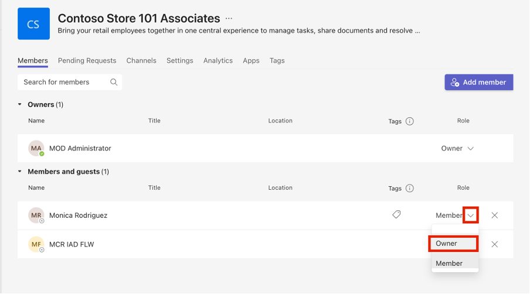

As Oscar, the Microsoft Power Platform administrator, you must set up your teams if you didn't already complete the [Microsoft Teams and Dataverse security setup](/training/modules/retail-setup-master-data/microsoft-teams-dataverse/?ns-enrollment-type=learningpath&ns-enrollment-id=learn-bizapps.retail-store-operations-assist) in the [Set up reference data and security](/training/modules/retail-setup-master-data/) module.

1. Go to [Microsoft Teams](https://teams.microsoft.com/) in an InPrivate or Incognito browser session.

1. Sign in with the admin tenant.

1. Select **Teams**.

	> [!div class="mx-imgBorder"]
	> 

1. Select **Create team**.

	> [!div class="mx-imgBorder"]
	> 

1. Under **Select from a template**, scroll down and then select **Manage a Store**.

	> [!div class="mx-imgBorder"]
	> 

1. On the **Manage a Store** pane, select **Next**.

	> [!div class="mx-imgBorder"]
	> 

1. On the **What kind of team will this be** pane, select **Private**.

	> [!div class="mx-imgBorder"]
	> 

1. On the **Some quick details about your private team** pane, enter **Contoso Store 101 Associates** as the name of your team and then select **Create**.

	> [!div class="mx-imgBorder"]
	> 

1. After the team is created, select the ellipsis (**...**) next to it. From the dropdown menu, select **Manage team**.

	> [!div class="mx-imgBorder"]
	> 

1. Select **Add member**.

	> [!div class="mx-imgBorder"]
	> 

1. Search for and select **Monica Rodriguez** and **MCR IAD FLW**. Select **Add**.

	> [!div class="mx-imgBorder"]
	> 

1. Select **Close**.

	> [!div class="mx-imgBorder"]
	> 

1. Change the role of Monica from **Member** to **Owner**.

	> [!div class="mx-imgBorder"]
	> 

1. Use the following details to create another team for store managers.

	- Template - **Retail for Managers**
	- Name - **Contoso Store 101 Managers**
	- Member - **Monica Rodriguez**
