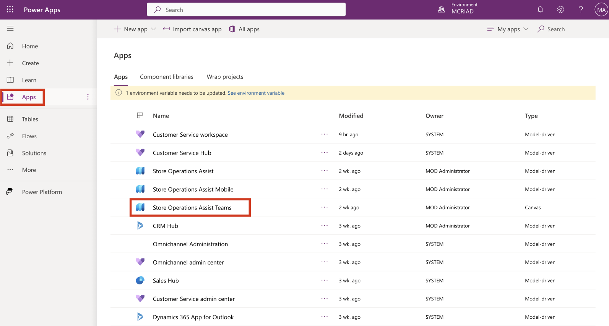
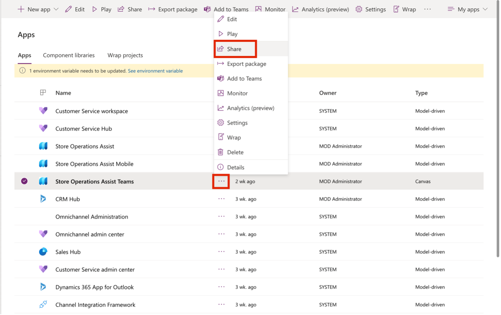
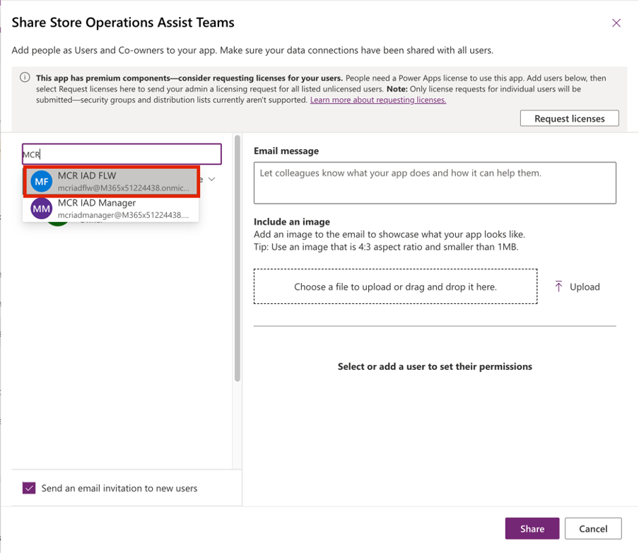
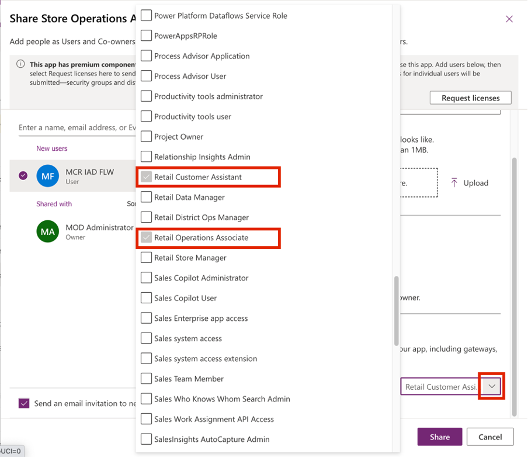
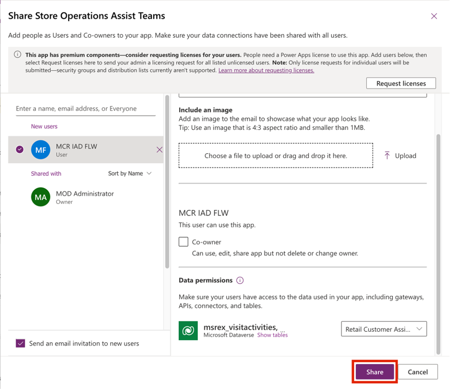
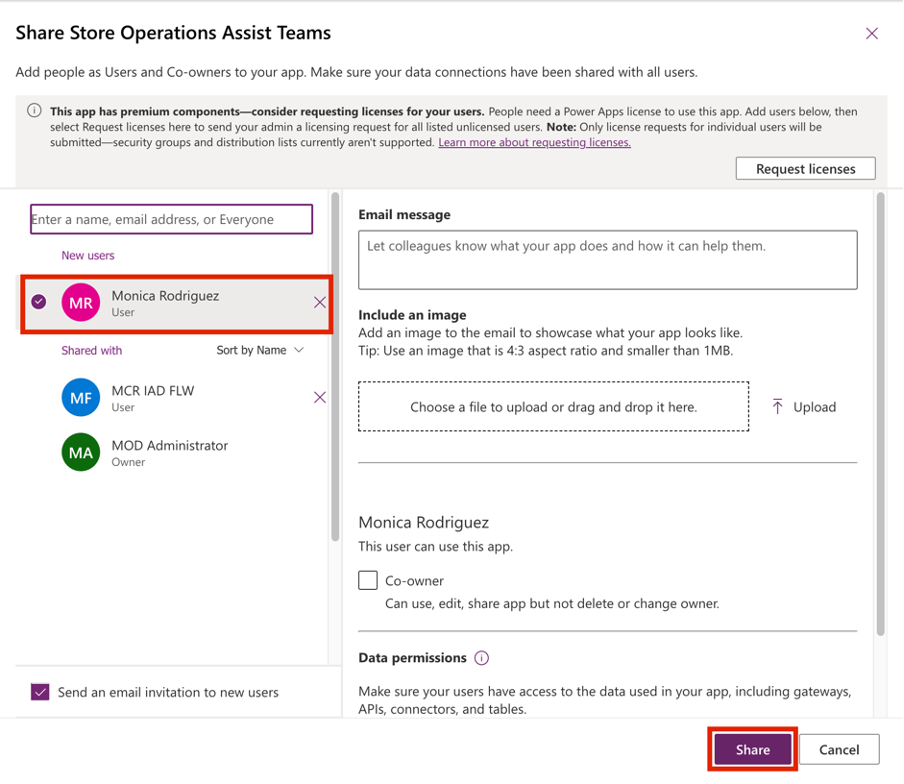
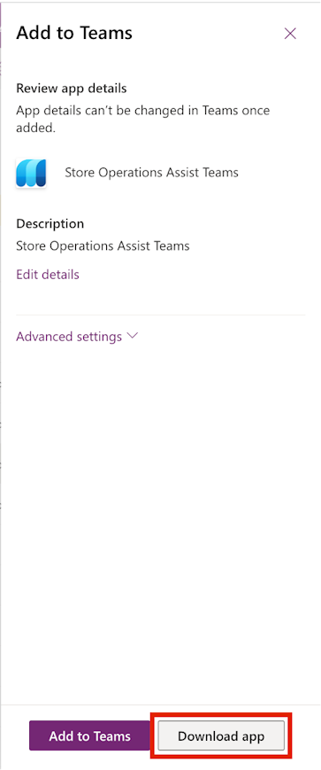

You use the role permissions that are granted to Oscar as a Microsoft Power Platform administrator to share and embed Store Operations Assist Teams into Microsoft Teams. This integration helps store associates of Contoso Retail access the app conveniently from Microsoft Teams.

## Task - Share Store Operations Assist Teams with your organization

Share Store Operations Assist Teams with your organization by following these steps:

1. Sign in to [Power Apps](https://make.preview.powerapps.com/?utm_source=padocs&utm_medium=linkinadoc&utm_campaign=referralsfromdoc).

1. Ensure that you're in the correct environment.

1. On the left navigation pane, select **Apps**. Select **Store Operations Assist Teams**.

	> [!div class="mx-imgBorder"]
	> 

1. Select **More Commands** (**...**), and then select **Share** from the dropdown menu.

	> [!div class="mx-imgBorder"]
	> 

1. On the **Share Store Operations Assist Teams** pane, in the **Enter a name, email address, or Everyone** box, search for and select **MCR IAD FLW** from the dropdown menu.

	> [!div class="mx-imgBorder"]
	> 

1. Under **Data permissions**, select **Retail Operations Associate** and **Retail Customer Assistant** from the dropdown list.

	> [!div class="mx-imgBorder"]
	> 

1. Select **Share**.

	> [!div class="mx-imgBorder"]
	> 

1. Share the app with user **Monica Rodriguez**. Leave the **Data permissions** field unchanged.

	> [!div class="mx-imgBorder"]
	> 

## Task - Embed Store Operations Assist Teams in Microsoft Teams

To embed Store Operations Assist Teams in Microsoft Teams, follow these steps:

1. Sign in to [Power Apps](https://make.preview.powerapps.com/?utm_source=padocs&utm_medium=linkinadoc&utm_campaign=referralsfromdoc).

1. Ensure that you're in the correct environment.

1. On the left navigation pane, select **Apps**. Select **Store Operations Assist Teams**.

	> [!div class="mx-imgBorder"]
	> 

1. Select **More Commands** (**...**), and then select **Add to Teams** from the dropdown menu.

	> [!div class="mx-imgBorder"]
	> 

1. The **Add to Teams** panel opens on the right side of the screen. Select **Download app**.

	> [!div class="mx-imgBorder"]
	> 

1. The **Store Operations Assist Teams.zip** file is downloaded. Note the path of the file because you need it in the next exercise. 
