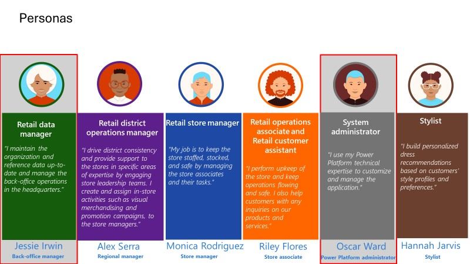

This module focuses on setting up security and organizational data. 

The security setup exercise focuses on establishing the essential security configurations for Store Operations Assist. It details the creation of Power Platform Teams linked to Teams/Microsoft 365 Groups and the necessary security permissions/roles required for a persona. 

The organizational data setup process concentrates on establishing the fundamental configurations for the Store Operations Assist solution within an organization. These foundational steps involve creating territories for retail organizations and setting up a hierarchical organizational structure by using business units. The data is set up for crucial information such as target groups, store zones, task types, request types, cancellation reasons, appointment types, and appointment teams. This reference data is specific to each organization, and you should set up the data according to your organization's requirements.

## Personas and scenarios

Contoso needs to manage the Store Operations Assist user access for their store associate users and managers directly from Microsoft Teams according to the organization hierarchy and business units that are defined. 

In the security setup exercise, you take on the role of Oscar Ward, the IT administrator for Contoso Retail, with the System Administrator security role assigned in Microsoft Power Platform environment. You set up a Microsoft Teams hierarchy and use it to set up and assign security roles/business units to Microsoft Dataverse for Teams to add users to Store Operations Assist. You also create an app setup policy in Microsoft Teams admin center, share Store Operations Assist Admin in Teams, and assign the policy to the team of Retail Data managers of Contoso. This step ensures that all retail data managers can access Store Operations Assist Admin in Teams.

Contoso also has a requirement to set up the organizational data based on its organizational hierarchical structure and reference data that are based on discussions with regional and store managers. This data is required for regional or store managers when they're creating store activities. 

In the data setup exercise, you assume the role of Jessie Irwin, the retail data manager for Contoso Retail, with the security role assigned in Microsoft Power Platform environment. You will use Store Operations Assist in Microsoft Teams for this exercise.

> [!div class="mx-imgBorder"]
> 

