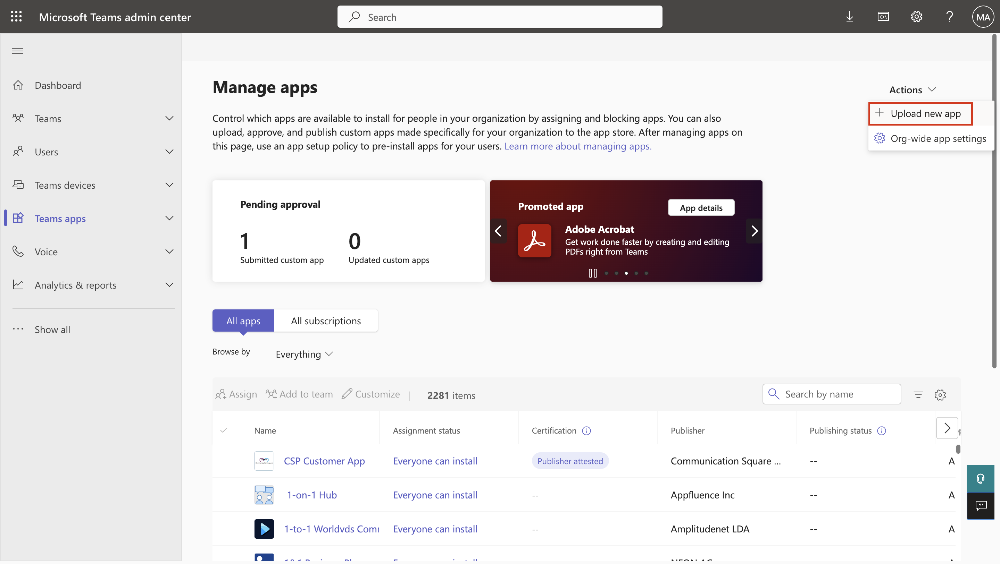

In this exercise, you'll set up Microsoft Dataverse security. In this exercise, you'll assume the role of Oscar, the system administrator, and perform the following tasks:

## Task: Create territories

You can use territories to group stores or business units in the same organizational hierarchy. In this task, you set up the territories for the Contoso Retail and Fabrikam Retail stores. 

1. Go to [Microsoft Power Apps](https://make.powerapps.com/?azure-portal=true) (we recommend that you use an Incognito or InPrivate browsing session). Ensure that you're in the correct environment. 

1. On the left navigation pane, select **Apps**. Select the play button that appears near **Store Operations Assist**.

   > [!div class="mx-imgBorder"]
   > 

1. In Store Operations Assist, select **App setup** from the area list in the bottom left corner.

   > [!div class="mx-imgBorder"]
   > 

1. On the left navigation pane, select **Territories**.

   > [!div class="mx-imgBorder"]
   > 

1. Select **New** on the upper command bar to create a new territory.

   > [!div class="mx-imgBorder"]
   > 

1. Enter **Redmond** in the **Territory Name** field and then select **Save**.

   > [!div class="mx-imgBorder"]
   > 

1. Repeat the previous steps to create the **San Francisco** and **New York** territories.

   > [!div class="mx-imgBorder"]
   > 

## Task: Create business units

A business unit represents the hierarchy of a retail organization, from the headquarters down to the stores, such as Headquarters > District > Store > Department. With the Store Operations Assist solution, you can create any level of hierarchy that reflects your organizational structure.

   > [!div class="mx-imgBorder"]
   > 

In this task, you create and import business units for various stores and regions and then assign them to appropriate territories and store managers. The business units data from the CSV file illustrates the organizational structure depicted in the organizational hierarchy. 

Typically, regional managers are assigned to the respective regional business units, such as Redmond, New York, and San Francisco, so that they can access the data from the stores within their purview. The store managers, customer assistants, and store associates have access to the respective stores so that they can access the data only from their stores.

1. On the left navigation pane, select **Business units**.

   > [!div class="mx-imgBorder"]
   > 

1. Copy the default business unit value displayed on the screen. 

1. Open the sample **Business Unit.csv** file. Download and extract the sample data from the [Business unit zip file](https://github.com/MicrosoftDocs/mslearn-developer-tools-power-platform/blob/master/retail-cloud/BusinessUnit.zip).

1. Change the **Parent Business** value of the highlighted cells in that column to the default business unit value in your environment. This value displays when you open the business units on the left navigation pane. Similarly, change the **Manager** value in the highlighted cells in that column with the **MCR IAD Manager** value that you're using.

   > [!div class="mx-imgBorder"]
   > 

1. On the left navigation pane, select **Business units**.

1. Select **Edit columns > Add columns**.

1. Select **Territory > Manager**.

   > [!div class="mx-imgBorder"]
   > 

1. Select **Close** on the **Add columns** screen and then select **Apply** on the **Edit columns** screen.

1. Select **Export to Excel**.

   > [!div class="mx-imgBorder"]
   > 

1. Open the downloaded Microsoft Excel file, copy all rows from the sample **Business Unit.csv** file into the new Excel sheet, and then save the Excel file.

1. On the **Business units** form, select the ellipsis (**...**) menu on the upper command bar and then select **Import from Excel**.

   > [!div class="mx-imgBorder"]
   > 

1. Upload the Excel file from the local directory and then select **Next**.

   > [!div class="mx-imgBorder"]
   > 

1. The **Allow Duplicates** option is set to **No** by default. Don't change this option.

1. Select **Finish Import** in the lower-right corner of the screen.

1. To track the progress of the import, go to Power Apps (we recommend that you use an Incognito or InPrivate browsing session).

1. Sign in with your MCR IAD Manager credentials.

   > [!NOTE]
   > For instructor-led training, use the credentials that your instructor has provided; for self-paced learning, use the credentials that have been generated in the Training Environment preparation module.

1. Select the correct environment from the **Environment** dropdown menu in the upper-right corner.

1. Select the **Settings** gear icon and then select **Advanced Settings** in the upper-right corner of the ribbon.

1. Select **Settings > Data Management**.

   > [!div class="mx-imgBorder"]
   > 

1. Select **Imports**.

1. If all records are successfully processed, then the **Status Reason** indicates **Completed** and the value in the **Successes** field is equal to **Total Processed**.

   > [!div class="mx-imgBorder"]
   > 

## Task: Change the default business unit

In this task, you change the default business unit to **Contoso Store 101**.

1. Go to [Power Platform admin center](https://admin.powerplatform.microsoft.com/).

1. On the left pane, select **Environments**.

1. Select your environment and then select **Settings** on the command bar.

1. Select **Users + permissions > Users**.

    > [!div class="mx-imgBorder"]
    > 

1. To change the default business unit for the store manager and store associate user ID to **Contoso Store 101**, search for **Monica** on the search bar and then select **Change business unit**. Select **Contoso Store 101** from the business units list.

   > [!NOTE]
   > If you're in an instructor-led training, use the store manager user ID that your instructor has provided. If you're in self-paced learning, use the store manager user ID that's created in the training environment section.
   >
   > If you don't find Monica in the users list, sign in with Monica's credentials into Store Operations Assist so that Monica's record is auto created in the Users table in the environment.

   > [!div class="mx-imgBorder"]
   > 

1. Similarly for the store associate’s user name, search by entering the user name in the search bar and then select **Change business unit**. Select **Contoso Store 101** from the business units list.

   > [!div class="mx-imgBorder"]
   > 

1. Go to Store Operations Assist, select **Business units** in the left navigation pane, and then select **Contoso Store 101**. Update the value in the **Manager** field to **Monica Rodriguez**.

   > [!div class="mx-imgBorder"]
   > 

You successfully changed the default business units for store manager and store associate in Contoso Store 101.

## Task: Create teams in Microsoft Teams

In this task, you create three Microsoft Teams: **Contoso Store 101 Managers**, **Contoso Store 101 Associates**, and **Contoso Retail Managers**. Ideally, a system administrator [sets up the team hierarchy](/microsoftteams/set-up-your-team-hierarchy/?azure-portal=true) before creating the teams in Microsoft Teams. However, in this task, you have to manually create the Microsoft Teams.

> [!NOTE]
> If you're in instructor-led training, set your user number as a prefix in the team name to make it unique.

1. Go to [Microsoft Teams](https://teams.microsoft.com/?azure-portal=true) in an InPrivate or Incognito browser session.

   > [!NOTE]
   > If you're in instructor-led training, use the provided credentials for the store manager to sign in to Microsoft Teams.

1. Select the + sign near the Teams and then select **Create team**.

   > [!div class="mx-imgBorder"]
   > 

1. Select **From scratch**.

   > [!div class="mx-imgBorder"]
   > 

1. Select **Public**.

   > [!div class="mx-imgBorder"]
   > 

1. Enter **Contoso Store 101 Managers** as the **Team name** and then select **Create**.

   > [!NOTE]
   > If you're in instructor-led training, set your user number as a prefix (for example: 001) in the team name to make it unique.

   > [!div class="mx-imgBorder"]
   > 

1. Search for store manager **Monica Rodriguez** and then select **Add**.

   > [!div class="mx-imgBorder"]
   > 

1. Repeat these steps to create the **Contoso Store 101 Associates** team and add **Frontline worker user** as a member in the team.

   > [!NOTE]
   > If you're in instructor-led training, set your user number as a prefix (for example: 001) in the team name to make it unique and then add the user account of the front-line worker that your instructor has provided for you.

1. Repeat these steps to create the **Contoso Retail Managers** team and add **Retail data manager** as a member in the team.

## Task: Create a Microsoft Power Platform team and link it to Microsoft Teams

In this task, you create three Microsoft Power Platform teams directly from Microsoft Teams to manage access rights for licensed Microsoft Dataverse users. 

- Assign the **Contoso Store 101 Managers** user group to **Retail Store Manager**. 
- Assign the **Contoso Store 101 Associates** user group to **Retail Customer Assistant** and **Retail Operations Associate**.
- Assign the **Contoso Retail Managers** user group to **Retail Data Manager**.

1. Go to [Power Platform admin center](https://admin.powerplatform.microsoft.com/?azure-portal=true) in an InPrivate or Incognito browser session.

   > [!NOTE]
   > If you're in instructor-led training, use the store manager user account.

1. On the left pane, select **Environments**.

   > [!div class="mx-imgBorder"]
   > 

1. Select your environment.

1. Select **Settings** on the command bar.

   > [!div class="mx-imgBorder"]
   > 

1. Select **Users + permissions > Teams**.

   > [!div class="mx-imgBorder"]
   > 

1. Select **Create Team**.

1. Enter the following details and then select **Next**.

   - **Team name** - XXX-Contoso Store 101 Manager

      > [!NOTE]
      > If you're in instructor-led training, set your user number as a prefix for the team name to make it unique. Replace XXX in the team name with your user number.

   - **Business unit** - Select **Contoso Store 101** from the dropdown menu

   - **Administrator** - Select your admin user ID from the dropdown menu

     > [!NOTE]
     > If you're in instructor-led training, use the user account that's been allocated to you for the store manager role or select your manager user ID.

   - **Team type** - Microsoft Entra ID Office Group

   - **Group name** - XXX-Contoso Store 101 Managers (enter the Microsoft Teams name that you previously created; it should appear in the dropdown menu)

      > [!NOTE]
      > If you're in instructor-led training, set your user number as a prefix in the team name to make it unique. Replace XXX in the group name with your user number.

   - **Membership type** - Members and guests; select this option so that all members and guests within the selected Microsoft team get access to Store Operations Assist

   > [!div class="mx-imgBorder"]
   > 

1. In the role assignment, select the **Retail Store Manager**, **Retail Data Manager**, and **Retail District Ops Manager** roles and then select **Save**.

   > [!div class="mx-imgBorder"]
   > 

1. Repeat steps 6 and 7 to create a Microsoft Power Platform team for **Contoso Store 101 Associates**.

1. In role assignment, select the **Retail Customer Assistant** and **Retail Operations Associate** roles and then select **Save** in the last step.

1. Sign in and then sign out of the Store Operations Assist environment (`environment prefix.crm.dynamics.com`) by using the **MCR IAD FLW** and **Monica Rodriguez** user accounts. This step ensures that you can create users automatically in the **Users** entity.

1. Repeat steps 6 and 7 to create a Microsoft Power Platform team for **Contoso Retail Managers**. For business unit, select your organization. Keep the rest of the information as the teams that you created earlier. 

1. In role assignment, select the **Retail Data Manager** role and then select **Save** in the last step. 

1. Sign in and then sign out of the Store Operations Assist environment (`environment prefix.crm.dynamics.com`) by using the **MCR IAD Manager** account.

## Task: Assign security roles to all Microsoft Dataverse teams

When the system automatically creates business units, a corresponding Dataverse team of the **Owner** team type is also created. The **Plan publish** process validates whether at least one security role is assigned to all teams in the environment. 

In this task, you assign the Retail Operations Associate security role to the automatically created Dataverse team.

1. Go to [Power Platform admin center](https://admin.powerplatform.microsoft.com/) in an InPrivate or Incognito browser session.

1. On the left pane, select **Environments**.

1. Select your environment and then select **Settings** on the command bar.

1. Select **Users + Permissions > Teams**.

   > [!div class="mx-imgBorder"]
   > 

1. Select **Contoso Store 101** and then select **Manage security roles**.

   > [!div class="mx-imgBorder"]
   > 

1. Select the **Retail Operations Associate** security role and then select **Save**.

1. Repeat the previous steps to update the security roles on the remaining store teams as listed for type **Owner**.

   - Contoso Store 102
   - Contoso Store 103
   - Contoso Store 104
   - Contoso Store 105
   - Contoso Store 106
   - Fabrikam Store 401
   - Fabrikam Store 402
   - Fabrikam Store 403
   - Fabrikam Store 404
   - Fabrikam Store 405
   - Fabrikam Store 406

## Task: Create and assign an app setup policy 

To create an app setup policy to provide Store Operations Assist in Microsoft Teams to the retail data managers, follow these steps: 

1. Go to [Microsoft Power Apps](https://make.powerapps.com/?azure-portal=true) (we recommend that you use an Incognito or InPrivate browsing session). Ensure that you're in the correct environment. 

1. On the left navigation pane, select **Apps**. 

1. Select **Store Operations Assist**. Select **More Commands (...)**, and then select **Share > Add to Teams** from the dropdown menu. 

   > [!div class="mx-imgBorder"]
   > 

1. The Add to Teams panel opens on the right side of the screen. Select **Download app**. 

   > [!div class="mx-imgBorder"]
   > 

1. The Store Operations Assist.zip file is downloaded. *Note the path of the file because you need it later in this exercise*. 

1. Sign in to [Microsoft Teams admin center](https://admin.teams.microsoft.com/) in a new tab page in the same InPrivate or Incognito browser. 

1. Expand **Teams apps** in the left navigation pane, select **Manage apps**, and then select **Actions > Upload new app** from the top right corner. 

   > [!div class="mx-imgBorder"]
   > 

1. On the pop-up window, select **Upload**. 

   > [!div class="mx-imgBorder"]
   > 

1. Select the Store Operations Assist.zip file that you downloaded in a previous step. After it's uploaded, you'll get a notification that the new app is added. Close that pop up.

1. Expand **Teams apps** in the left navigation pane, select **Setup policies**, and then select **Add**. 

   > [!div class="mx-imgBorder"]
   > 

1. Enter **ContosoDataManagers** as the policy name. Under Installed apps, select **Add apps**. 

   > [!div class="mx-imgBorder"]
   > 

1. In the right pane, search for **Store Operations Assist** from the dropdown menu, and select **Add**. 

   > [!div class="mx-imgBorder"]
   > 

1. Select **Add** again and then select **Save**. You're redirected to the App setup policies page in the Teams admin center. The policy that you created should display on this page under the Manage policies tab. 

1. Select the **Group policy assignment** tab and select **Add**. 

   > [!div class="mx-imgBorder"]
   > 

1. The Assign policy to a group panel opens on the right side of the screen. In the Select a group field, search for the **Contoso Retail Managers** group, and select **Add**. 

   > [!div class="mx-imgBorder"]
   > 

1. Under Select a policy field, select the **ContosoDataManagers** policy. Then select **Apply**.

   > [!div class="mx-imgBorder"]
   > 

1. Select **Confirm**. 

   > [!div class="mx-imgBorder"]
   > 

Your policy is now assigned for all the retail data managers at Contoso. Hence, they can access Store Operations Assist from their Microsoft Teams. 