In this exercise, you set up organizational reference data for Contoso Retail. You assume the role of Jessie, the retail data manager, and perform the following tasks:

## Task: Access Store Operations Assist from Microsoft Teams

In this task, you access Store Operations Assist Admin from Microsoft Teams.
 
1.	Go to [Microsoft Teams](https://teams.microsoft.com/).

1. Microsoft Teams opens in your browser tab page. Select **Use the web app instead**.

   > [!div class="mx-imgBorder"]
   > [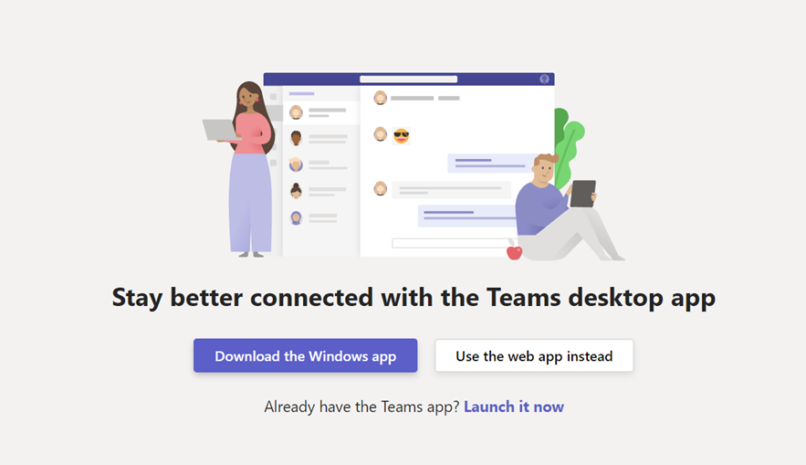](../media/use-web-app-instead.png#lightbox)

1. Sign in with your Microsoft Cloud for Retail Manager credentials (MCR IAD Manager).

   > [!NOTE]
   > For instructor-led training, use the credentials that your instructor has provided; for self-paced learning, use the credentials that have been generated in the Training Environment preparation module.

1. On the **Home** page, select the ellipsis (**...**) menu and select **Store Operations Assist** app.

   > [!div class="mx-imgBorder"]
   > [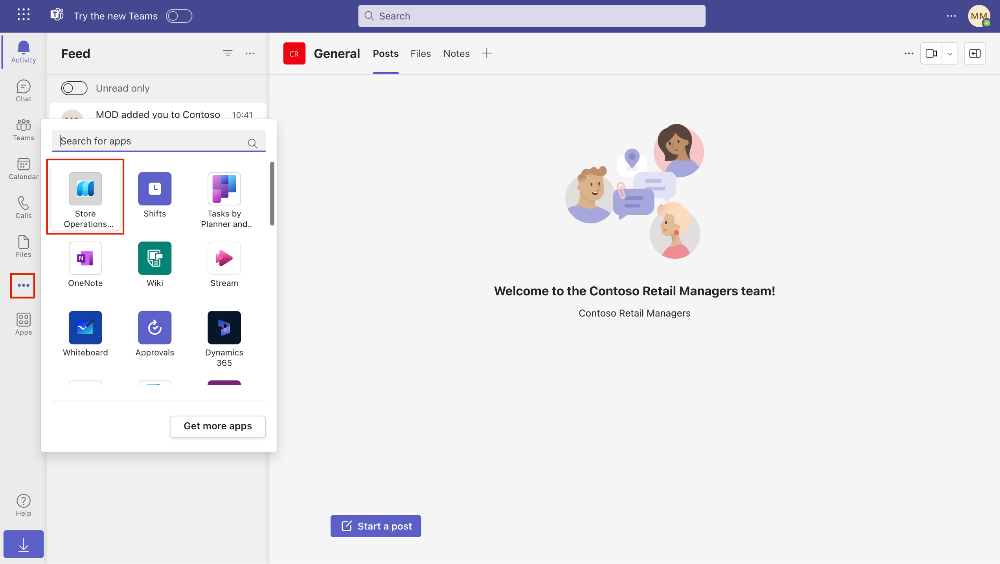](../media/app-selection.png#lightbox)

1. Right-click the **Store Operations Assist** icon on the left pane and then select **Pin** to pin Store Operations Assist Admin on Microsoft Teams navigation.

   > [!div class="mx-imgBorder"]
   > [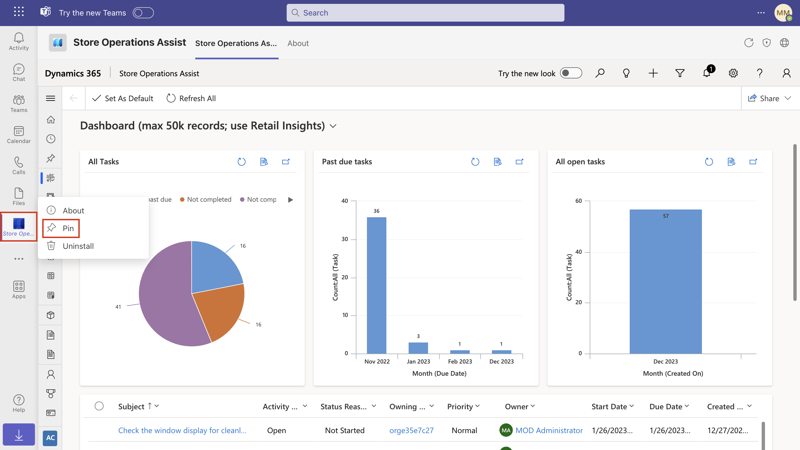](../media/pin-soa-teams.png#lightbox)

1. In the lower-left corner, select **Action center**.

   > [!div class="mx-imgBorder"]
   > [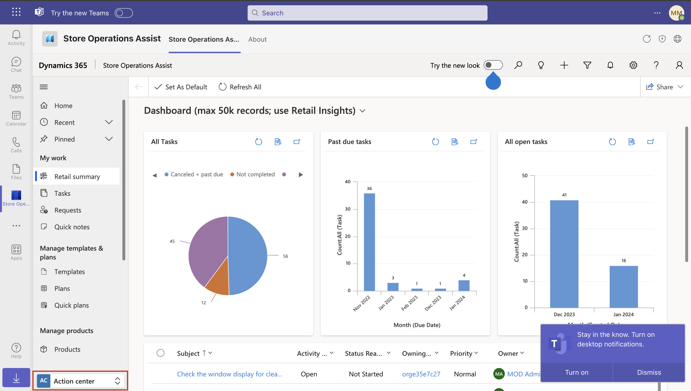](../media/action-center.png#lightbox)

1. Change the area to **App setup**.

   > [!div class="mx-imgBorder"]
   > [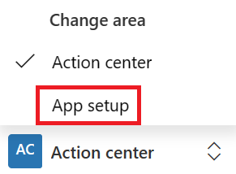](../media/change-area-path.png#lightbox)

## Task: Define target groups

Target groups help you group retail stores that usually perform the same tasks. A target group can consist of any combination of retail stores. However, in most cases, we recommend that you group retail stores that share similar characteristics so that you can implement the same tasks in those retail stores.

In this task, you create target groups and assign retail stores to the respective target groups.

1. On the left pane, select **Target groups**.

   > [!div class="mx-imgBorder"]
   > [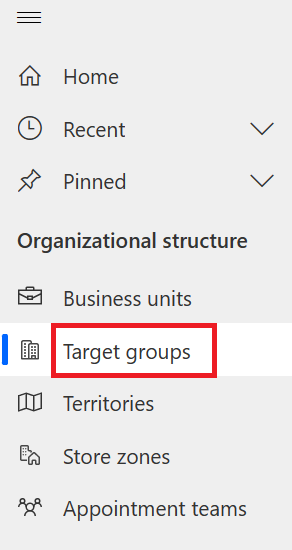](../media/target-groups-navigation.png#lightbox)

1. Select **New** on the upper command bar to create a new target group.

1. In the **Name** field, enter **Contoso Stores** and then select **Save** on the upper command bar to save the record.

   > [!div class="mx-imgBorder"]
   > [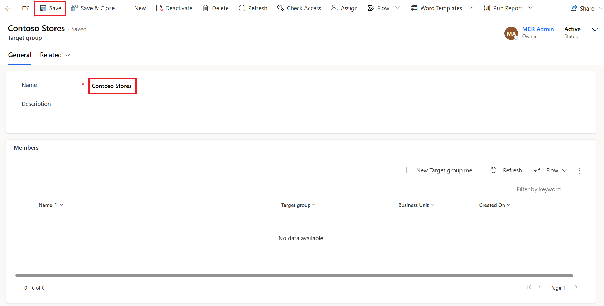](../media/target-groups-create.png#lightbox)

1. On the lower grid (**Members** tab), select **New Target group member** to assign a business unit to the target group.

   > [!div class="mx-imgBorder"]
   > [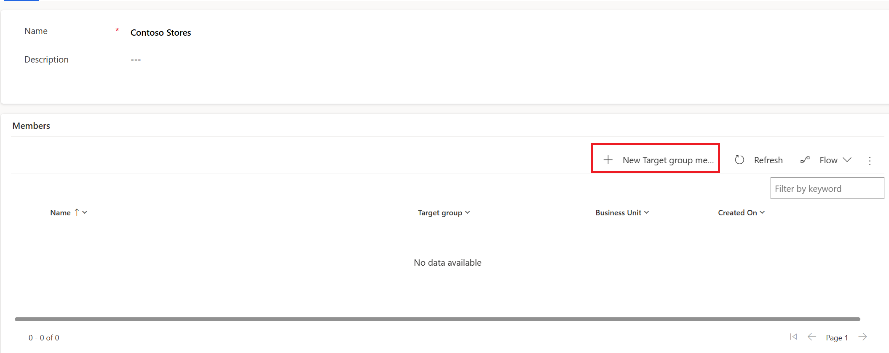](../media/new-target-group-member-button.png#lightbox)

1. Select **Contoso Store 101** as the **Store/Department** and then select **Save & Close**.

   > [!div class="mx-imgBorder"]
   > [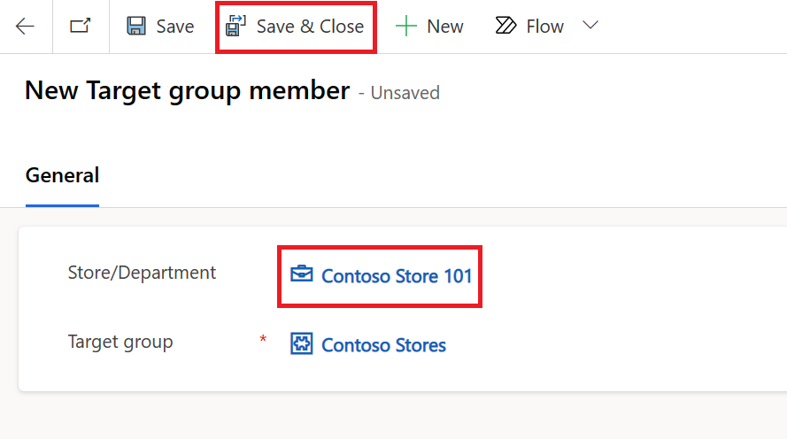](../media/new-target-group-member.png#lightbox)

1. Repeat steps 4 and 5 to add other Contoso stores to this target group. Also, repeat steps 2 to 6 to create a new target group, Fabrikam Store, and add the respective Fabrikam stores to that target group.

   > [!NOTE]
   > You can use Excel import to perform a bulk import and add stores to a target group. Alternatively, you can create new target groups by following the Excel import steps in the first task of this exercise.

## Task: Set up store zones

Store zones are specific locations in the store that are demarcated for a specific purpose. In this task, you set up the store zones.

1. On the left navigation pane, select **Store zones**.

   > [!div class="mx-imgBorder"]
   > [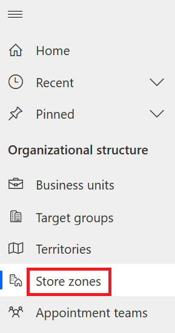](../media/store-zones-navigation.png#lightbox)

1. Select **New** on the upper command bar to create a new store zone.

1. Enter **Personal Care** as the name and then select **Save**.

   > [!div class="mx-imgBorder"]
   > [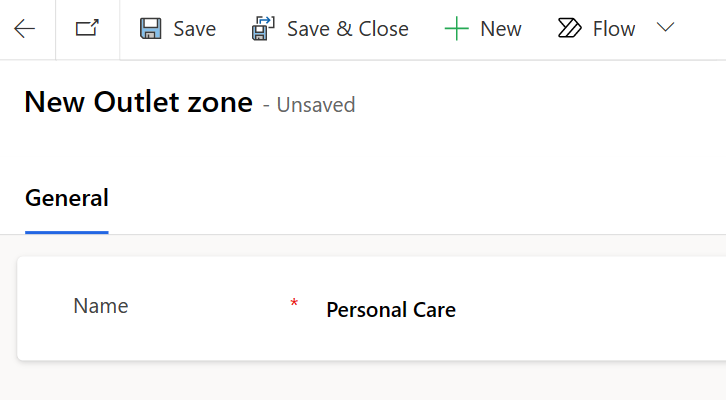](../media/personal-care.png#lightbox)

1. Repeat the previous two steps to create the following store zones:

   - Men's Clothing

   - Women's Clothing

   - Kids Clothing

   - Checkout

   - Back Aisle

   - Footwear

## Task: Define task types

You can use task types to segment various types of store tasks in groups, such as store walk, promotion setup, visual merchandising, or inventory spot count. In this task, you set up task types for **Inventory spot count** and **Product price update**.

1. On the left navigation pane, select **Task types**.

1. Select **New** on the upper command bar to create a new task type.

1. Enter **Inventory spot count** as the name and then select **Save** on the command bar.

   > [!div class="mx-imgBorder"]
   > [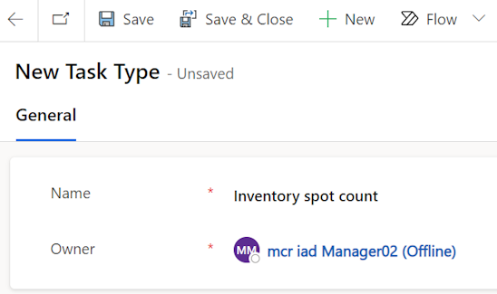](../media/new-task-type.png#lightbox)

1. Repeat the two previous steps to create the **Product price update** task type. The result should be as shown in the following screenshot.

   > [!div class="mx-imgBorder"]
   > [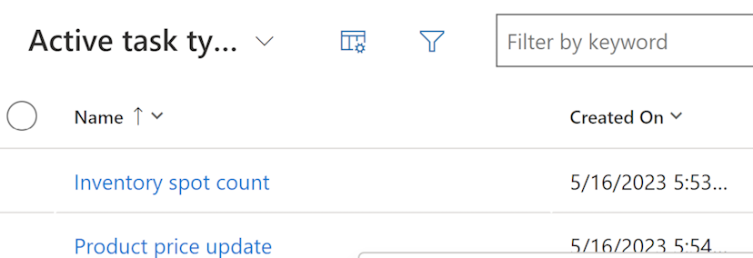](../media/task-types.png#lightbox)

## Task: Create request types

Store associates use request types when they create a new request in Store Operations Assist Mobile; however, it's optional. This field segments the various types of tasks in groups, such as clean-up, repairs, and asset support. The store manager can filter or sort by the request type when they view and approve requests. In this task, you create a request type for **Asset support**.

1. On the left navigation pane, select **Request types**.

1. Select **New** on the upper command bar to create a new request type.

1. Enter **Asset support** as the name and then select **Save & Close** on the command bar.

   > [!div class="mx-imgBorder"]
   > [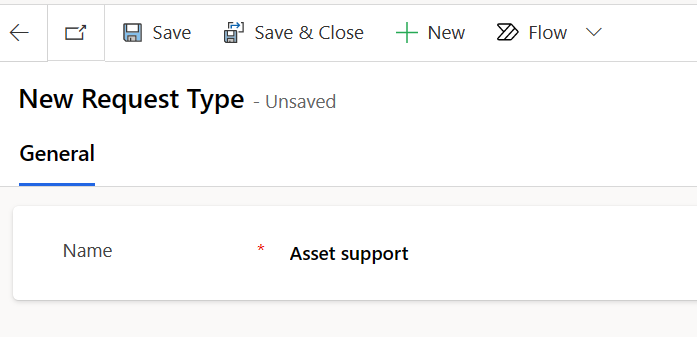](../media/new-request-type.png#lightbox)

## Task: Create cancellation reasons

Cancellation reasons specify the reasons that store associates can provide for canceling a task. In this task, you set up a cancellation reason named **Obsolete**.

1. On the left navigation pane, select **Cancellation reasons**.

1. Select **New** on the upper command bar to create a new cancellation reason.

1. Enter **Obsolete** as the name and then select **Save & Close** on the command bar.

   > [!div class="mx-imgBorder"]
   > [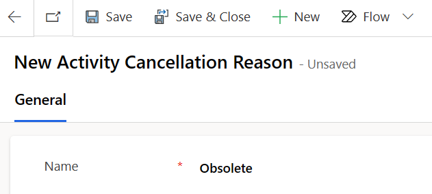](../media/new-cancellation-reason.png#lightbox)

## Task: Set up appointment types

You can use appointment types to categorize an appointment. In the Store Operations Assist solution, you can set up virtual and in-store appointment types. A virtual appointment happens online between the customer and the retail associate or expert over Microsoft Teams (video/audio). An in-store appointment happens offline between the customer and the retail associate or expert in the store. In this task, you set up a new appointment type for **Design Consultation**.

1. On the left navigation pane, select **Appointment types**.

1. Select **+ New** on the upper command bar to create a new appointment type.
 
1. Enter **Design Consultation** as the name, select **30 minutes** from the **Appointment Duration** dropdown menu, and then select **Save & Close** on the command bar.
 
   > [!div class="mx-imgBorder"]
   > [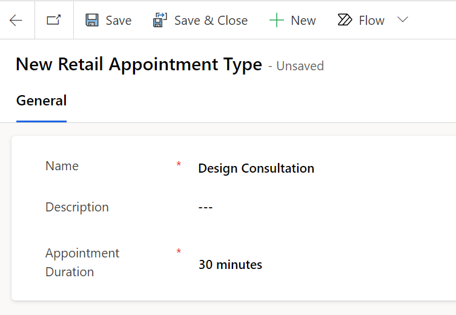](../media/new-appointment-type.png#lightbox)

## Task: Set up appointment teams

You can use appointment teams to add users who can take an appointment with customers. In this task, you assign the virtual stylists to take an appointment.

1. On the left navigation pane, select **Appointment teams**.

1. Select **+ New** on the upper command bar to create a new appointment team.
 
1. Provide the following values:

   - **Team Name** - Stylists
   - **Business Unit** - Contoso Store 101
   - **Administrator** - Provide your manager user ID 

   > [!NOTE]
   > For this task, consider the manager user ID to be the Virtual Stylist’s user.

   > [!div class="mx-imgBorder"]
   > [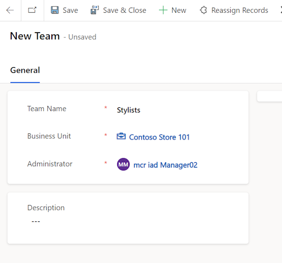](../media/add-team-stylists.png#lightbox)

1. Select **Save** on the command bar. The **Team members** section displays on the right-side of the screen.

1. Select **Add Existing User**.

   > [!div class="mx-imgBorder"]
   > [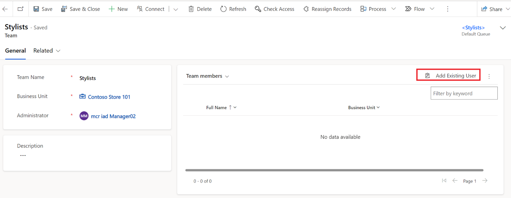](../media/add-existing-user.png#lightbox)
 
1. Select the manager user ID and then select **Add** to add your user to the team members list so that you can set up the appointment with the same manager user ID. 

   > [!div class="mx-imgBorder"]
   > 
 
1. Select **Save & Close** on the command bar.
