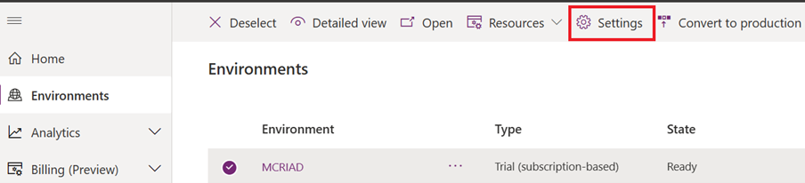
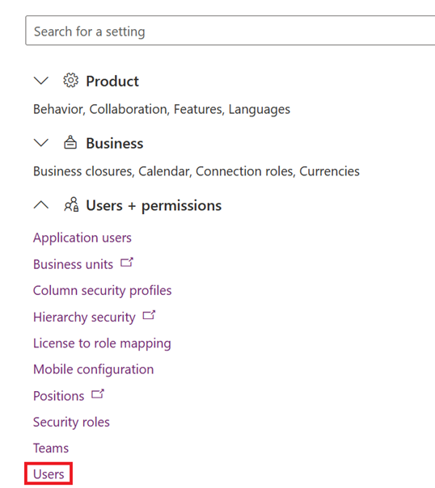
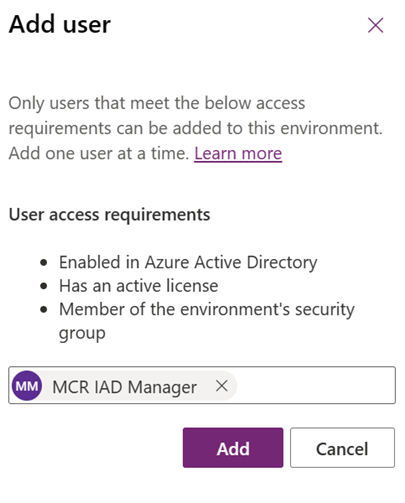
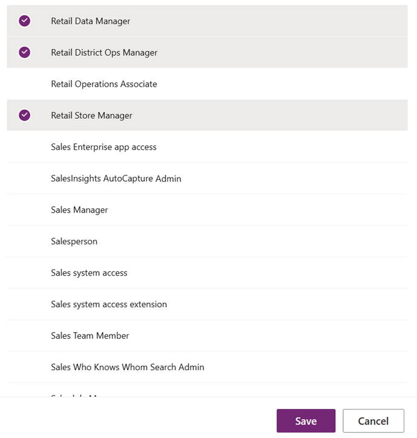

In this exercise, you'll assign the Manager security roles to the manager user. 

1.	Go to [Power Platform admin center](https://admin.powerplatform.microsoft.com/) in an InPrivate or incognito browser session.

1.	On your left pane, select **Environments** and select your environment. 

1. Select **Settings**.

   > [!div class="mx-imgBorder"]
   > 

1. Select **Users**.

   > [!div class="mx-imgBorder"]
   > 

1. Select **+ Add user**.

1. Select **MCR IAD Manager** and then select **Add**. 

   > [!div class="mx-imgBorder"]
   > 

1. Select the **Retail Data Manager**, **Retail District Ops Manager**, and **Retail Store Manager** roles and then select **Save**.

   > [!div class="mx-imgBorder"]
   > 
