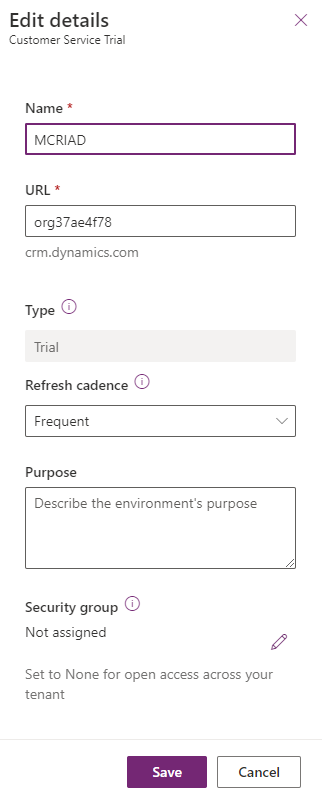

In this exercise, you'll learn how to create a new Microsoft Power Platform environment.

1. Go to [Microsoft Power BI](https://app.powerbi.com/?azure-portal=true) in a new tab page in the same InPrivate/Incognito browser. This step is to help ensure that you have access to Power BI before you attempt to deploy dashboards as part of the Store Operations Assist solution.

1. Go to [Environments | Power Platform admin center (microsoft.com)](https://admin.powerplatform.microsoft.com/environments/?azure-portal=true) and select **Customer Service Trial** in the Environments table.

1. On the Customer Service Trial Details pane, select **Edit**.

1. Update the details, and then select **Save**.

      - **Name** - +++MCRIAD+++

   > [!div class="mx-imgBorder"]
   > 

      

   After you've updated the environment, you will be returned to the MCRIAD environment.

