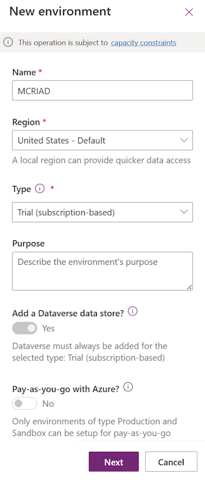
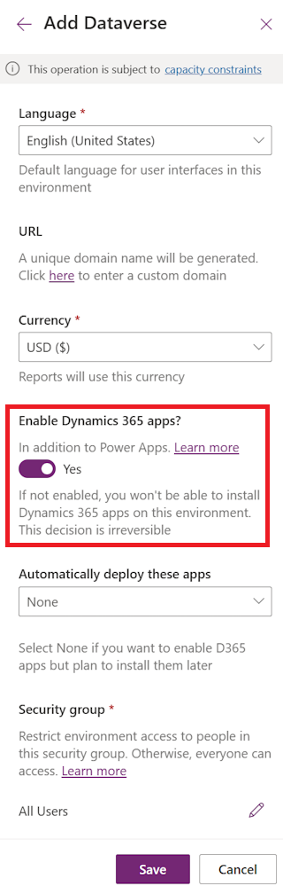

In this exercise, you'll learn how to create a new Microsoft Power Platform environment.

1. Go to [Microsoft Power BI](https://app.powerbi.com/?azure-portal=true) in a new tab page in the same InPrivate/Incognito browser. This step is to help ensure that you have access to Power BI before you attempt to deploy dashboards as part of the Store Operations Assist solution.

1. Go to [Environments | Power Platform admin center (microsoft.com)](https://admin.powerplatform.microsoft.com/environments/?azure-portal=true) and select **New** on the command bar.

1. On the right pane, enter the following required details and then select **Next**.

   > [!div class="mx-imgBorder"]
   > 

   - **Name** - Provide a name for the environment

   - **Region** - Select a region. 
   
   > [!NOTE]
   > Store Operations Assist is not available in all the regions and hence select one of the regions listed in [International Availability](/industry/retail/availability)

   - **Type** - Trial (subscription-based)

1. Enter the details, turn on the **Enable Dynamics 365 apps** toggle, and then select **Save**.

   > [!div class="mx-imgBorder"]
   > 

   - **Language** - English (United States)

   - **URL** - You can provide a desired prefix for the URL. Otherwise, the system assigns a random prefix.

   - **Enable Dynamics 365 apps** - Turn on this toggle because it's a dependency for the Store Operations Assist solution. 

   > [!IMPORTANT]
   > If Dynamics 365 apps is not enabled, you won't be able to install Store Operations Assist. 
   
   - **Automatically deploy these apps**: None

   - **Security group** - All Users or any other security group if you've created one.

   After you've created the environment, the environment will show in the **Environments** list as **Ready**.

