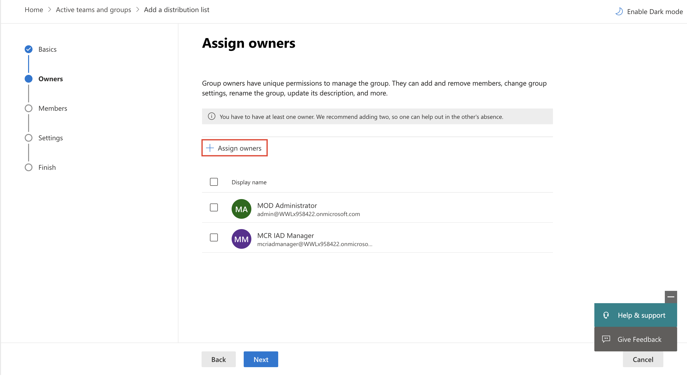

In this exercise, you'll create users and assign the required licenses. Later modules will feature these users as different personas.

1. Go to [Microsoft 365 admin center](https://admin.microsoft.com/?azure-portal=true).

1. Sign in with your credentials.

1. On the left navigation pane, select **Active users**.

   > [!div class="mx-imgBorder"]
   > 

1. Select the **Add multiple users** button.

   > [!div class="mx-imgBorder"]
   > 

1. Add the following users and then select **Next**.

   - **MCR IAD Manager** (you can use it for Personas: IT Admin/District Manager/Data Manager for Contoso)

   - **MCR IAD FLW** (you can use it for Personas: Store Associate for Contoso Store 101)

   - **Monica Rodriguez** (you can use it for Personas: Store Manager for Contoso Store 101)

   > [!div class="mx-imgBorder"]
   > 

1. Select **Dynamics 365 Customer Service Enterprise Admin**, **Office 365 E5**, and **Power BI Premium Per User** licenses and then select **Next**.

    >[!alert] Some of the licenses may show as unavailable. Select the available options and proceed to the next step.

   > [!div class="mx-imgBorder"]
   > 

1. Select the **Add users** button.

1. Select the **Download user details** button so that you can retrieve the respective user credentials.

1. Select **Active Users** on the left pane.

1. Select **Admin User**, which causes the Admin user details to appear on the right pane.

1. Select the **Licenses and apps** tab and make sure that all three licenses (Dynamics 365 Customer Service Enterprise Admin, Office 365 E5, Power BI Premium Per User licenses) are selected.

   > [!div class="mx-imgBorder"]
   > 

1. On the left pane, select **Active teams & groups**.

   > [!div class="mx-imgBorder"]
   > 

1. On the **Distribution list** tab, select **Add a distribution list**.

   > [!div class="mx-imgBorder"]
   > 

1. Name the group **IT Helpdesk** and then select **Next**.

   > [!div class="mx-imgBorder"]
   > 

1. Select **+ Assign owners** to add **Admin** and **MCR IAD Manager** users and then select **Next**.

   > [!div class="mx-imgBorder"]
   > 

1. Select **+ Add members** to add **Admin** and **MCR IAD Manager** users and then select **Next**.

1. Set the email address to **ITHelpdesk** and then select **Next**.

   > [!div class="mx-imgBorder"]
   > 

1. On the **Review** screen, review the details and then select **Create group** to create the distribution list to use in the Extend Store Operations Assist module.

