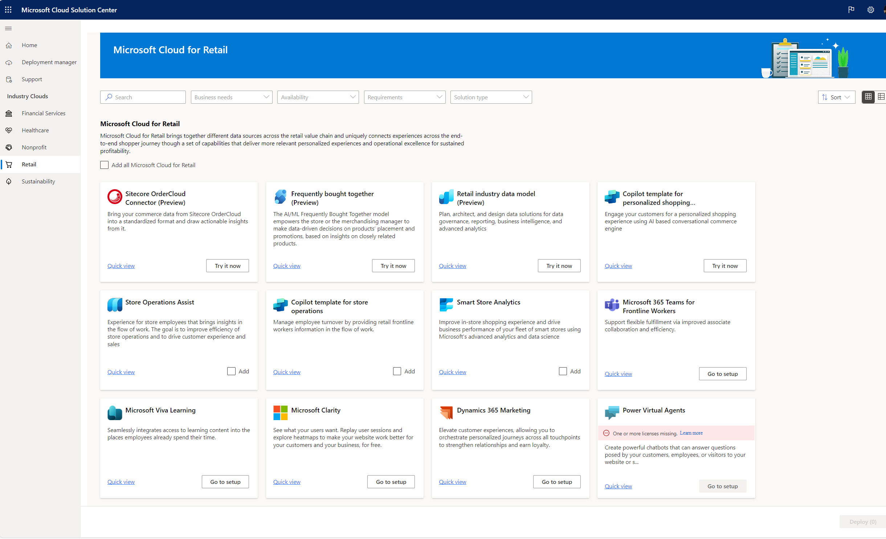
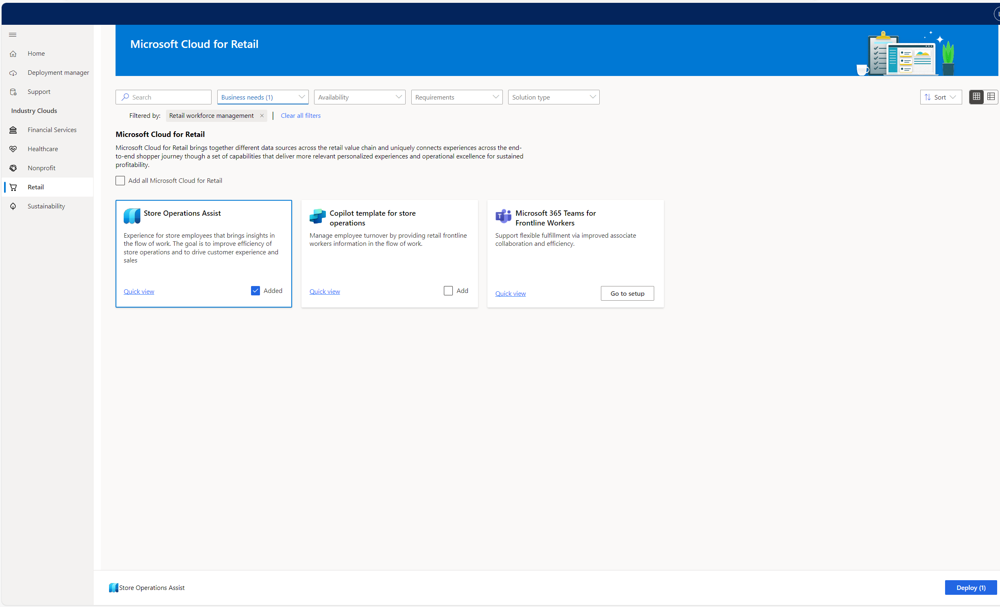
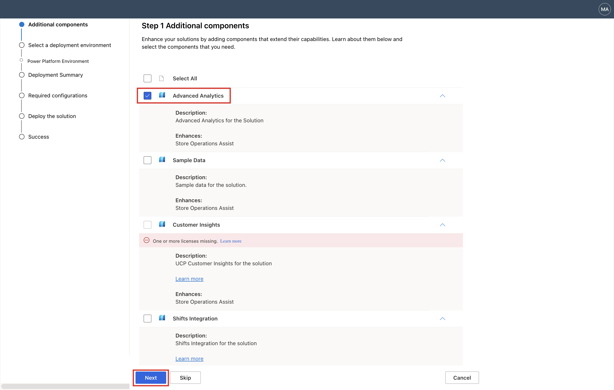
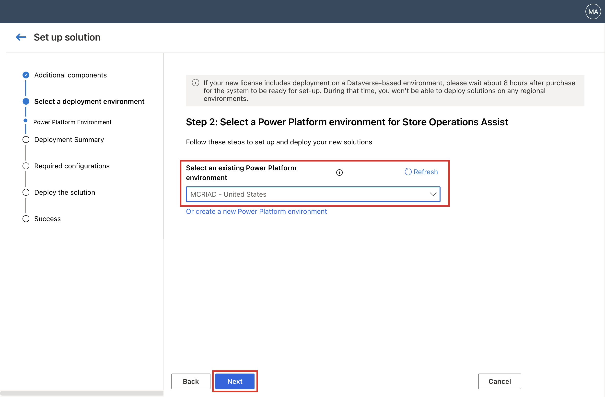
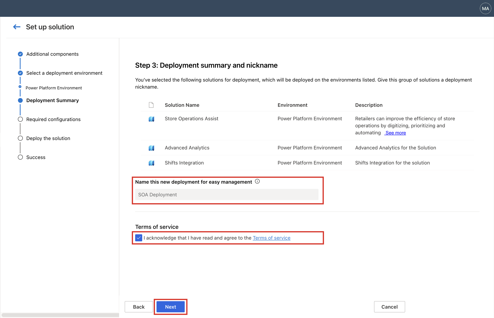
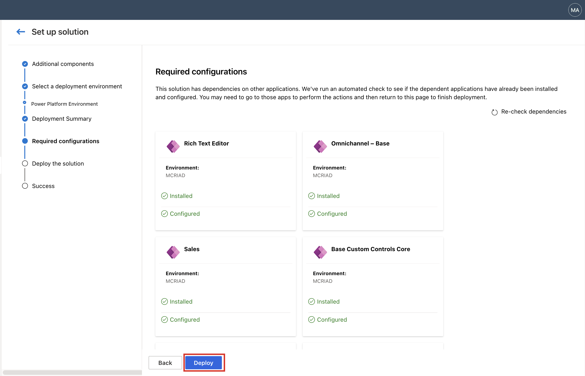
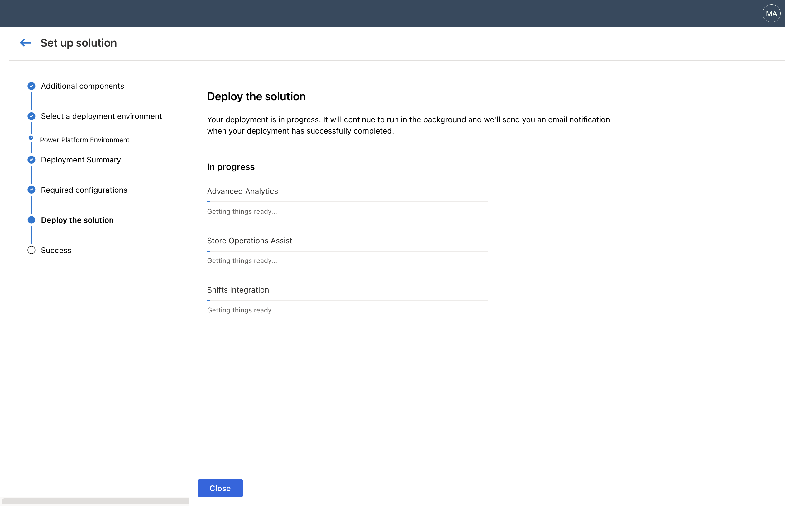

Microsoft Cloud for Retail includes solutions that are built on capabilities within Microsoft Power Platform. To set up these solutions, use [Microsoft Cloud Solution Center](https://solutions.microsoft.com/?azure-portal=true).

Solution Center guides you through and simplifies the deployment process. It checks licensing requirements and dependencies to ensure that you have everything you need for your deployment. In this exercise, you'll use Solution Center to deploy Store Operations Assist.

1. Go to [Microsoft Cloud Solution Center](https://solutions.microsoft.com/?azure-portal=true) in a new tab page in the same InPrivate or Incognito browser.

1. Select **Retail** under Industry Clouds section.

   > [!div class="mx-imgBorder"]
   > 

1. Filter for **Retail workforce management**. Select the **Add** checkbox on the **Store Operations Assist** solution card and then select **Deploy** in the lower-right edge of the screen.

   > [!div class="mx-imgBorder"]
   > 

1. Select **Advanced Analytics** and then select **Next**. 

   > [!IMPORTANT]
   > Make sure that you select the **Advanced Analytics** checkbox to deploy the Retail Insights dashboard and complete the **Use the Retail Insights dashboard** module. 

   > [!div class="mx-imgBorder"]
   > 

1. Select the Power Platform environment that you created in an earlier exercise and then select **Next**. 

   > [!div class="mx-imgBorder"]
   > 

   > [!IMPORTANT]
   > It might take 8 hours for the environment to be displayed in the environment lookup if the Power Platform/Dynamics license has been recently added to the tenant.

1. Provide a name for the deployment, select the checkbox to agree to the terms of service, and then select **Next**.

   > [!div class="mx-imgBorder"]
   > 

1. Select **Deploy** to deploy the solution.

   > [!div class="mx-imgBorder"]
   > 

   It might take one to two hours to deploy the solution. Meanwhile, you can observe the status of the solution deployment. You'll also receive an email to the admin user after the solution is successfully deployed.

   > [!div class="mx-imgBorder"]
   > 
