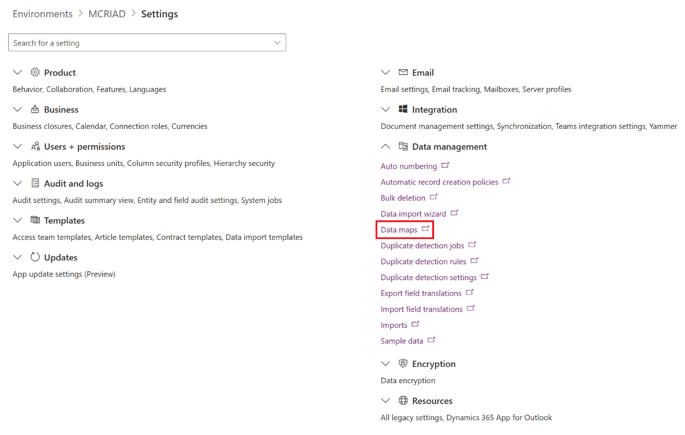
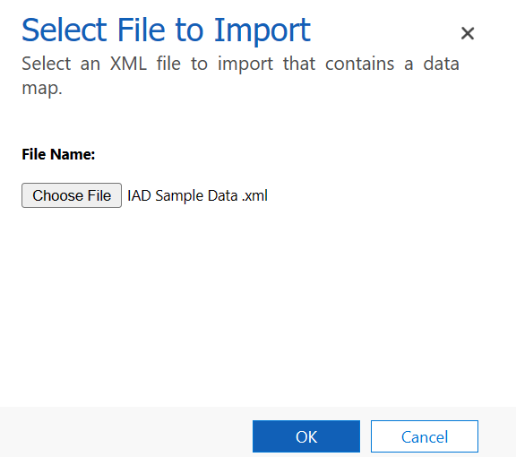
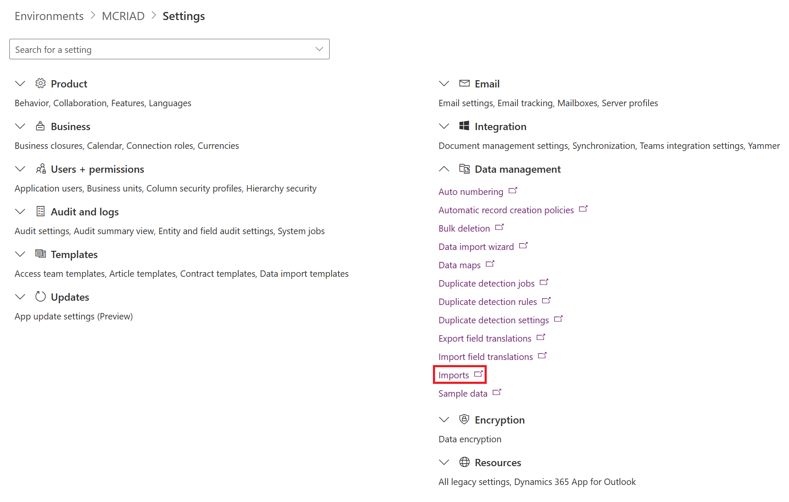
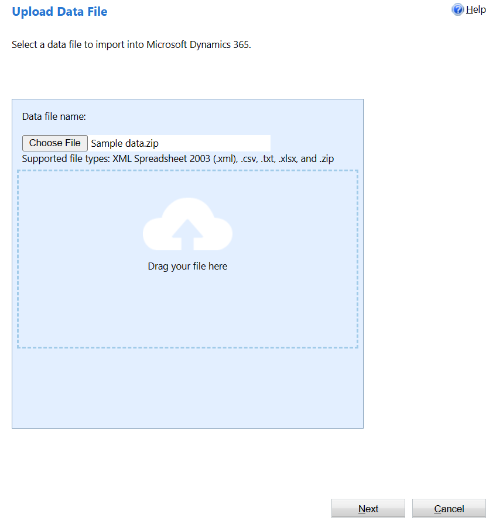
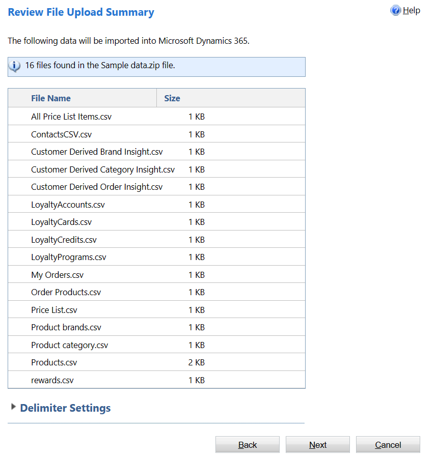
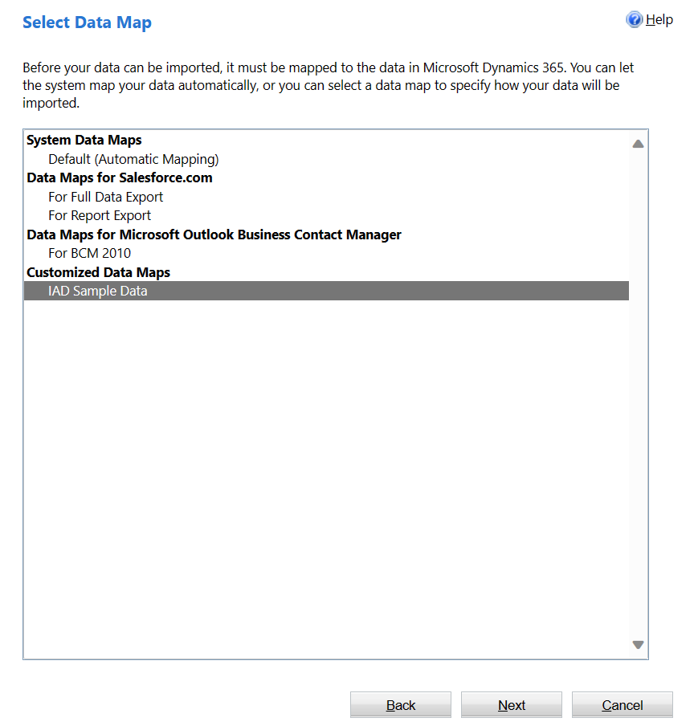
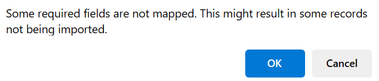
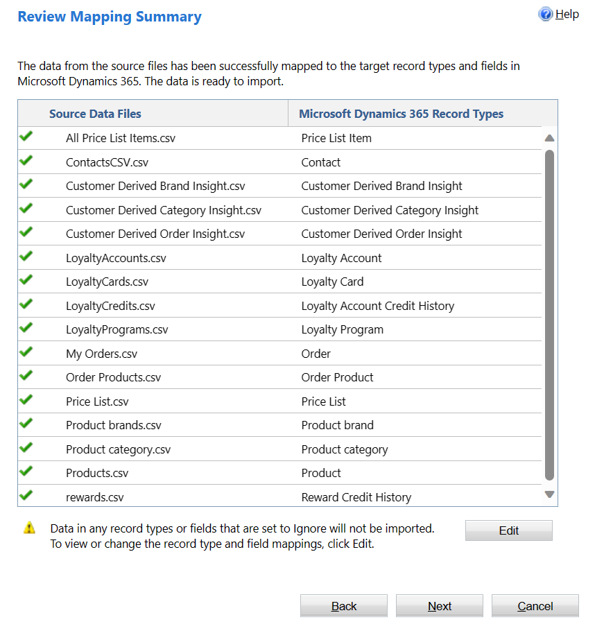
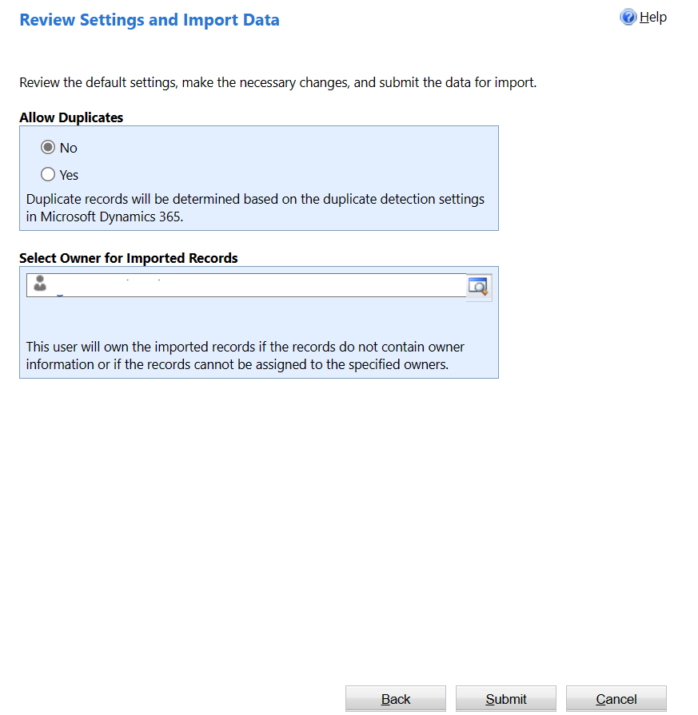
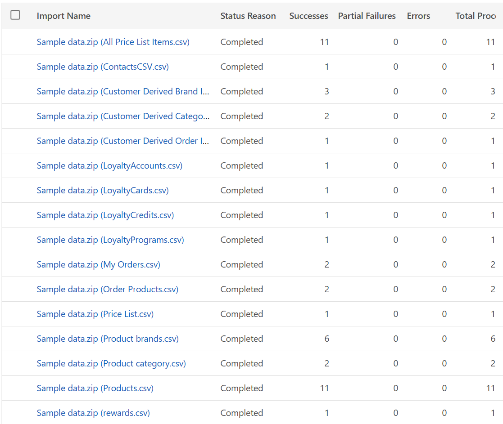

In this exercise, you'll import sample data that was created for this training and that's required in the later modules. 

1. Go to [Power Platform admin center](https://admin.powerplatform.microsoft.com/?azure-portal=true) in an InPrivate or Incognito browser session.

1. On the left pane, select **Environments**.

   > [!div class="mx-imgBorder"]
   > 

1. Select your environment.

1. Select **Settings** on the command bar.

1. Select **Data management > Data maps** to open Data maps in a new tab in your browser.

   > [!div class="mx-imgBorder"]
   > 

1. Select **Import** in the command bar.

1. Search for the data map XML file and then import it. Download and extract the sample data map XML file from the [IAD Sample Data.zip](https://github.com/MicrosoftDocs/mslearn-developer-tools-power-platform/blob/master/retail-cloud/IAD%20Sample%20Data.zip) file.

   > [!div class="mx-imgBorder"]
   > 

1. On the Power Platform admin center browser tab page, select **Data management > Imports**.

   > [!div class="mx-imgBorder"]
   > 

1. Select **Import Data** in the command bar.

1. Download and go to the [Sample data.zip](https://github.com/MicrosoftDocs/mslearn-developer-tools-power-platform/blob/master/retail-cloud/Sample%20data.zip) file and then select **Next**.

   > [!div class="mx-imgBorder"]
   > 

1. Select **Next** on the **Review File Upload Summary** page.

   > [!div class="mx-imgBorder"]
   > 

1. Beneath the **Customized Data Maps** section, select the **IAD Sample Data** file that was previously imported. Select **Next**.

   > [!div class="mx-imgBorder"]
   > 

1. Select **Next** on the **Map fields** section because the fields are automatically mapped based on the mapping that's defined in the imported data map.

1. A pop-up window might appear, indicating that some fields aren't mapped. Ignore the message and select **OK**.

   > [!div class="mx-imgBorder"]
   > 

1. On the **Review Mapping Summary** screen, if a green check mark appears next to all data files in the list, select **Next**.

   > [!div class="mx-imgBorder"]
   > 

1. Set **Allow Duplicates** to **No** and then select **Submit**.

   > [!div class="mx-imgBorder"]
   > 

1. Select **Finish**.

1. After the data has successfully imported, the value in the **Successes** column will be equal to the value in the **Total processed** column for all import files.

   > [!div class="mx-imgBorder"]
   > 

You can also validate the import by opening the respective forms in Store Operations Assist.
