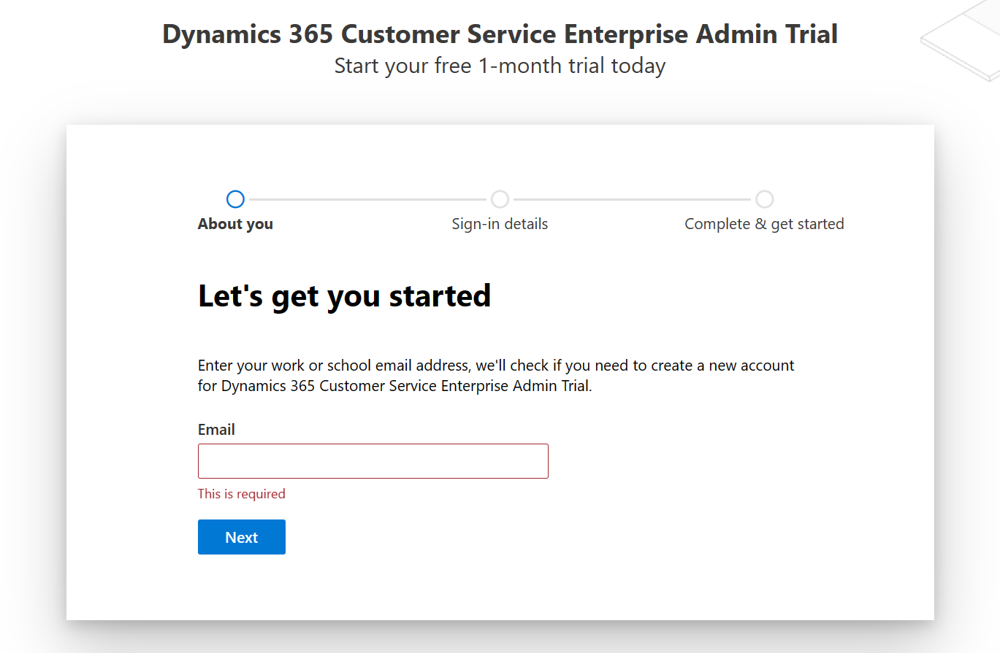
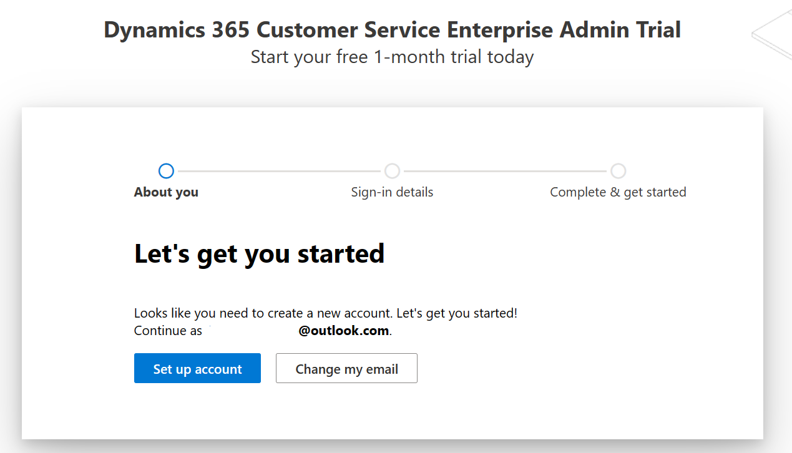

In this exercise, you'll learn how to create a new tenant with Microsoft Power Platform license.

> [!NOTE]
> If you have an existing tenant, you can skip this exercise. However, we recommend that you create a new tenant with a Dynamics 365 trial and a Microsoft 365 trial.

1. Open an **InPrivate** or **Incognito** web browsing session and then go to [https://trials.dynamics.com](https://trials.dynamics.com/?azure-portal=true).

   > [!IMPORTANT]
   > You need to open a browser in **InPrivate** or **Incognito** mode to create a new tenant so that the trial isn't added to your or your company's tenant.
   >
   > **To open an InPrivate window in Microsoft Edge**
   >
   > 1. Open the Edge browser.
   >
   > 1. In the upper-right corner, select the **Settings and more** ellipsis (**...**) and then select **New InPrivate window**.
   >
   > **To open an Incognito window in Google Chrome**
   >
   > 1. Open the Chrome browser.
   >
   > 1. In the upper-right corner, select the **Customize and control** menu (vertical ellipsis) and then select **New Incognito window**.

1. Scroll down and then select **Try for free** in the **Dynamics 365 Customer Service** card.

   > [!div class="mx-imgBorder"]
   > 

1. A pop-up window appears, asking you to enter your email address to start your free trial. Select the link to create a new Microsoft Entra ID trial account.

   > [!div class="mx-imgBorder"]
   > 

1. A new account creation flow for **Dynamics 365 Customer Service Enterprise Admin Trial** displays. Get started by entering your email address in the `Admin@YourUniqueTenantName.onmicrosoft.com` format.

   > [!div class="mx-imgBorder"]
   > 

1. If the email is already using other Microsoft services, the following warning will appear. Select **Create a new account instead**.

   > [!div class="mx-imgBorder"]
   > 

   Otherwise, the system will prompt you to set up your new account. Select **Set up account**.

   > [!div class="mx-imgBorder"]
   > 

1. Provide the necessary information on the **About you** page. Enter a valid phone number where you can receive a text message to validate the sign-up process.

   > [!div class="mx-imgBorder"]
   > 

1. Complete the verification.

   > [!div class="mx-imgBorder"]
   > 

1. After the verification is complete, you can request a valid domain name. Select **Save** to check availability. If an error doesn't appear, the domain is ready for use. When the domain is available, set up a username **Admin** and then set up a password.

   > [!div class="mx-imgBorder"]
   > 

Your Microsoft 365 tenant is successfully created along with the Dynamics 365 Customer Service license, which also includes a Microsoft Power Apps license.

   > [!div class="mx-imgBorder"]
   > 
