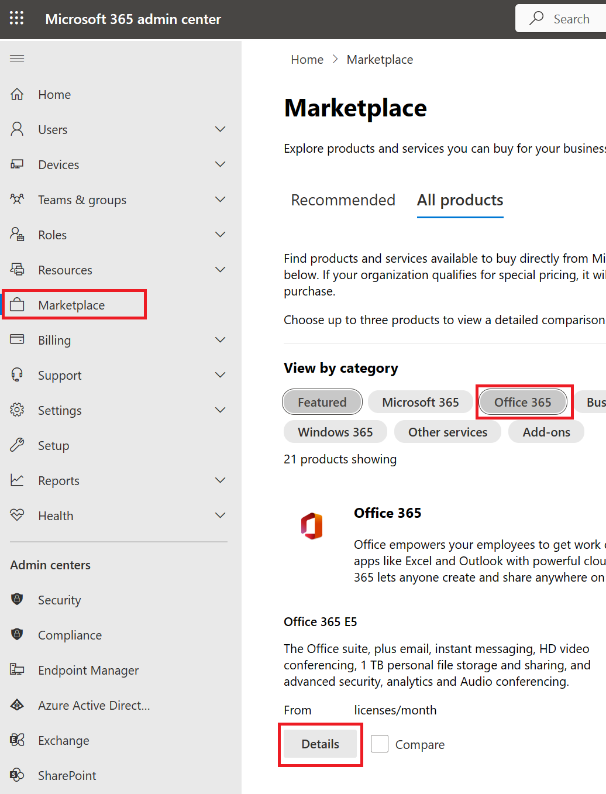
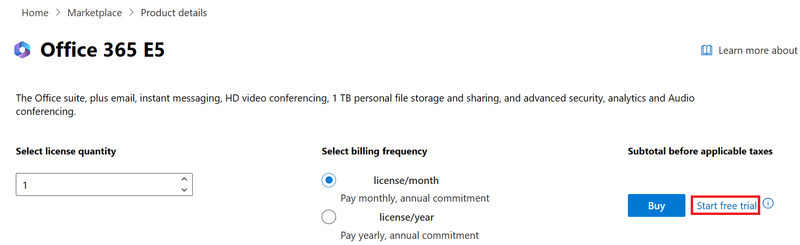
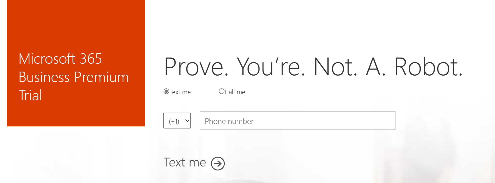
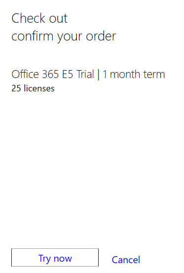

In this exercise, you'll add the necessary Microsoft Office 365 trial, which includes Microsoft Teams and email capabilities that are required for a tighter integration with Store Operations Assist.

1. With your newly created credentials from the previous task, go to [Microsoft 365 admin center](https://admin.microsoft.com/).

1. Go to **Marketplace**, select **Office 365**, scroll down to **Office 365 E5**, and then select **Details**.

   > [!div class="mx-imgBorder"]
   > 

   > [!NOTE]
   > In this exercise, you will be using an Office 365 E5 license which includes license to Microsoft Teams and other Office apps. In a real customer implementation, you might not require an E5 license and either Microsoft 365 F1 or F3 license can also be purchased. These licenses cost lesser and are sufficient for Store Operations Assist. Refer to the [prerequisites](/industry/retail/deploy-store-operations-assist) section to understand the minimum licensing requirements for Store Operations Assist.

1. Select **Start free trial**.

   > [!div class="mx-imgBorder"]
   > 

1. Enter a valid phone number to prove that you're not a robot and then go through the verification process.

   > [!div class="mx-imgBorder"]
   > 

1. Select **Try now** to start your free trial and then select **Continue**.

   > [!div class="mx-imgBorder"]
   > 

When you complete these steps, the Office 365 E5 trial license is applied to the tenant created for this exercise.

