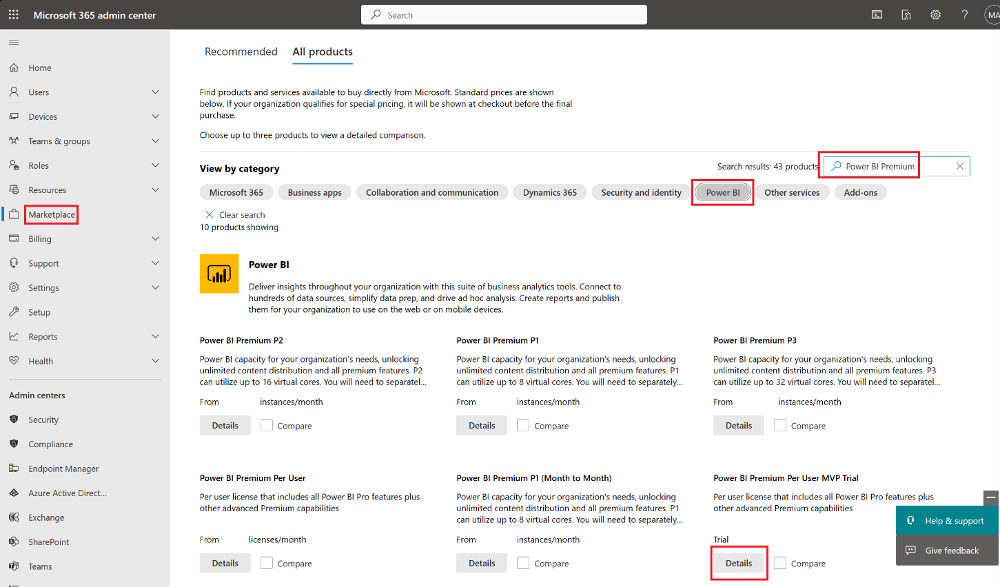
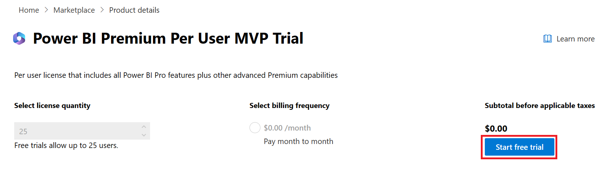
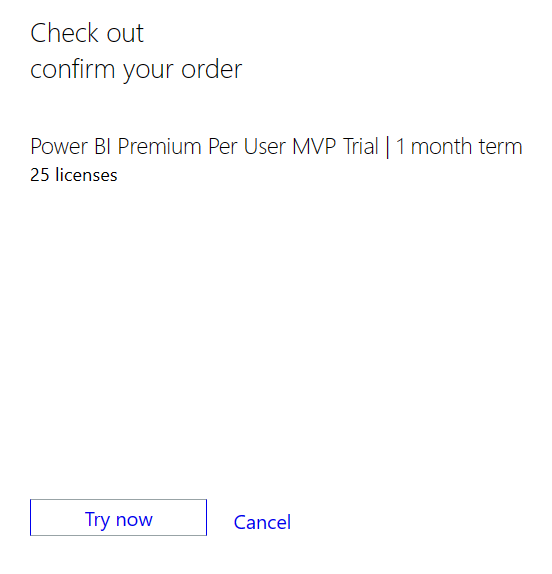

In this exercise, you'll add the necessary Microsoft Power BI Premium trial license. This license will help you deploy the Retail Insights dashboard, which is an optional component in the Store Operations Assist solution.

1. With your newly created credentials from the first task, go to [Microsoft 365 admin center](https://admin.microsoft.com/).

1. Go to **Marketplace**, select **Power BI**, search for **Power BI Premium**, scroll down to **Power BI Premium Per User MVP Trial**, and then select **Details**.

   > [!div class="mx-imgBorder"]
   > 

1. Select **Start free trial**.

   > [!div class="mx-imgBorder"]
   > 

1. Select **Try now** to start your free trial and then select **Continue**.

   > [!div class="mx-imgBorder"]
   > 

When you complete these steps, the **Power BI Premium Per User** trial license will be applied to the trial tenant.
