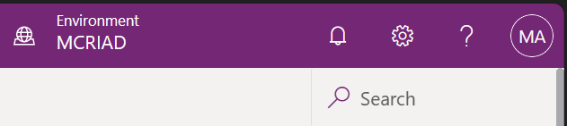
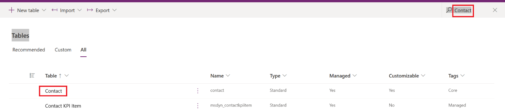
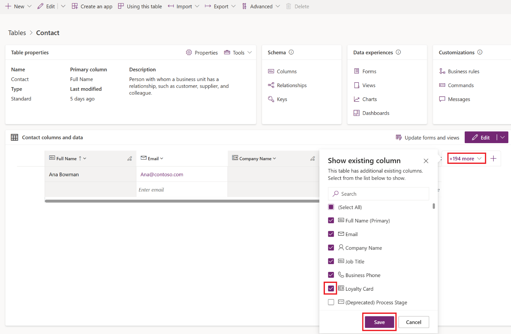
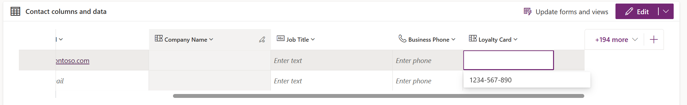

In this task, you'll update the Loyalty Account number for a customer account.

1. Go to [Power Apps](https://make.powerapps.com/?azure-portal=true) in a new browser tab page.

1. Select the environment (in the upper-right edge of the screen) that you created.

   > [!div class="mx-imgBorder"]
   > 

1. Select **Tables** on the left pane.

1. Select **All** and then search for and select **Contact**.

   > [!div class="mx-imgBorder"]
   > 

1. Under the **Contact columns and data** section, select **+ 194 more** and then select **Loyalty Card**.

   > [!div class="mx-imgBorder"]
   > 

1. Scroll to the right of the screen and select **Loyalty Card** from the lookup. Select anywhere outside the table to automatically save the changes.

   > [!div class="mx-imgBorder"]
   > 
