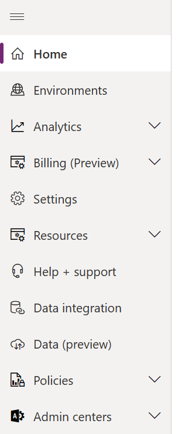
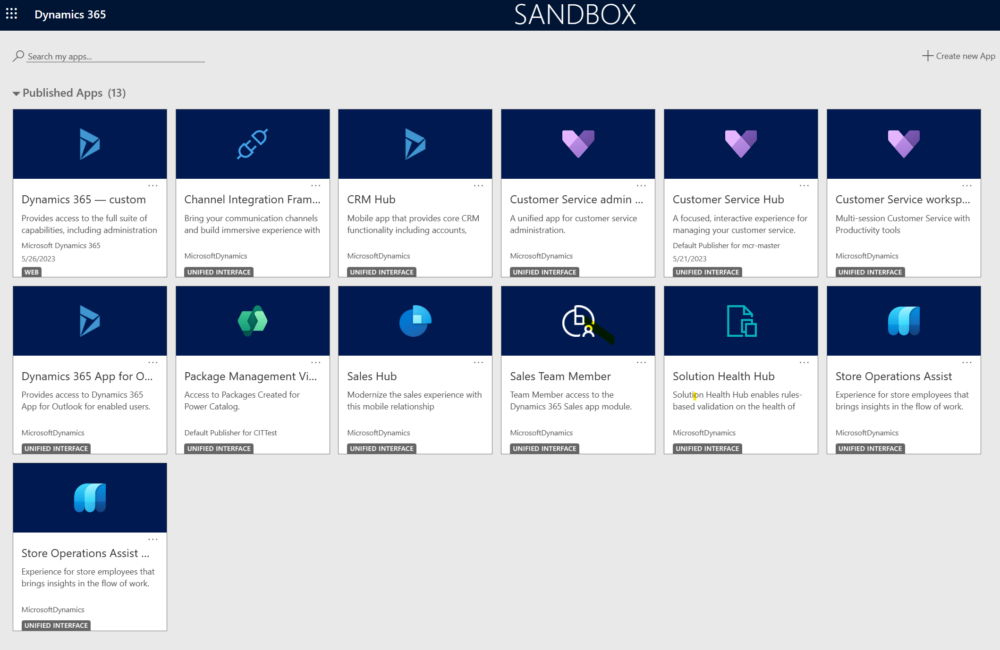
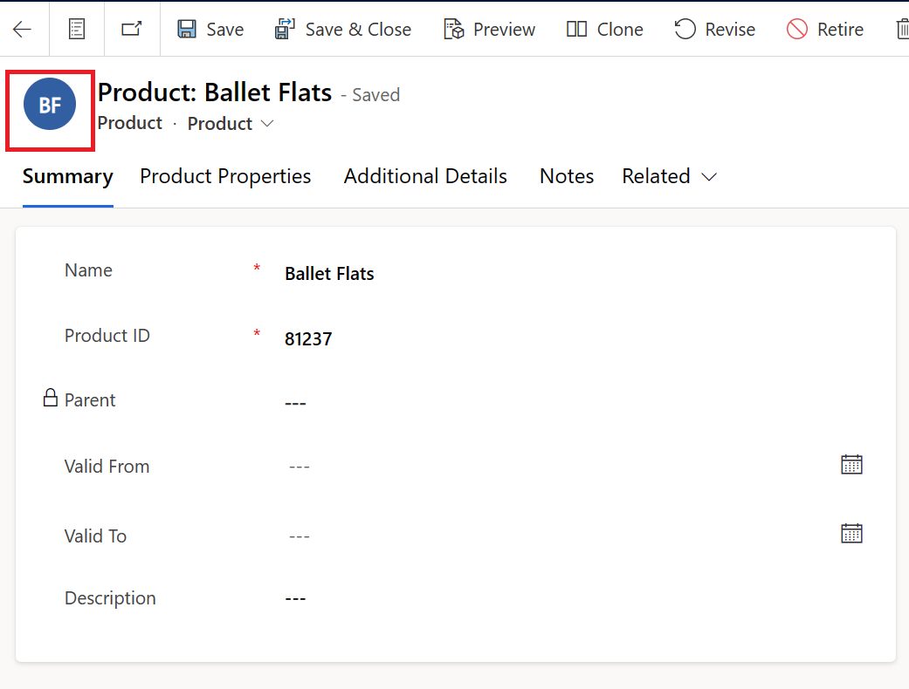
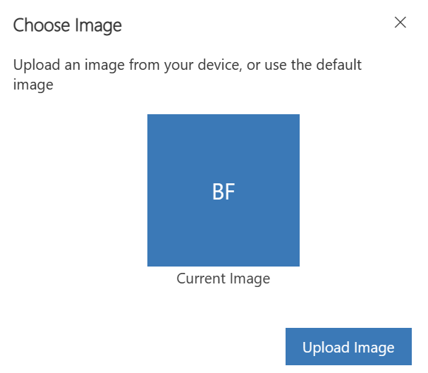
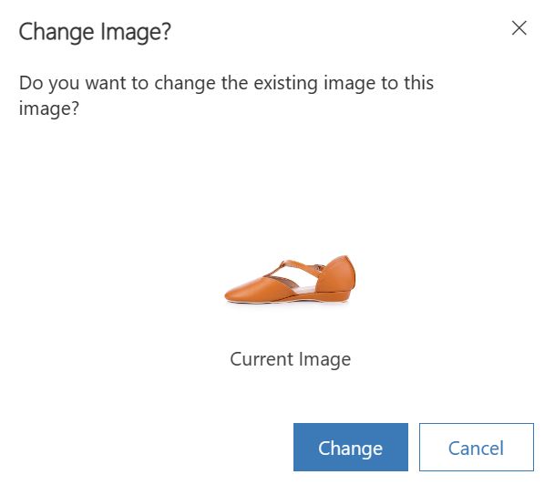

In this exercise, you'll import product images. In later modules, you'll use these images to view the product images in the Store Operations Assist mobile app while performing tasks such as product price updates or inventory stock count.

1. Download and unzip the [**Product images.zip**](https://github.com/MicrosoftDocs/mslearn-developer-tools-power-platform/blob/master/retail-cloud/Product%20images.zip) file.

1. If you haven't yet signed in to Microsoft Power Platform admin center, go to [Power Platform admin center](https://admin.powerplatform.microsoft.com/?azure-portal=true) in an InPrivate or Incognito browser session.

1. On your left pane, select **Environments**.

   > [!div class="mx-imgBorder"]
   > 

1. Select your environment and then select **Open** on the command bar.

1. Select the **Store Operations Assist** app.

   > [!div class="mx-imgBorder"]
   > 

1. Select **Products** on the left navigation pane.

1. Select a product and then select the icon above the **Summary** tab to open the image upload pop-up screen.

   > [!div class="mx-imgBorder"]
   > 

1. Select **Upload Image** to select the image from the local browser (from the unzipped product images folder).

   > [!NOTE]
   > The names on product images are the same as the product names.

   > [!div class="mx-imgBorder"]
   > 

1. Select **Change**.

   > [!div class="mx-imgBorder"]
   > 

1. Repeat the previous steps to upload images for other products.
