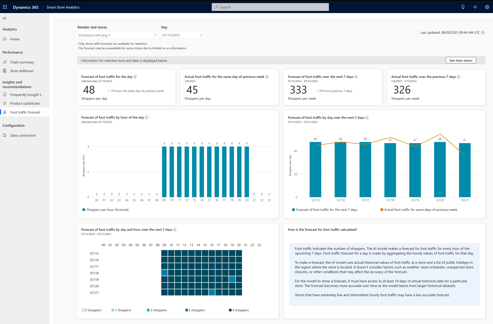

The **Insights and recommendations** page of Smart Store Analytics applies data science to reveal deeper insights into store performance, shoppers, and products. On this page, you can get insights into a certain store or the entire retail chain.

The following video provides an introduction on how to use the Insights and recommendations page:

> [!VIDEO https://www.microsoft.com/en-us/videoplayer/embed/RW1g6QE]

## Frequently bought together

The **Frequently bought together** section empowers the store or the merchandising manager to make data-driven decisions on product placement and promotions. Two views are available for **Frequently bought together** product associations: **Frequently bought together products** and **Product-specific drilldown**.

### Frequently bought together products view

The **Frequently bought together products** view shows the topmost related product associations for the last 7, 30, or 90 days.

> [!div class="mx-imgBorder"]
> 

For more information, see [Frequently bought together products view](/industry/retail/insights-smart-store-analytics?azure-portal=true#frequently-bought-together-products-view).

### Product-specific drilldown view

The **Product-specific drilldown** view shows the top five most strongly related product associations for the last 7, 30, or 90 days.

> [!div class="mx-imgBorder"]
> 

For more information, see [Product-specific drilldown view](/industry/retail/insights-smart-store-analytics?azure-portal=true#product-specific-drilldown-view).

## Product substitutes

The product substitute recommendations section offers insights into products that customers can view as alternatives to other products in the store or the retail chain. 

### Product substitutes screen

The **Product substitutes** screen shows the recommended substitutes for any product in a store or across the retail chain.

### Product substitutes table

Product recommendations are presented in a table, as shown in the following screenshot. Recommendations are based on the analysis of data collected over the past 90 days, and they're updated every 24 hours.

> [!div class="mx-imgBorder"]
> 

For more information, see [Product substitutes table](/industry/retail/insights-smart-store-analytics?azure-portal=true#product-substitutes-table).

### Performance of alternate products

You can use the **Performance of alternate products** graph to analyze the performance of the selected and alternative products over time.

> [!div class="mx-imgBorder"]
> 

## Foot traffic forecast

Retailers can view the foot traffic forecast for every hour of the upcoming seven days.

With the foot traffic forecast dashboard, store managers and marketing teams can monitor foot traffic predictions for a selected smart store on a specific date.

> [!div class="mx-imgBorder"]
> 

For more information, see [Foot traffic forecast dashboard](/industry/retail/insights-smart-store-analytics?azure-portal=true#foot-traffic-forecast-dashboard).
