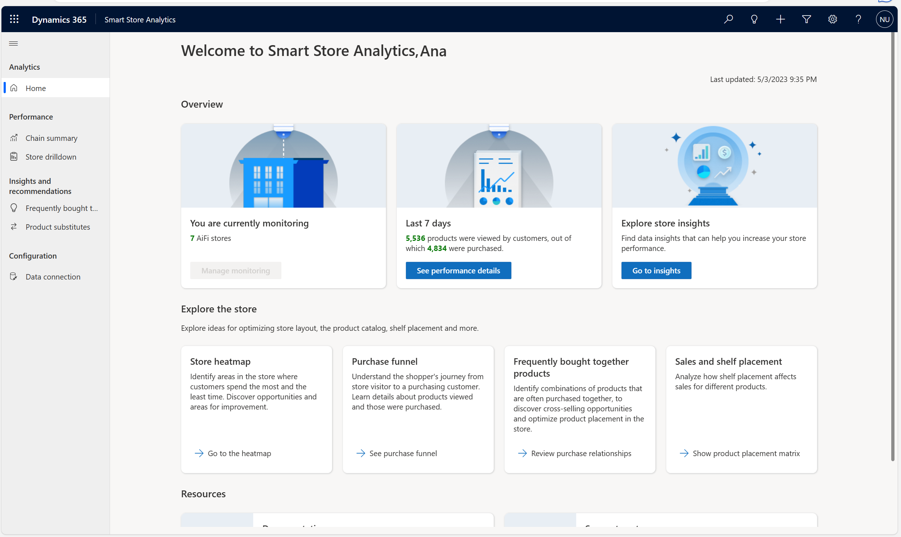
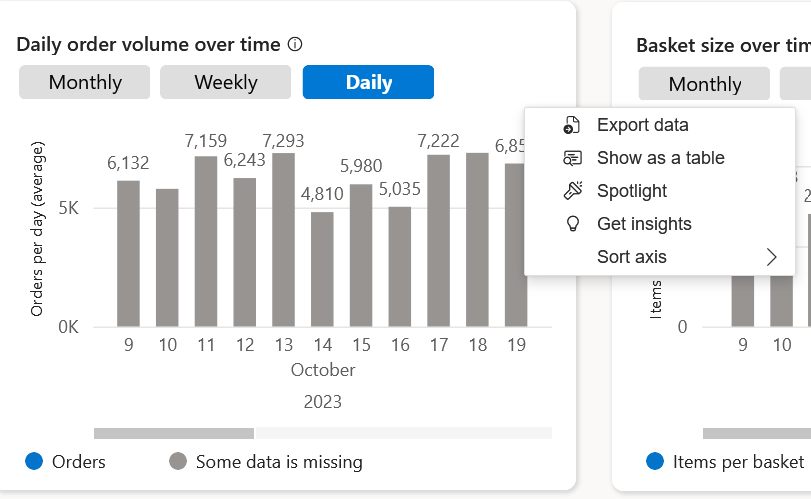

Smart Store Analytics help retailers to see the insights that matter most, together with highly specific recommendations, all targeted toward helping drive sales, lower costs, and improve the in-store experience. Smart Store Analytics reveals detailed shopper interactions in many ways. 

- Tracks store KPIs like number of shoppers, basket size and checkout time.

- Displays foot traffic through the store as a heat map.

- Plots unit sales against shopper height to help optimize visibility and shelf placement.

- Maps customer journey as a funnel, from entry through product discovery, consideration, and conversion.

- Brings together all of the app's KPIs, data visualizations, and data science insights. Retailers.

## Home page

The **Home** page in Smart Store Analytics has three sections: **Overview**, **Explore the store**, and **Resources**.

> [!div class="mx-imgBorder"]
> 

The **Overview** section summarizes some key metrics:

- Number of stores that the solution is monitoring
- Performance of the fleet of stores over a period of four weeks
- Representative insights into fleet performance with a link to deeper insights

The **Explore the store** section has useful links for you to explore ideas for your store optimization, and it includes the following features:

- Store heatmap
- Purchase funnel
- Frequently bought together products
- Sales and shelf placement matrices

The **Resources** section has links to resources for product documentation and the support center to raise tickets for help and support.

For more information, see [Use Smart Store Analytics](/industry/retail/use-smart-store-analytics?azure-portal=true#home-page).

## More Options control

You can use a **More Options** control to export data, show data as a table, reveal the widget through the Spotlight feature, and more. This control is available for most Smart Store Analytics data widgets.

To access the **More Options** control, hover your mouse cursor over the right side of a data widget, at which point an ellipsis (**...**) should appear.

> [!div class="mx-imgBorder"]
> 

For more information, see [More Options - Smart Store Analytics](/industry/retail/more-options-smart-store-analytics/?azure-portal=true).
