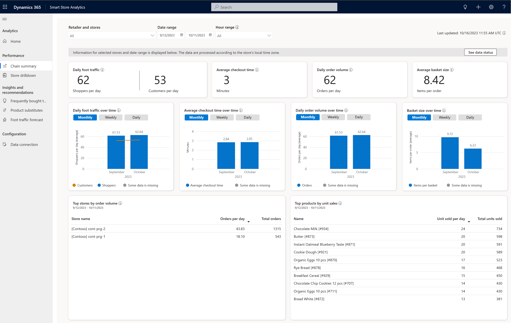
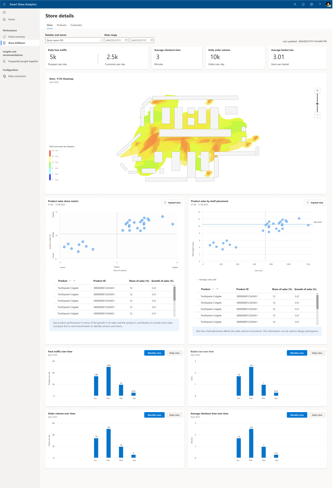
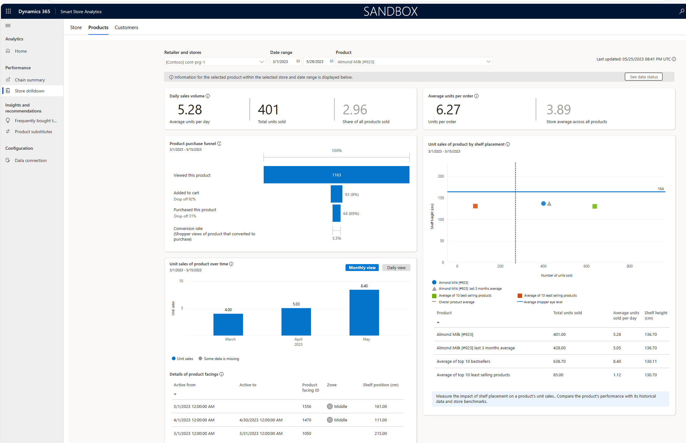
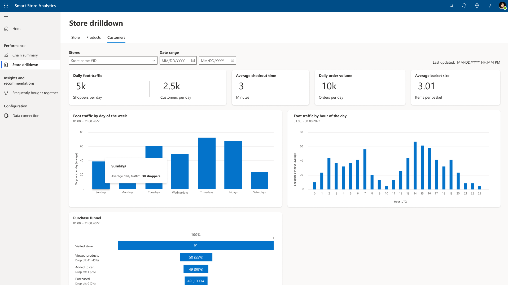

The **Performance** page of Smart Store Analytics has two sections: **Chain summary** and **Store drilldown**.

## Chain summary

The **Chain summary** section serves as a dashboard view of the chain's entire fleet of stores.

> [!div class="mx-imgBorder"]
> 

For more information, see [Chain summary](/industry/retail/performance-smart-store-analytics?azure-portal=true#chain-summary).

## Store drilldown

The **Store drilldown** section provides store managers with an in-depth view into the performance of a chosen store. Additionally, this section helps store managers discover ideas for greater performance.

The **Store drilldown** section has the following screens: **Store**, **Products**, and **Customers**.

### Store screen

The **Store** screen helps the store manager drill down into the performance of a single store. It offers KPIs, visualizations, and more.

> [!div class="mx-imgBorder"]
> 

For more information, see [Store screen](/industry/retail/performance-smart-store-analytics?azure-portal=true#store-screen).

### Products screen

The **Products** screen provides store managers with an in-depth view into the performance of a chosen product. Additionally, it helps store managers generate ideas for driving greater product performance.

> [!div class="mx-imgBorder"]
> 

For more information, see [Products screen](/industry/retail/performance-smart-store-analytics?azure-portal=true#products-screen).

### Customers screen

The **Customers** screen provides store managers with an in-depth view into customer traffic in the store.

> [!div class="mx-imgBorder"]
> 

For more information, see [Customers screen](/industry/retail/performance-smart-store-analytics?azure-portal=true#customers-screen).
