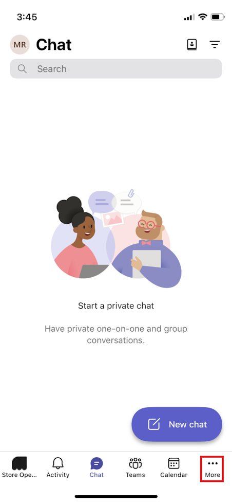
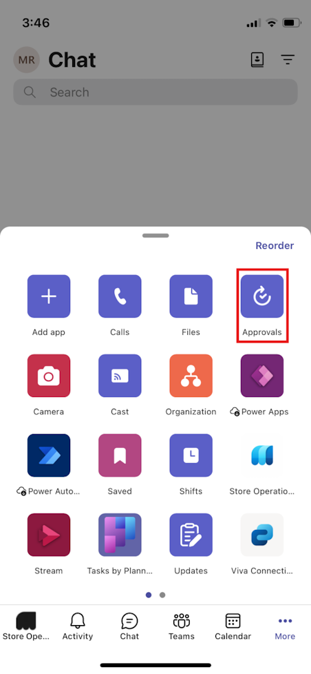
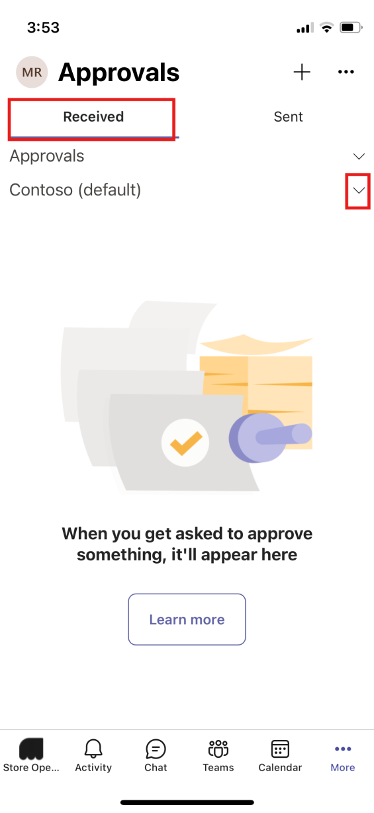
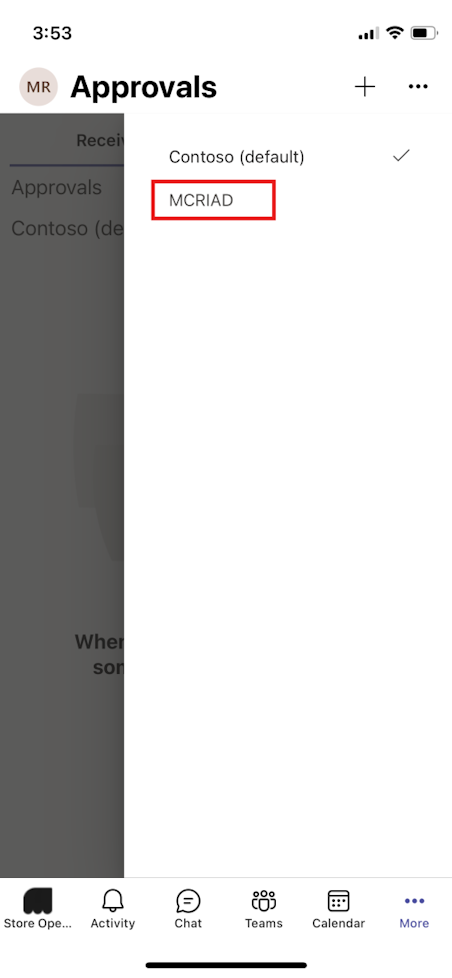
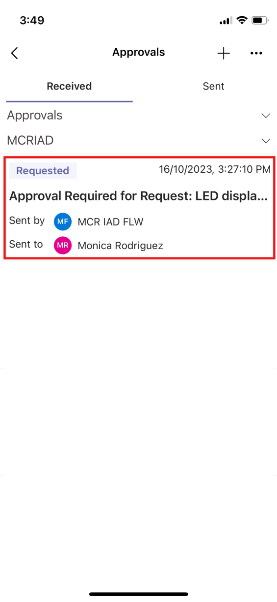
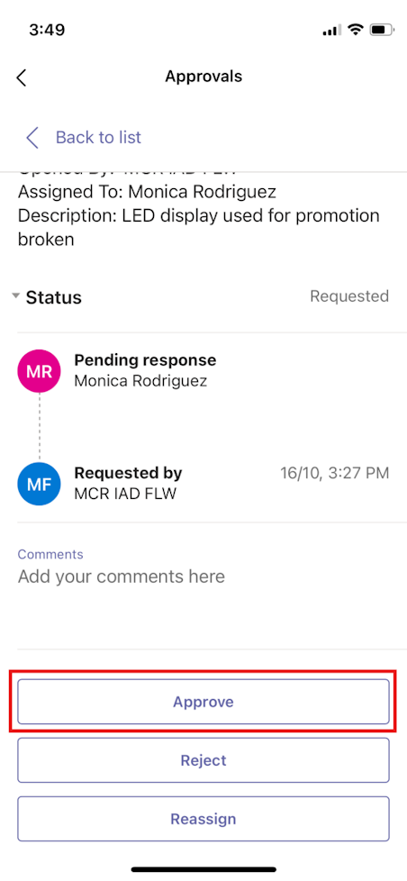

Complete the following steps as Monica Rodriguez to view and approve the repair request from Riley Flores.

1. Open [Microsoft Teams](https://teams.microsoft.com/?azure-portal=true) on your mobile device.

1. Sign in by using **Monica Rodriguez** credentials.

1. Select **More (...)** from your Teams navigation bar.

   > [!div class="mx-imgBorder"]
   > 

1. Select **Approvals**.

   > [!div class="mx-imgBorder"]
   > 

1. Make sure that the **Received** tab is selected. Select the dropdown menu next to **Contoso**.

   > [!div class="mx-imgBorder"]
   > 

1. Select the **MCRIAD** environment.

   > [!div class="mx-imgBorder"]
   > 

1. The request that Riley created in the previous exercise should display. Select the **Approval Required for Request: LED display repair** request.

   > [!div class="mx-imgBorder"]
   > 

1. Scroll down and select **Approve**.

   > [!div class="mx-imgBorder"]
   > 

Notice that the status changes from **Requested** to **Approved**.
