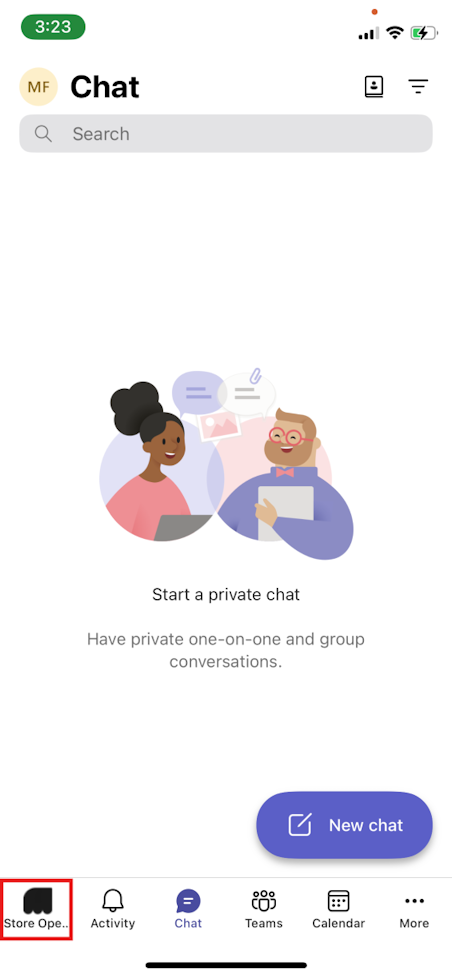
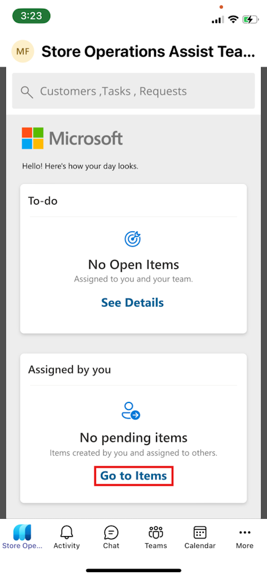
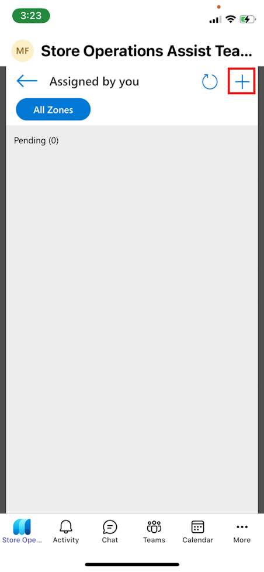
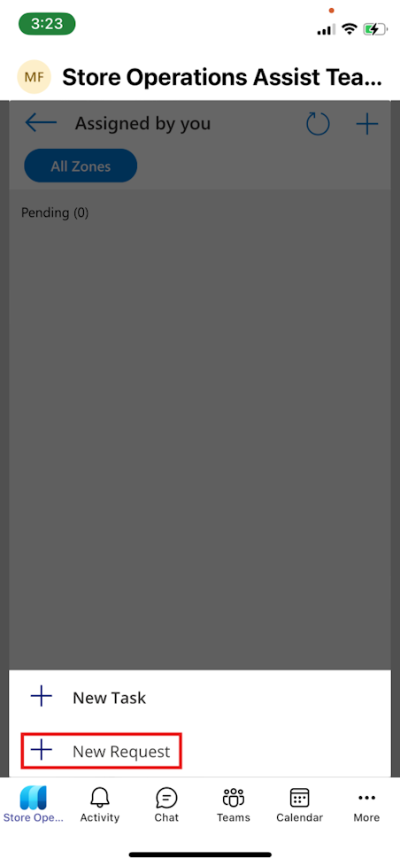
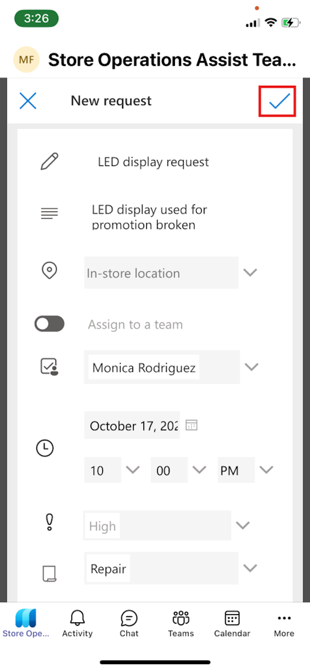
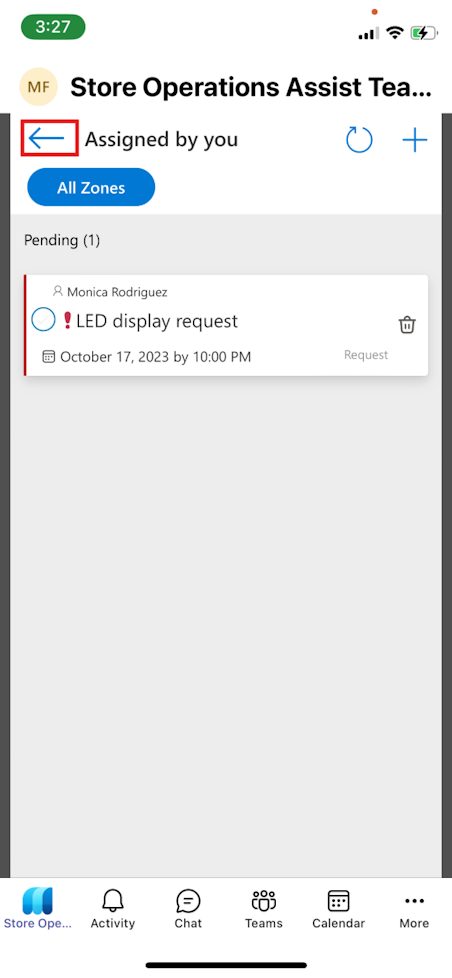

Complete the following steps to create a new request and assign it to Monica Rodriguez.

1. Open [Microsoft Teams](https://teams.microsoft.com/?azure-portal-true) on your mobile device.

1. Sign in by using the **MCR IAD FLW** credentials.

1. Select the **Store Operations Assist Teams** app that's pinned to your Teams navigation bar.

   > [!div class="mx-imgBorder"]
   > 

1. In the **Assigned by you** section, select **Go to Items**.

   > [!div class="mx-imgBorder"]
   > 

1. Select the plus (**+**) icon from the command bar.

   > [!div class="mx-imgBorder"]
   > 

1. Select **New Request**.

   > [!div class="mx-imgBorder"]
   > 

1. Enter the following details:

   - **Name** - LED display request
   - **Description** - LED display used for promotion broken
   - **Select Assignee** - Monica Rodriguez
   - **Date** - Tomorrow's date (10:00 PM)
   - **Priority** - High
   - **Type** - Repair

1. Select the check mark (**✓**) from the command bar.

   > [!div class="mx-imgBorder"]
   > 

1. On the **Assigned by you** page, select the back arrow to return to the home page.

   > [!div class="mx-imgBorder"]
   > 
