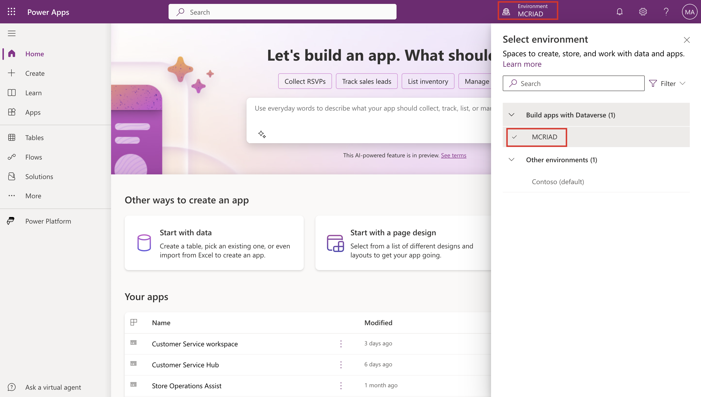
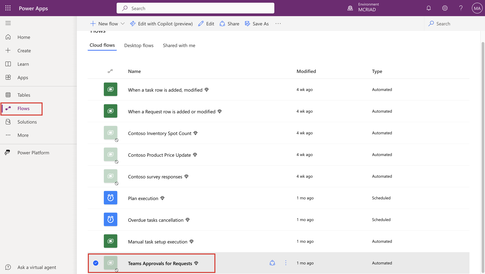
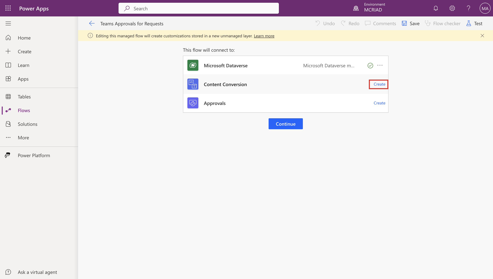
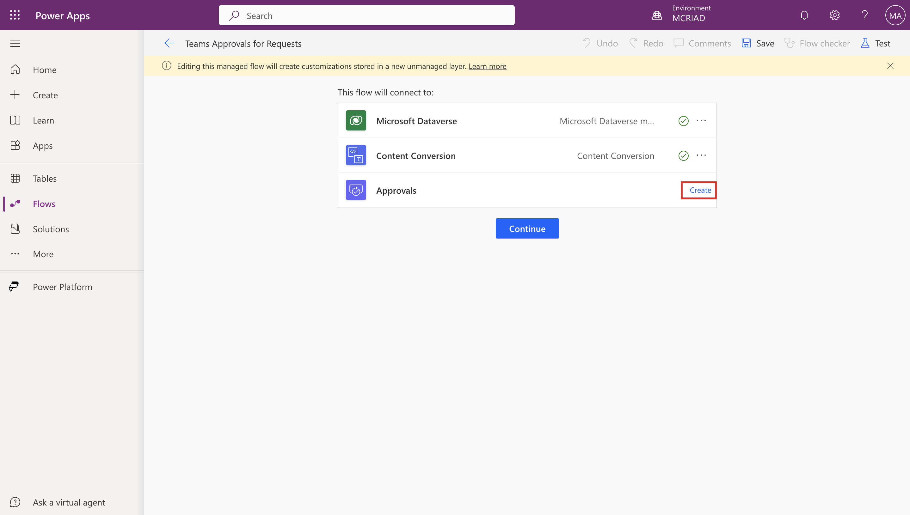
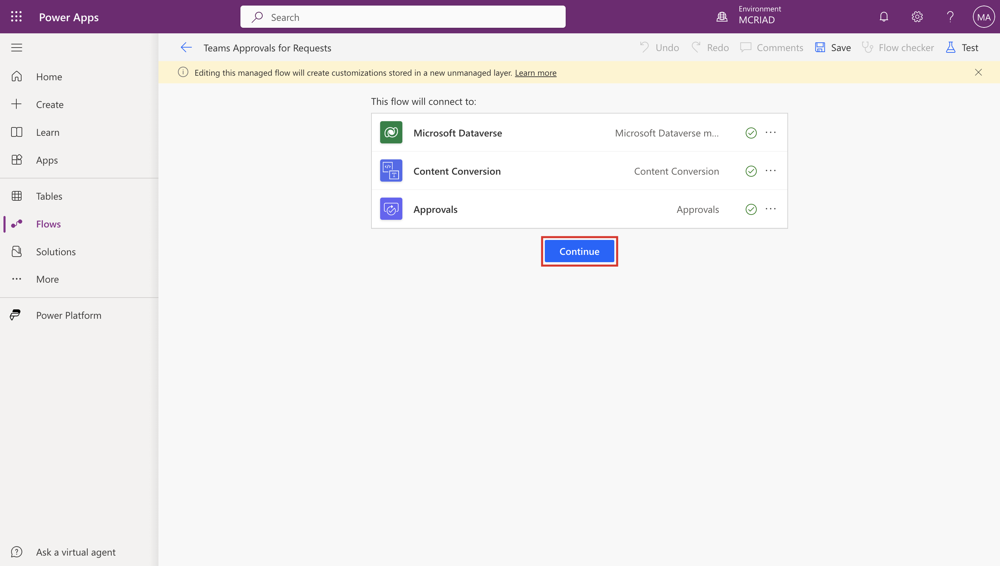
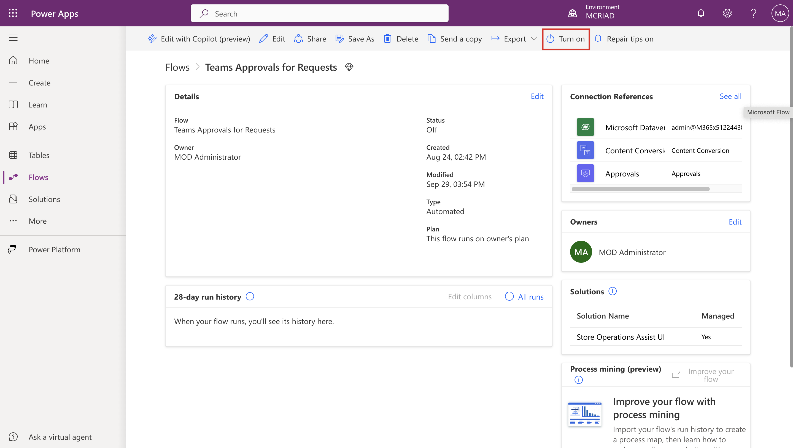

As Oscar, the Microsoft Power Platform administrator, you need to turn on the **Teams Approvals for Requests** flow in Power Apps portal. 

1. Open [Power Apps](https://make.powerapps.com/?azure-portal=true) in a web browser.

1. Sign in by using the admin tenant.

1. From the command bar, select the environment. Make sure that you've selected the **MCRIAD** environment.

   > [!div class="mx-imgBorder"]
   > 

1. From the left navigation pane, select **Flows** and then select **Teams Approvals for Requests** from the list of **Cloud flows**.

   > [!div class="mx-imgBorder"]
   > 

1. On the flow page, under the **This flow will connect to** section, select **Create** next to **Content Conversion**.

   > [!div class="mx-imgBorder"]
   > 

1. If asked, sign in by using your tenant credentials.

1. Select **Create** next to **Approvals**.

   > [!div class="mx-imgBorder"]
   > 

1. After both flows are created, select **Continue**.

   > [!div class="mx-imgBorder"]
   > 

1. You're redirected to the flow information page. From the command bar, select **Turn on**.

   > [!div class="mx-imgBorder"]
   > 

Now, your flow is ready to be used. The first time that the request is created, the flow is triggered.
