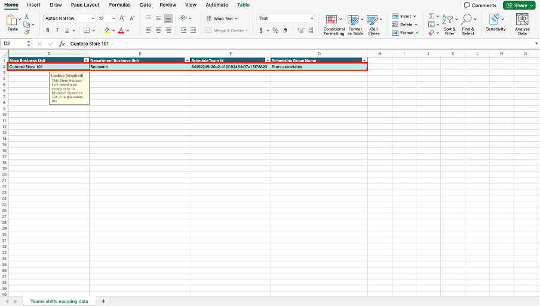

Complete the following steps to set up Shifts integration in Store Operations Assist:

1. Open [Power Apps](https://make.powerapps.com/?azure-portal=true) in a web browser and then sign in by using the admin tenant.

1. From the command bar, select the environment. Make sure that you select the **MCRIAD** environment.

   > [!div class="mx-imgBorder"]
   > 

1. Select **Apps** from the left navigation and then select the play button near the **Store Operations Assist** admin app.

   > [!div class="mx-imgBorder"]
   > 

1. Select **App setup** from the lower-left menu option.

   > [!div class="mx-imgBorder"]
   > 

1. Select **Teams shifts mapping** from the available menu options.

   > [!div class="mx-imgBorder"]
   > 

1. Select the ellipsis (**...**) menu from the upper ribbon and then select **Export to Excel**.

   > [!div class="mx-imgBorder"]
   > 

1. Open the file and then use the Excel template to fill in the following details. Then, save the file.

   - **Store Business Unit** - Contoso Store 101

   - **Department Business Unit** - Redmond

   - **Schedule Team ID** - The group ID of the store team in Microsoft Teams from the previous exercise

   - **Scheduling Group Name** - Name of the scheduling group in the Shifts app from the previous exercise

   > [!div class="mx-imgBorder"]
   > 

1. Return to the Store Operations Assist portal. Select the ellipsis (**...**) menu from the upper ribbon and then select **Import from Excel**.

   > [!div class="mx-imgBorder"]
   > 

1. Select **Choose file** and then select the Excel file that you edited. Select **Next**.

   > [!div class="mx-imgBorder"]
   > 

1. Select **Finish Import**.

   > [!div class="mx-imgBorder"]
   > 

1. On the **Your data has been submitted for import** notification, select **Done**.

   > [!div class="mx-imgBorder"]
   > 

1. On successful import, the mapping shows on the screen. If not, select **Refresh** from the upper bar.

   > [!div class="mx-imgBorder"]
   > 

1. When mapping data is available, select the business unit and then select **Activate** from the upper bar.

   > [!div class="mx-imgBorder"]
   > 

1. On the confirmation prompt, select **Activate**.

   > [!div class="mx-imgBorder"]
   > 
