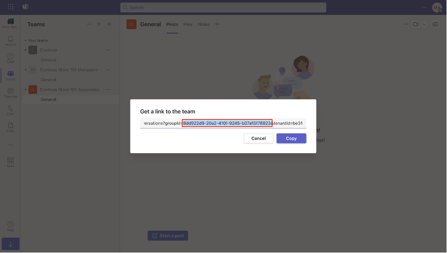

Complete the following steps to create a schedule for store associates in Teams:

1. Open [Microsoft Teams](https://teams.microsoft.com/?azure-portal=true) in a web browser and then sign in by using the admin tenant.

1. Select the more apps ellipsis (**...**) option from the navigation bar, and then search for and select the **Shifts** app.

   > [!div class="mx-imgBorder"]
   > 

1. To create a schedule for your store associates, select **Create** beside the **Contoso Store 101 Associates** team.

   > [!div class="mx-imgBorder"]
   > 

1. Select **(UTC-08:00) Pacific Time (US & Canada)** as the **Time zone** and **Los Angeles** as the **Closest city**. Select **Confirm**.

   > [!div class="mx-imgBorder"]
   > 

1. Near the group name, select the more options ellipsis (**...**) and then select **Rename group**.

   > [!div class="mx-imgBorder"]
   > 

1. Name the group to **Store associates** and then select **Save**. This name is the *Schedule Group Name*, so make sure that you note it for later use.

   > [!div class="mx-imgBorder"]
   > 

1. In the Contoso Store 101 Associates screen, next to the Store associates group name, select **Add people**.

   > [!div class="mx-imgBorder"]
   > 

1. In the **Add members to Store associates** dialog, select **MCR IAD FLW** as the user and then select **Add**.

   > [!div class="mx-imgBorder"]
   > 

1. Select **Close**.

   > [!div class="mx-imgBorder"]
   > 

1. Hover your cursor over the first column for **MCR IAD FLW**, and then select the ellipsis (**...**) that appears. Select **Add shift**.

   > [!div class="mx-imgBorder"]
   > 

1. Enter tomorrow's date, enter **8:00** to **17:00** as shift timing, and then select **Save**.

   > [!div class="mx-imgBorder"]
   > 

1. Similarly, create shifts for the next three days. Select **Share with team** from the upper-right corner.

   > [!div class="mx-imgBorder"]
   > 

1. In the **Share with your team** calendar dialog, select the dates for which the shifts were assigned and then select **Share**.

   > [!div class="mx-imgBorder"]
   > 

1. From the left navigation, select **Teams** and then select the more options ellipsis (**...**) menu near **Contoso Store 101 Associates**. From the dropdown list, select **Get link to team**.

   > [!div class="mx-imgBorder"]
   > 

1. From the link, copy the part between **groupid=** to **&tenantID**. 

   > [!IMPORTANT]
   > This ID is the *Schedule Team ID*, so make sure that you note it for later use.

   > [!div class="mx-imgBorder"]
   > 
